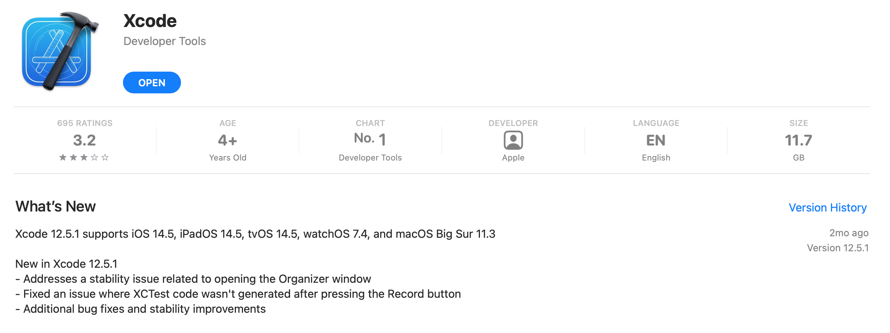

`Desarrollo Mobile` > `Swift Fundamentals`

## Módulo: Swift Fundamentals Naranja X

Bienvenidos al curso de Programación en Swift.
En este módulo aprenderemos los fundamentos básicos del lenguaje de programación Swift, así como del entorno de desarrollo de Apps en iOS.

### Antes de comenzar...

Primero deberás **descargar Xcode** en tu equipo. Solo abre el link y da click en descargar.

#### Descargar Xcode desde el App Store

[Descargar Xcode desde el App Store](https://apps.apple.com/mx/app/xcode/id497799835?l=en&mt=12)

#### Descargar Xcode desde el Portal de desarrolladores

[Descargar Xcode desde el portal de desarrolladores](https://developer.apple.com/download/more/)

**Nota:** Dentro del portal buscar *Xcode 12.5.1*, descargar en formato *.xip*. 
Igualmente descargar *Command_Line_Tools_for_Xcode_12.5.1.dmg*.

### OBJETIVO 

 - El alumno desarrollará con Swift aplicaciones para iOS altamente optimizadas, ágiles, veloces, interactivas y funcionales. Aprender los fundamentos del lenguaje Swift y del entorno iOS.

### ORGANIZACIÓN DE MÓDULO 
 
 - [Sesión 1](Sesion-01): Introducción al desarrollo móvil 
 - [Sesión 2](Sesion-02): Herramientas de desarrollo en iOS 
 - [Sesión 3](Sesion-03): Tu primera App
 - [Sesión 4](Sesion-04): Estructura básica del lenguaje Swift
 - [Sesión 5](Sesion-05): Variables y tipos de datos en Swift
 - [Sesión 6](Sesion-06): Operadores
 - [Sesión 7](Sesion-07): Control de flujos
 - [Sesión 8](Sesion-08): Elementos de interfaz de usuario UIKit

#### Mas información sobre iOS Development: 

[Developer Program](https://developer.apple.com/programs/)

