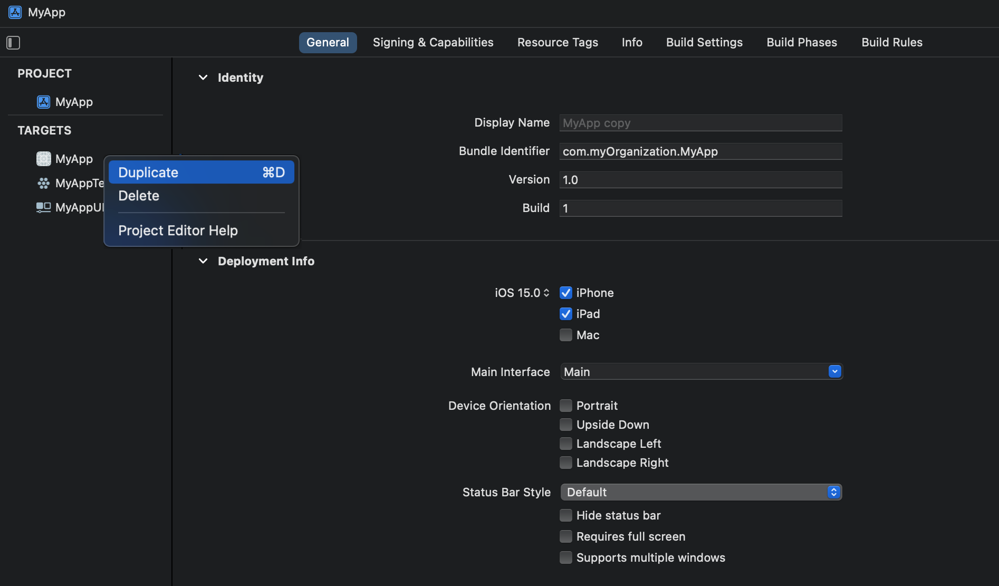
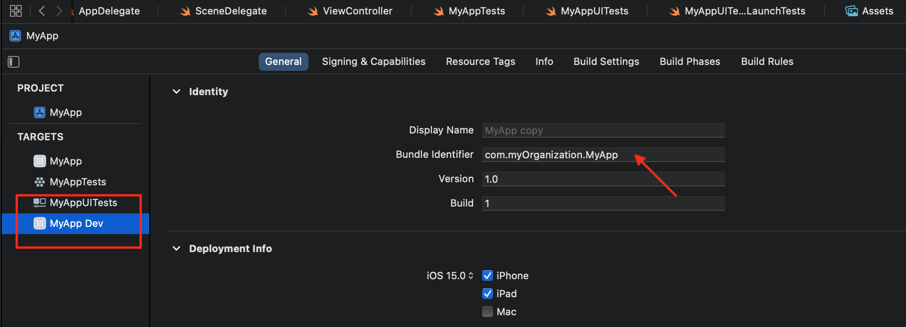
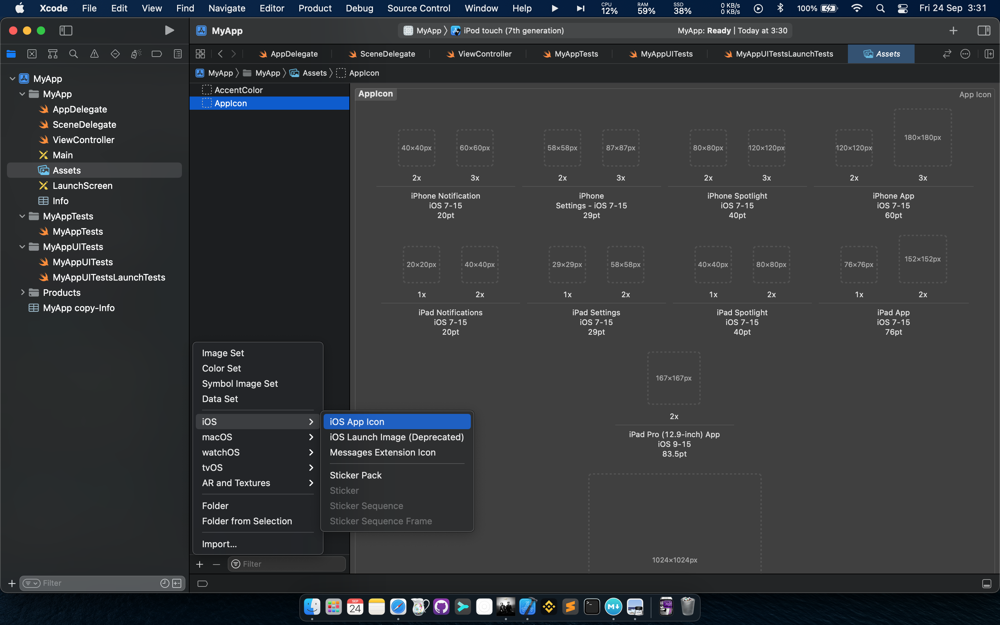
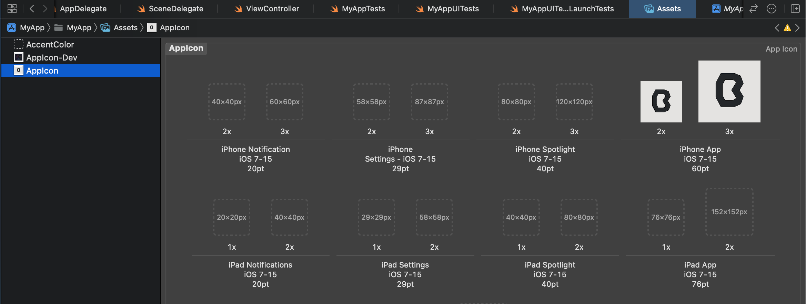
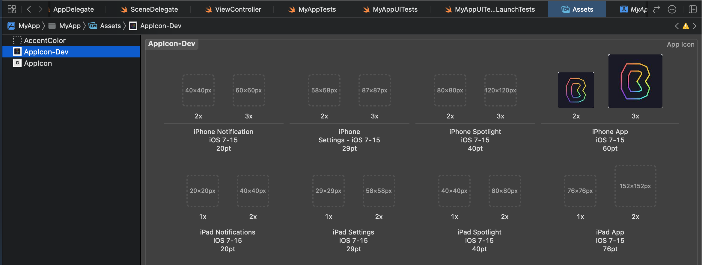
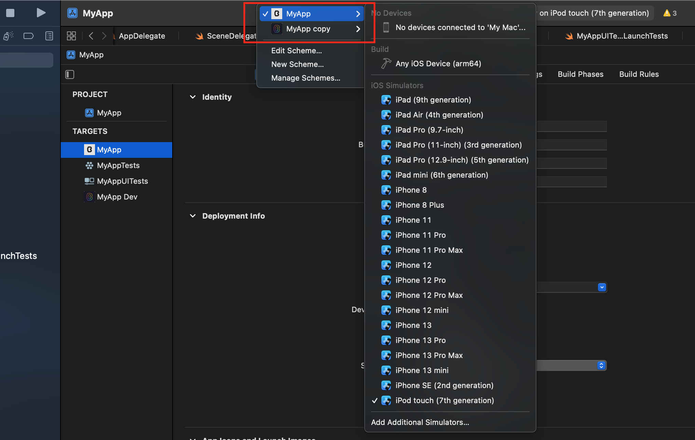
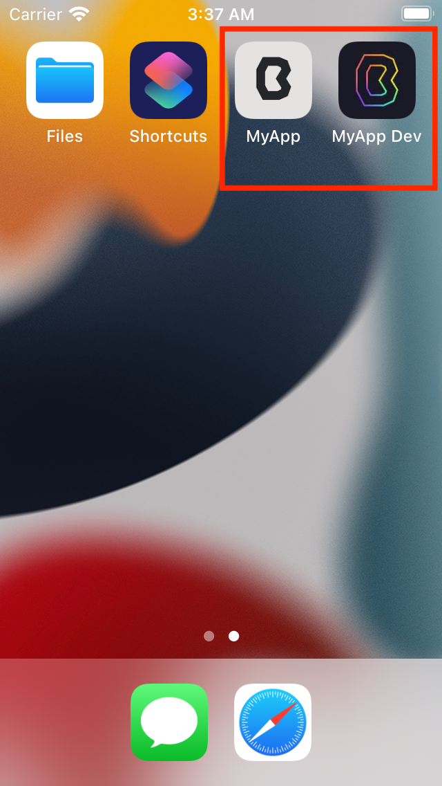

`Desarrollo Mobile` > `Swift Fundamentals`

## Ejemplo-01: Crear un Target customizado 

### OBJETIVO

- Comprender el uso de un Target y editar sus valores.

#### REQUISITOS

1. Xcode 12.5.1 o superior

#### DESARROLLO

1.- Crear un proyecto nuevo.

2.- Nos dirijimos a la sección de Targets y duplicamos el Target principal.

En el target duplicado cambiamos el nombre y el identifier.

Con estos dos targets generaremos dos compilaciones de Apps con icono diferente. Agreguemos un icono para cada target que vamos a usar.

Tendremos un AppIcon para Dev y uno para Producción.

Para ejecutar la App, elejiremos el target a ejecutar:

Hacemos esta misma acción para ambos targets.

El resultado final:

