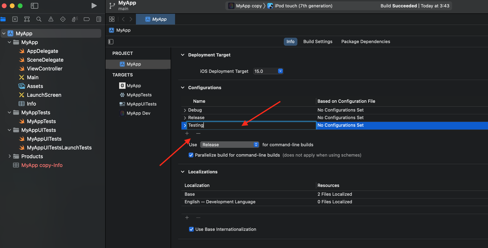
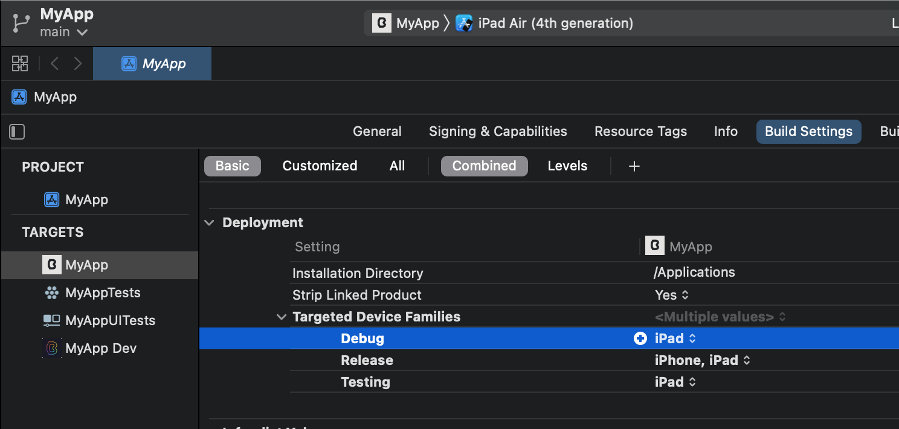
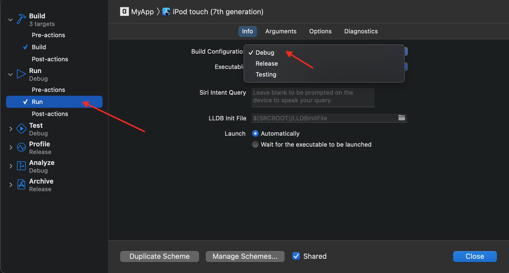
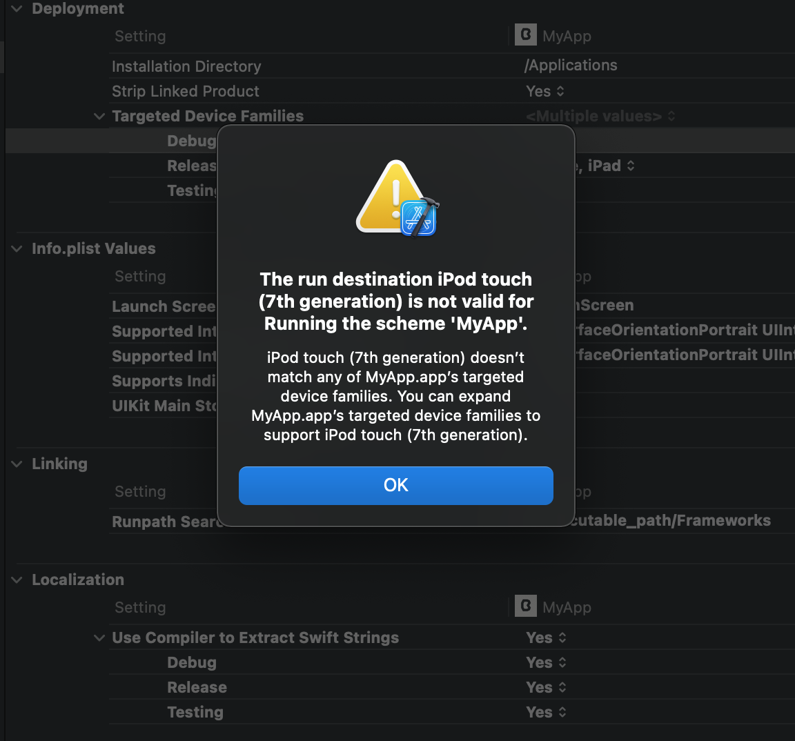

`Desarrollo Mobile` > `Swift Fundamentals`

## Ejemplo-02: Crear un Build Configuration, especificar que dispositivo esta permitido iPhone o iPad

### OBJETIVO

- Comprender el uso de Build Configurations y editar sus valores.

#### REQUISITOS

1. Xcode 12.5.1

#### DESARROLLO

En este ejemplo agregaremos un build configuration llamado Testing, en este nuevo Build Configuration restringiremos que solo pueda ejecutarse en iPad.

1.- Agregaremos un nuevo Build configuration, vamos a Project y buscamos Configurations. Podemos dar click en el botón de `+` o duplicar algún configuration existente.

2.- Ya duplicado, nos dirijimos a Build Settings, buscamos el valor de Targeted Device Families y buscamos nuestro Configuration recien creado. Editamos el valor a iPad.

3.- Para ejecutar la App, editamos el Scheme y elejimos el configuration.

Si ejecutamos la App elijiendo el Configuration de Testing con ipad asignado y en nuestro device tenemos algo que no sea iPad, obtendremos un Error:

De esta forma podemos asignar ciertas configuraciones a un Scheme o Target.