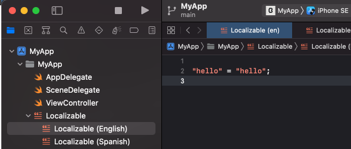

`Desarrollo Mobile` > `Swift Fundamentals`

## Ejemplo-03: Crear un Scheme, cambiar idioma.

### OBJETIVO

- Aprender a editar Schemes existentes.

#### REQUISITOS

1. Xcode 12.5.1.

#### DESARROLLO

Crear un Scheme, cambiar idioma [Ejemplo 03](Ejemplo-03)

En este ejemplo elejiremos un Target para el idioma Inglés y otro para el Español. Así cuando elijamos uno u otro, el idioma detectado por la App cambiará.

En este caso elejimos Español (spanish). Inmediatamente se mostrará un cuado de dialogo donde tenemos la opción de elegir al Storyboard. Esto es porque el Storyboard puede manejar multiples lenguajes. Podemos dejar la configuración como esta.

Agregaremos un archivo String al proyecto especificando el Target principal, al especificar ambos localizables estamos indicando que idiomas estan soportados:

Por último agregamos una cadena de texto en este formato:

> "key" = "value";
 
 
 
 

En un View Controller invocaremos al valor del Localizable mediante el siguiente código, el valor cambiará dependiendo del Scheme utilizado, ya que en uno se especifico el idioma como Spanish.

El resultado:

