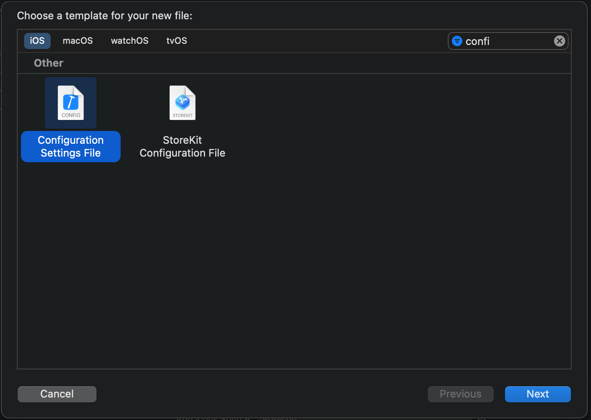
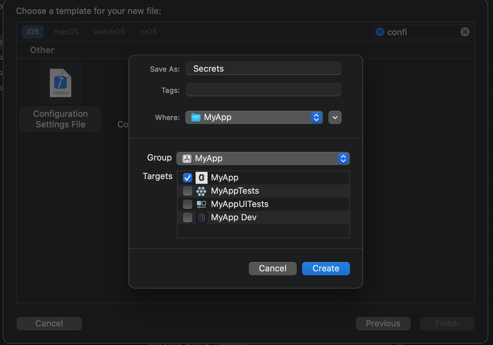
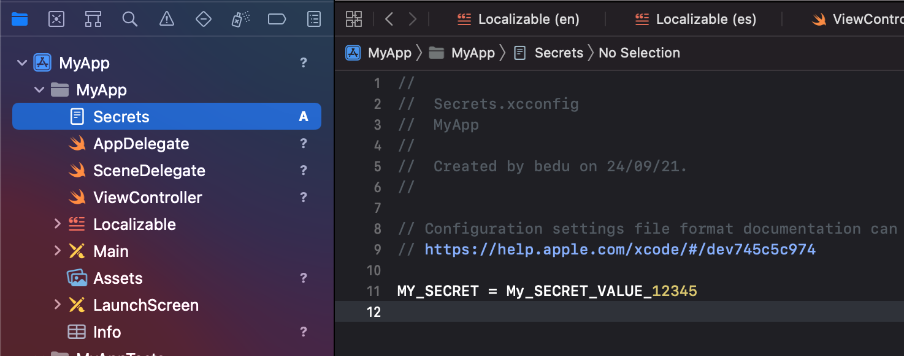
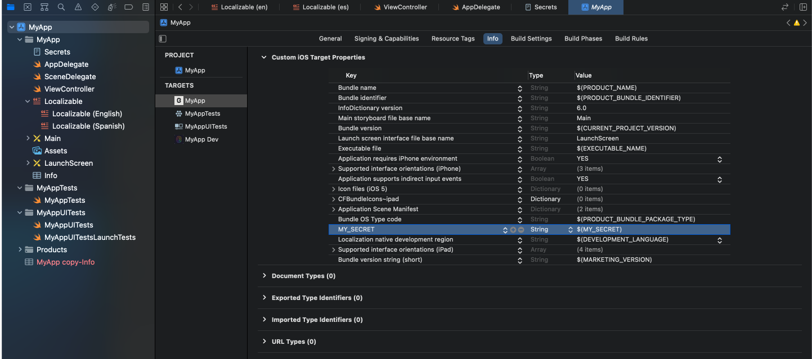
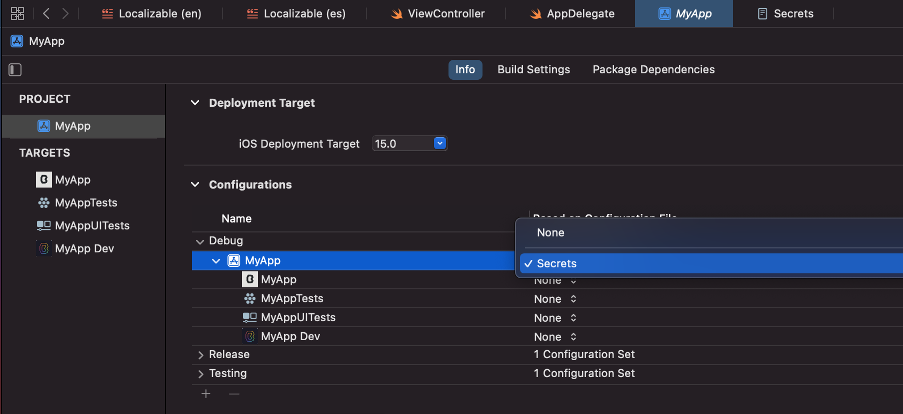
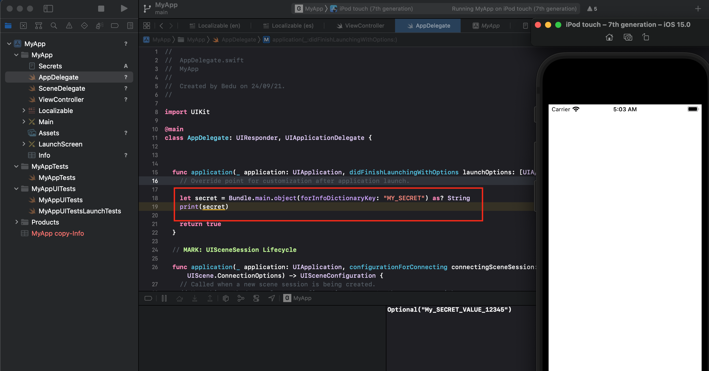

`Desarrollo Mobile` > `Swift Fundamentals`

## Ejemplo-04: Secrets

### OBJETIVO

- Aprender a crear un Secret file en Xcode.

#### REQUISITOS

1. Xcode 12.5.1.
2. Git

#### DESARROLLO

 
En el siguiente ejemplo aprenderemos a crear un archivo de configuración para almacenar un Secret.

Este archivo se configurará a modo de que no sea distribuido por algun manejador de repositorios como Git.

1.- En la carpeta de nuestro proyecto (el cuál esta configurado para ser distribuido y almacenado por Git). Creamos un archivo llamado `.gitignore`.

Abrimos la terminal, nos dirigimos a nuestra carpeta e ingresmos el siguiente comando:

> touch .gitignore && open .gitignore

Este comando creará un archivo llamado .gitignore y una vez creado lo abriremos.

En el interior de este archivo escribiremos el nombre de nuestro archivo de configuración, en este ejemplo: `Secrets.xcconfig`. Guardamos y cerramos el archivo.

Creamos un nuevo archivo de configuración, vamos a File > New File:

Escribimo un nombre y elegimos un Target, en este caso el principal.

En este nuevo archivo agregamos un nuevo valor, este valor será nuestro Secret:

Es necesario registrar este nuevo archivo en nuestro Info.plist:

En cada configuración especificamos el archivo de Secrets a utilizar:

Finalmente, escribiremos un poco de código en Swift para extraer el valor del Secret. 

