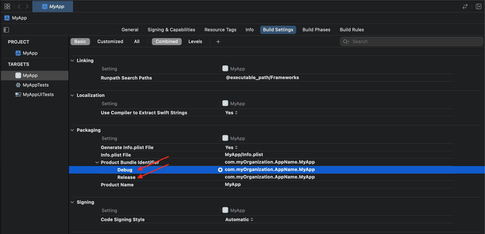

`Desarrollo Mobile` > `Swift Fundamentals`

## :wave: Sesión 1: Introducción al desarrollo móvil   

### 🎯 Objetivo de la sesión:

Describir el ecosistema iOS, las tecnologias disponibles, prácticas, inicio del proceso de diseño y la distribución de una App.

### 🎯 Qué aprenderán

## Introducción al desarrollo en iOS, generalidades.

#### Ciclo de Vida de una App
 
 El desarrollo de una App no es un proceso finito, puede pensarse que una vez que se tenga un producto terminado este ya no necesitará modificarse nunca mas. Este pensamiento es errado y no obstante, el desarrollo de un software es un proceso iterativo de mejora continua.
 
 En un equipo de desarrollo de software existen diferentes roles, desde el desarrolldor senior front-end, back-end, middle-ware, QA, etc. Cada uno con una misión pero todos con el mismo objetivo, lanzar a producción una nueva versión de la App.
 
 Ya que una App puede ser parte de un negocio, es necesario medir. Cualquier métrica que aporte valor al producto debe ser incluida, como por ejemplo, que tipo de usuario interactua con la App, las opciones mas utilizadas, zona geográfica, tipo de usuario respecto a ingresos, etc.
 
 Entonces, comenzamos el ciclo de vida de una App desde el diseño, una vez definidas las historias de usuario, comenzamos el diseño del sistema: Etapa de desarrollo.
 
 Imaginemos que hemos alcanzado la primera versión de la App, es momento de distribuirla con los clientes, estamos ahora en la etapa de Distribución, sin embargo, antes de enviar un aversión a producción, debemos probar el producto, entonces pasamos al a fase de Pruebas (QA).
 
 En la etapa de Testing, no solo se prueba el código o la App, sino temas de negocio, como quizas algun asunto legal, de marketing, etc.
 
 De momento nuestro proceso sigue el siguiente flujo:
 
 > Development -> Testing
 
 Ya autorizado por QA, es momento de enviar la App a producción. Para ello enviamos una versión a Apple. El equipo de Apple se encargará de verificar que nuestro producto cumpla sus lineamientos.
 
  
  
[App Store Review Guidelines](https://developer.apple.com/app-store/review/guidelines/)

 A grandes rasgos estos lineamientos consisten en no publicar una App que pueda contener temas sensibles, de copyright, que atente contra la seguridad o desinformación. Que sea una copia de otra App, Spam, o que no tenga regulación por alguna autoridad, por ejemplo, una app para minar criptomonedas directamente en el smartphone quedaria prohibida del AppStore.
 
 Bien, si la App pasa el filtro de Apple, es momento de publicarla en el AppStore. El proceso se ve de la sig. forma:
 
 
  > Development -> Testing -> Review -> Publishing
  
  Por último, hace falta mejorar el producto, para poder mejorarlo es necesario medir que se quiere mejorar. Para ello tenemos herramientas de analíticos (como se mencionaron en el prework). Agregamos esta etapa al ciclo de vida:
  
> Development -> Testing -> Review -> Publishing -> Analytics

Con la información recopilada de los Analytics, podemos agregar, quitar o modificar nuestra App.

 Bien, ya tenemos las etapas del ciclo de vida de una App. ¿Que herramientas tenemos para cada una?. De lado del programador, en la etapa de Development contamos con Xcode. Para la fase de pruebas tenemos [Testflight](https://developer.apple.com/testflight/) para distribuir una versión de nuestra App a QA, pero, si se requiere Testing de lado del desarrollador podemos hacer uso de Instruments, el cuál esta incluido en Xcode así como tambien de Unit Tests, estas últimas son conocidas como pruebas unitarias. Un ejemplo de prueba unitaria sería verificar que el email ingresado tenga el formato deseado, para ello extraemos el código que verifica dicho valor y creamos casos que deben cumplirse, si estos son exitosos, esta garantizado que en nuestra app funcionará perfectamente.
 
 Para la etapa de Review, necesitaremos una cuenta de Apple. Para ello visitamos el portal de developer apple: [developer.apple.com](https://developer.apple.com).
 
 Una vez registrado una cuenta, tenemos dos opciones, registrarnos como empresas o como personas [Programs Enroll](https://developer.apple.com/programs/enroll/).
 

Una vez registrada una cuenta de desarrollador podemos acceder a herramientas y recursos de Apple, versiones Beta, versiones legacy, soporte, opciones avanzadas como In-App Purchases (compras directamente en la App), push notifications, Cloud Kit, etc.

 
#### Instalando Xcode

Como hemos visto a lo largo de la clase o como bien ya tendras conocimiento, para desarrollar Apps en iOS podemos utilizar el editor oficial de Apple, Xcode.

Para ello podemos ir directamete al AppStore, o si ya contamos con una cuenta de desarrollador, podemos acceder a la zona de descargas en developer.apple.com.

 
 
 Una vez instalado ejecutamos la App, se nos solicitará instalar los command line tools. Este paquete incluye todas las herramientas que Xcode necesita para poder compilar nuestro código.
 
 
 
 Una vez finalizada la instalación, la pantalla de bienvenida se muestra.
 
 
 
 Esta ventana será muy recurrente a lo largo de las sesiones. En ella podemos ubicar el botón para crear un nuevo proyecto.
 
  
  
 
 Continuamos la creación del proyecto Eligiendo el tipo de proyecto a crear, App. El nombre, Identificador, lenguaje de programación, etc.
 

  
  Dentro de estas opciones, es importante señalar el **Organization Identifier**. Este identificador es aquel que tiene la forma de un sitio web escrito al revés, por ejemplo `com.myCompany`. Y es único, de esta manera Apple identificara los productos en su AppStore.
  Debajo de esta Organization Identifier encontramos al bundle Identifier o bundle ID. Este ID posee el valor del Organization Identifier mas el nombre de nuestra App o identificador ue queramos ponerle a nuestra App. Como mencionamos, este ID es único en el sistema de Apple y será hasta el momento de publicar una App cuando quede registrada.
  
Asi mismo, Xcode puede manejar las cuentas de Apple creadas:  
  

Y tambien descargar sus certificados necesarios para poder subir una versión de la App al portal de desarrolladores:

  
#### Certificados
  
  Los certificados en Apple vienen en dos sabores, es decir, para desarrollo (development) o distribución. Como la palabra lo indica, si lo que necesitamos es ejecutar la App en un dispositivo físico pero no publicarla en la tienda, hacemos uso de un certificado de Development. Pero si lo que requerimos es publicar una versión nueva, haremos uso de un certificado de distribución.
  
  
  
  
#### Provisioning profiles

Para poder crear un provisioning profile, es necesario tener un certificado y un App ID. Este nos permitirá poder instalar las Apps que creemos en nuestro dispositivo físico.
Cada provisioning profile requiere que se especifique que dispositivos van a ser compatibles.

  

#### TestFlight

Apple provee una herramienta para distribuir una versión de tu App para que pueda pasar por la etapa de QA. Hablamos de Testflight, esta herramiente es descargable desde el AppStore, tan solo hay que buscar `TestFlight`.

  

Esta App trabaja directametne con el Apple ID. En esta herramienta se listaran las versiones de la App que estes desarrollando. Mostrando la versión y número de Build. Cabe mencionar que esta versión de prueba cuenta con fecha de expiración. Al seleccionar el botón Install, automaticamente comenzará la descarga al dispositivo.

 
 
 
#### Build Configurations

Es común crear una App con diferentes tipos de configuración. Por ejemplo una version de tu App que solo muestre cierto tipo de contenido mientras esta en Testing, pero al momento de enviarla a Release muestre el contenido de Producción. Para lograr esto podemos tomar ventaja de los "Build Configurations". Por defecto un proyecto en iOS tiene dos: Debug y Release. Usando estas configuraciones, puedes especificar 
 
 

 
#### Schemes
 
Un Scheme es una colección de Targets, Build configurations y Build Settings que Xcode usa cuando esta compilado. Los schemes son la unión de estas partes, al elegir un scheme, usas un tipo de configuración global.
 

#### Targets

Un Target es una lista de archivos e instrucciones que le dice a Xcode como construir una App o una extensión. Cuando ejecutamos el botón de ejecutar app, estamos ejecutando el Target. En Xcode podemos agregar diferentes tipos de Target, por defecto tenemos aquel que representa a la configuración global o principal. Usualmente tiene el nombre de tu App.

 Es muy fácil agregar un nuevo Target, solo dando click en el icono de `+` en la parte inferior de la sección de Targets.
 
 

 Si tu proyecto requiere tener una versión para Apple Watch, un nuevo Target debes agregar.
 
  

#### Secrets

En algunos casos una App debe manejar algún valor secreto, como una llave. Un secret es un tipo de dato privado que tu App usará, puede ser un password, servicio o credenciales.

Es importante manejar un medio para almacenar un secreto en la App, ya que es muy facil exponer estos valores en un repositorio por error y así un tercero pueda ver esta información.

Xcode provee un archivo especial llamado Configuration file `.xcconfig`, este archivo no debe ser compartido por un control de versiones como Git.

Con un archivo `.xcconfig` podrás almacenar tus *secrets*. Este archivo debe ser agregado a .gitignore si estamos usando Git (o alguna configuración similar). La idea es no incluir este archivo a algún repositorio. Cada Secreet debe ser referenciado por código.

 
### Ejemplos
 
Crear un Target customizado [Ejemplo 01](Ejemplo-01)
 
Crear un Build Configuration, especificar que dispositivo esta permitido iPhone o iPad
[Ejemplo 02](Ejemplo-02)
 
Crear un Scheme, cambiar idioma [Ejemplo 03](Ejemplo-03)

Crea un Secret, crear un secret [Ejemplo 04](Ejemplo-04)

#### Reto

Configuración inicial de proyecto: [Reto 01](Reto-01)

### 📂 Entregable del proyecto

El experto mostará un ejemplo de aplicación similar a la que se construirá en las siguientes sesiones.

