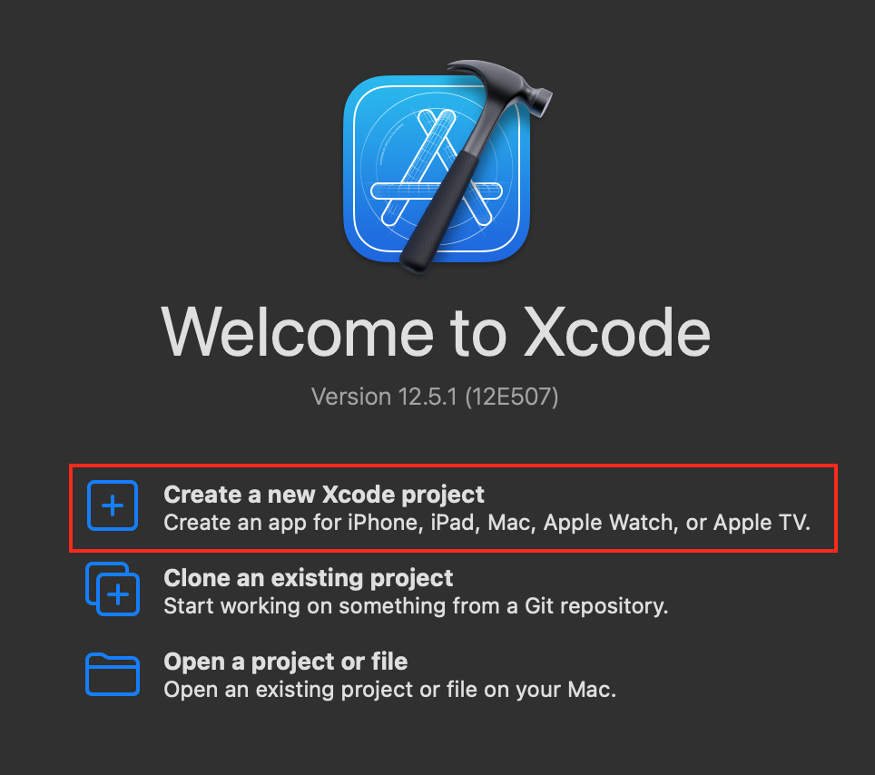
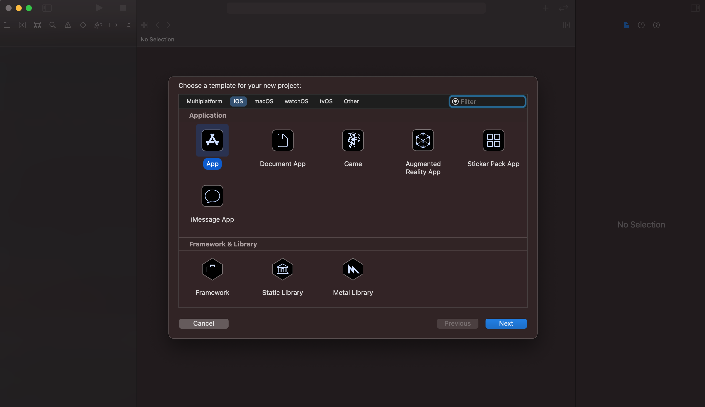
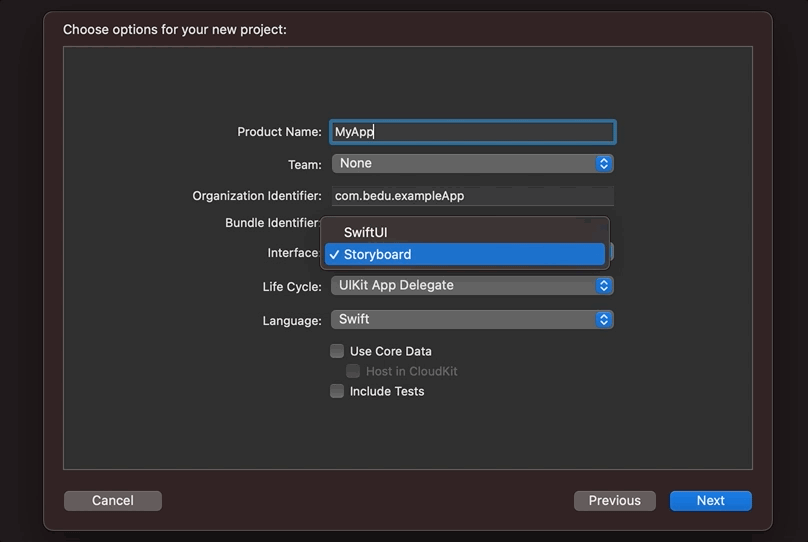
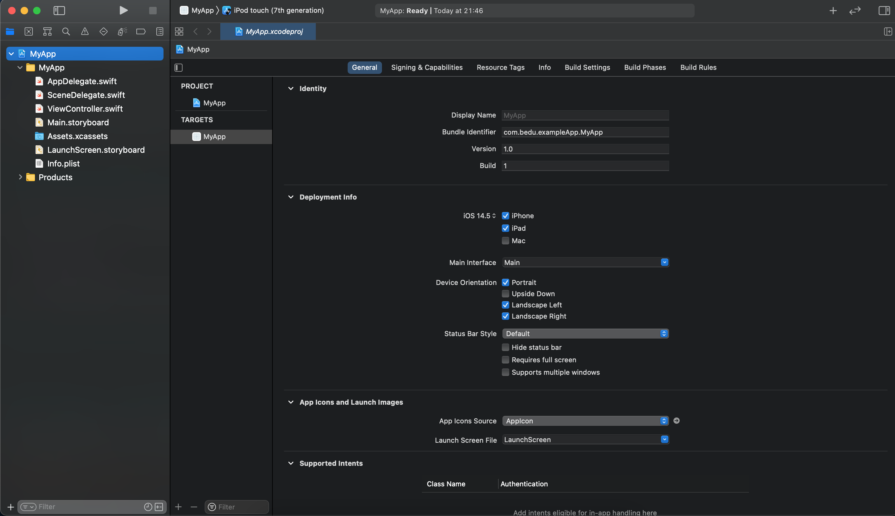
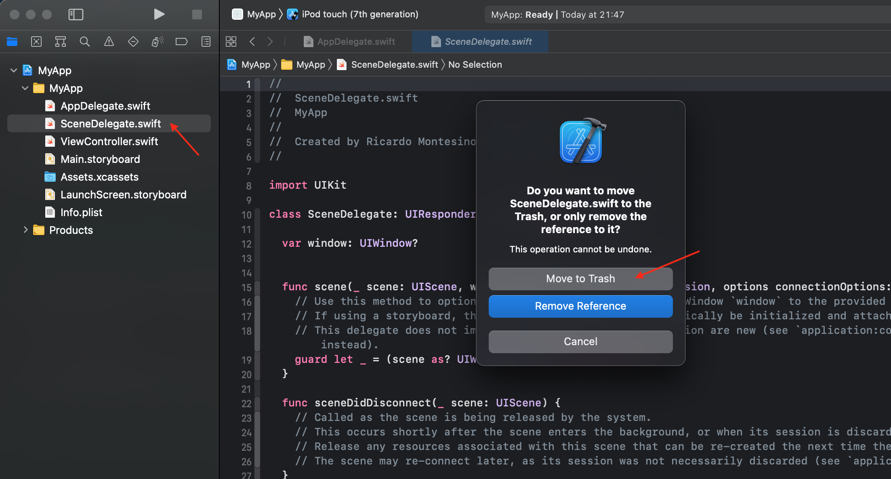
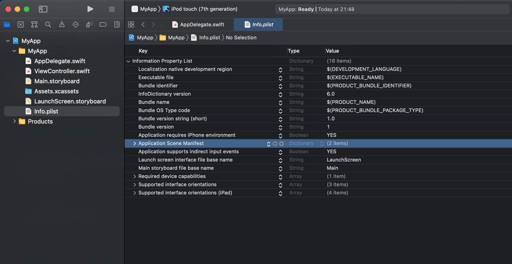
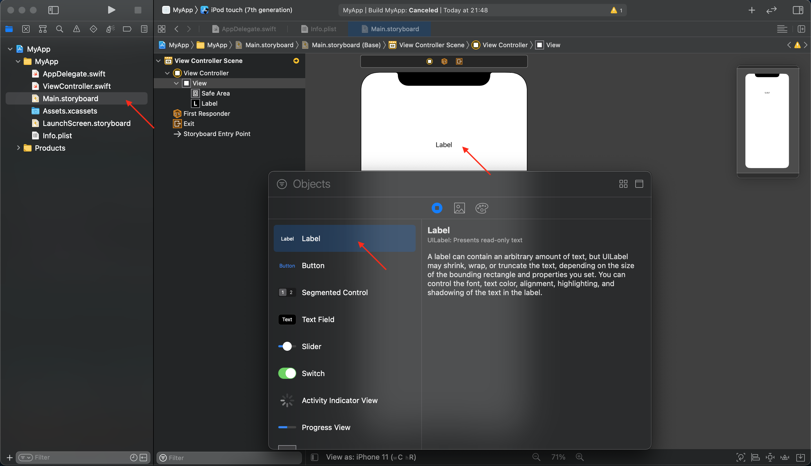
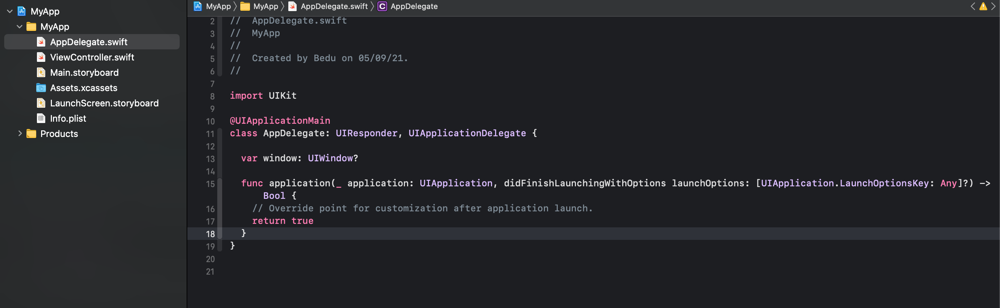

`Desarrollo Mobile` > `Swift Fundamentals`

## Ejemplo-03: Creando un proyecto con UIKit - AppDelegate, Switf y Storyboards.

### OBJETIVO

- Aprender a crear un proyecto base en Xcode.

#### REQUISITOS

1. Xcode 12.5.1.

#### DESARROLLO

1.- Abrir **Xcode** y crear un nuevo proyecto en 

Para crear un proyecto en Xcode para iOS tenemos dos opciones, la primera al ejecutar Xcode aparece la sig. pantalla, elegimos `Create a new Xcode project`:

La segunda manera es yendo al menú `File > New > Project ... ` y elegimos dentro de iOS, la opción de `App`.

Seguido de esto, se nos solicitará indicar que tipo de proyeto deseamos. Ingresamos el nombre, identificador, interfaz, ciclo de vida y lenguaje de programación que usará el proyecto.

Al dar click en Next se mostrará el editor.

¡Y vemos el proyecto creado!

Ahora haremos algunas modificaciones a la configuración para usar únicamente `AppDelegate`. Primero, eliminamos los archivos de SceneDelegate, lo seleccionamos, presionamos `Delete` en el teclado y damos click en `Move to trash`.

 
 
 Ahora, vamos al archivo `Info.plist`, aqui buscamos el valor `Application Scene Manifest` y lo eliminamos.
 

 Bien, es momento de agregar algo de contenido a nuestro Storyboard, abrimos Main.storyboard y arrastramos un Label a la pantalla.
 
 
 
 Por último, en el archivo de AppDelegate.swift, borraremos el código de Scene Delegate. Solo hace falta declarar la variable window para que Xcode tenga una referencia de ventana.
 
  
 
 Ejecutamos el proyecto.
 
Estos pasos son útiles si el proyecto a crear requiere compatibilidad con versiones viejas de iOS y no esta contemplado el uso de múltiples Scenes o ventanas en la app.
 
