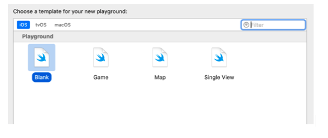
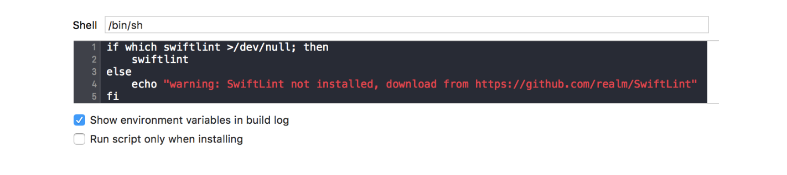

`Desarrollo Mobile` > `Swift Fundamentals`

## Creación de Proyectos y Playgrounds

### OBJETIVO

- Hacer que el alumno esté más familiarizado con el uso de Xcode en la creación de proyectos de iOS.
- Familiarizarse con el uso de Playgrounds. 
- Conocer cómo Xcode puede aumentar sus funcionalidades usando plugins de terceros.

#### REQUISITOS

1. Xcode 12.5.1, iOS Simulator y Terminal.

#### DESARROLLO

Tal como lo hicimos durante el Work, debes asegurarte de completar lo siguiente:

Esta actividad consistirá en tres partes, creación y ejecución de proyectos, uso de Playgrounds e instalación de un plugin de terceros en Xcode.  Este último podría ser un poco complicado, no te preocupes si al primer intento no funciona, la idea de esto es perder el miedo al uso de Xcode.

### Creación de proyectos.

1.- Crear cuatro tipos diferentes de proyectos cumpliendo lo siguiente. En todos los casos cambiar el nombre de la app mediante el uso de Info.plist, tanto nombre corto como nombre largo.

- Interface: Storyboard, Life Cycle UIKit
	- Language: Swift
	- Language: Objective-C

- Interface: SwiftUI, Life Cycle UIKit
	- Language: Swift

- Interface: SwiftUI, Life Cycle SwiftUI
	- Language: Swift

2.- Crear un proyecto que omita el uso de Storyboards, este no debe hacer uso de SwiftUI. 

#### Crear un proyecto que omita el uso de Storyboards..

Crear la App basandose en la sig. configuración:

- Interface: Storyboard, Life Cycle UIKit.	
	- Language: Swift
	
	- Debe de omitir el uso de storyboards. 

#### Playgrounds

Ahora, ¿Recuerdas que Xcode provee de 4 plantillas para la creación de un Playground?. Esta vez crearemos un playground de Mapas.

En el código agregaremos la ubicación en coordenadas de nuestra ciudad preferida.
También mostraremos este mapa de múltiples formas, con vista satelital o vista por default.

#### Plugins de terceros (EXTRA)

Vamos a integrar un plugin muy utilizado en el mundo del desarrollo de Apps, hablamos de SwiftLint. Este plugin se encarga de ver que tan bueno es tu código en Swift, es decir, se encarga de avisarle al desarrollador si está siguiendo buenas prácticas de programación.

Generalidades:

Hay muchas formas de instalar este plugin. Te sugerimos comenzar por:
1.- Instalar HomeBrew
2.- Instalar swiftLint mediante HomeBrew.
https://github.com/realm/SwiftLint

Una vez instalado, procedemos a integrarlo en Xcode.
Ya configurado en Xcode, en nuestra carpeta del proyecto crearemos un archivo .YML, este contiene las reglas que SwiftLint utilizará para evaluar tu código en Swift.

**Pasos a seguir: **

Si contamos con HomeBrew instalado, ingresamos el siguiente comando en la Terminal.

> brew install swiftlint

En Xcode agregaremos un nuevo Script.

Vamos a Build Phases. Click en + y seleccionar "New Run Script Phase". Ingresamos el sig. script:

**Ejecutamos algún proyecto**

Swift Lint tiene aún más configuraciones, te invitamos a ver el repositorio en donde encontrarás más información al respecto. 

https://github.com/realm/SwiftLint

Si persisten las dudas, puedes consultar la sig. fuente:

https://medium.com/developerinsider/how-to-use-swiftlint-with-xcode-to-enforce-swift-style-and-conventions-368e49e910

