`Desarrollo Mobile` > `Swift Fundamentals`

## :wave: Sesión 2: Herramientas de desarrollo en iOS    

### 🎯 Objetivo de la sesión:

- Reconocer las herramientas necesarias para el desarrollo de apps en iOS. 

- Aprenderán las partes principales de Xcode. Utilizar los simuladores de iphone.

### ⚙ Configuración

Software instalado:

- Xcode 12.5.1
- Command line tools 

### 🎯 Qué aprenderán

- Uso de Xcode, Targets, Inspector, Playgrounds y simulador.
- Asociár cuentas con Xcode.
- Creación de proyectos en iOS.
- Manejo del simulador por medio de la terminal.
- Planteamiento del proyecto: Se plantea el proceso de desarrollo de una App a nivel general.

### 🎩 Desarrollo

En esta sesión aprenderemos a utilizar los componentes de Xcode así como el uso de Playgrounds y simulador. Se crearán diferentes tipos de proyectos en iOS tanto con el uso de `UIKit`, `AppDelegate`, `SceneDelegate` y `SwiftUI`. Incluyendo el uso de Storyboards y al mismo tiempo como crear un proyecto que no dependa del Storyboards.

## Creación de proyectos 

### Creando proyectos en iOS mediante Xcode

Xcode ofrece diferentes maneras para poder crear proyectos, ya sea utilizando Swift, Objective-C, SwiftUI o Storyboards. Cualquiera de ellas es válida siempre y cuando satisfagan las necesidades del proyecto.

En esta serie de cursos utilizaremos Storyboard y Swift. De manera paulatina iremos dejando de lado el Storyboard paradar paso al uso de Swift en su forma mas pura.

Comenzamos...

Para crear un proyecto en Xcode para iOS tenemos dos opciones, la primera al ejecutar Xcode aparece la sig. pantalla, elegimos `Create a new Xcode project`:

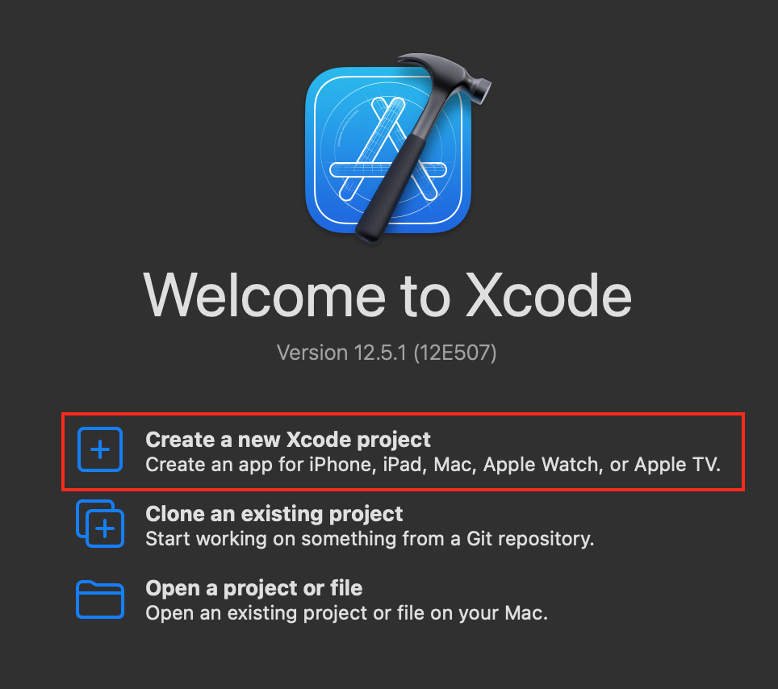

`File > New > Project ... ` Elegimos dentro de iOS, la opción de `App`.

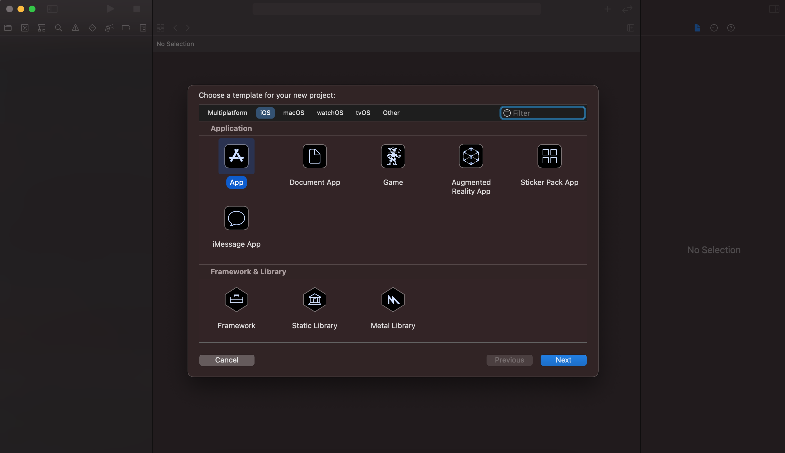

Seguido de esto, se nos solicitará indicar que tipo de proyeto deseamos. Ingresamos el nombre, identificador, interfaz, ciclo de vida y lenguaje de programación que usará el proyecto.

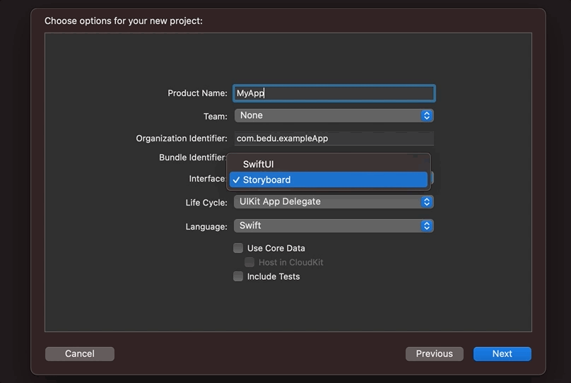

Al dar click en Next se mostrará el editor.

Estudiemos las partes que lo componen.

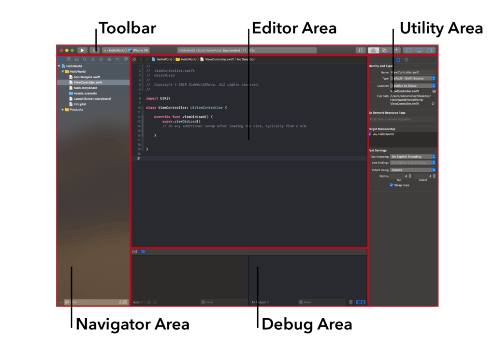

Es importante ubicar estas zonas, ya que en las siguientes sesiones se hará mención de ellas para referirnos en que lugar de Xcode se encuentra cierta opción.

- `Toolbar`: Aqui tenemos las opciones de ejecutar código, simulador, mostarar/ocultar paneles de Xcode, y otras opciones para editar codigo.
- `Navigation Area`: Se enlistan los archivos pertenecientes al proyecto. De igual forma se llegan a mostrar mensajes de error, breakpoints o información relacionada a commits de git. Igualmente es muy usado para buscar código dentro de todo nuestro proyecto.
- `Editor Area`: Simplemente es donde escribimos nuestro código o bien editamos la UI.
- `Utility Area`: Podriamos pensar que es la zona donde encontramos las preferencias de cualquier cosa de Xcode, como las de un archivo, elemento de UI, paquete, etc. La información que podemos encontrar va desde su directorio o a que Target pertenece.
- `Debug Area`: En esta zona encontraremos los Logs de la app, tambien podremos hacer uso de los breakpoints al momento de hacer debugging y ver sus valres aqui.
 
 
### Creando playgrounds en Xcode
 
 Xcode proporciona un editor de código que es muy útil para hacer pruebas rapidas de Swift y proyectos realmente sencillos, este es conocido como Playground.
 
En Xcode vamos a `File > New > Playground...`, elegimos `Blank` y siguiente.
 
 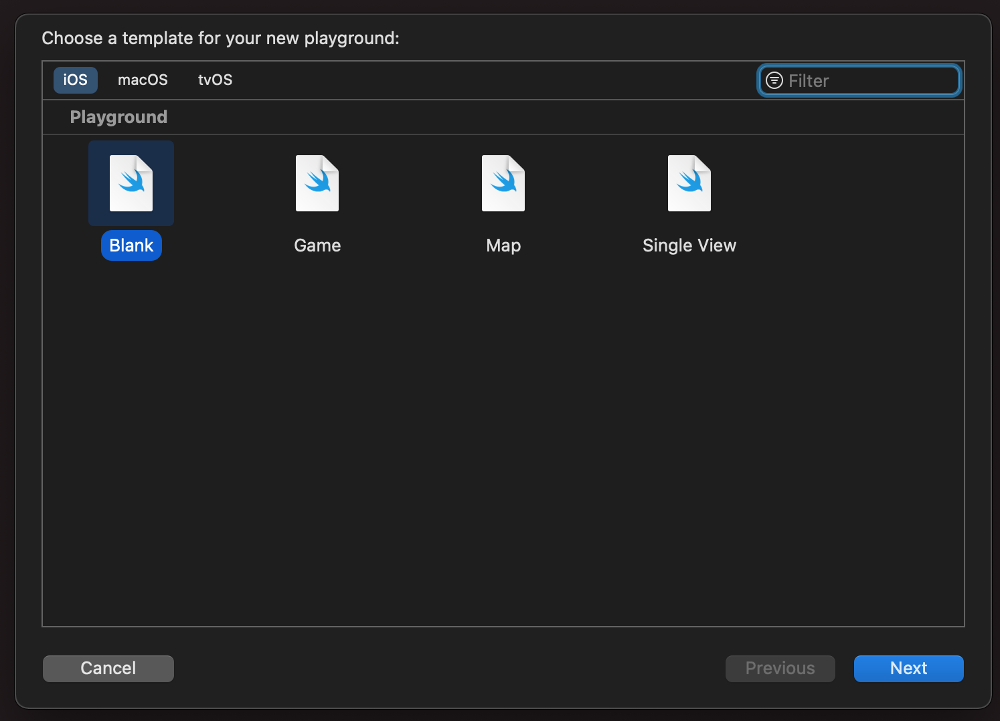
 
 En un Playground es donde iremos probando nuestro código de Swift win necesidad de crear un proyecto en iOS. En el Ejemplo-02 haremos uso de los Playgrounds.
 
### Conceptos y consideraciones

Antes de comenzar con la creación de Apps en iOS debes saber que existen diferentes formas de crear un proyecto desde cero. Sin importar si usas o no SwiftUI, SceneDelegate o AppDelefate el proceso de ejecución de inicio de una App es el mismo.

**Veamos en que consiste...**

Al ejecutar una App, una secuencia de pasos complejos son ejecutados, muchos de los cuales `UIKit` maneja de manera automática. Durante la secuencia de lanzamiento, `UIKit` invoca métodos (funciones) del app delegate para que se puedan ejecutar ciertas tareas. Esto puede verse en el siguiente diagrama.

Ver mas [About the App Launch Sequence](https://developer.apple.com/documentation/uikit/app_and_environment/responding_to_the_launch_of_your_app/about_the_app_launch_sequence).

- La app es ejecutada, Xcode proee una función `main()` que a su vez ejecuta la función main de `UIKit`, `UIApplicationMain()`.

- La función  `UIApplicationMain()` crear un objeto de tipo UIApplication y tu app delegate.

- UIKit llama al delegate de tu app, y ejecuta la función ` application(_:willFinishLaunchingWithOptions:)`.

- Hay un paso de restauración de estados, el cuál ejecuta metodos adicionales de tu app delegate y view controllers.

- UIKit ejecuta la función de app delegate `application(_:didFinishLaunchingWithOptions:)`.

Cuando la inicialización esta completa, el sistema usa tanto el `scene delegate` o `app delegate` para mostrar la `UI` y posteriormente manejar el ciclo de vida de tu app.

Considera leer este articulo de Medium al respecto [iOS Application Launch Sequence](https://swiftlyanand.medium.com/ios-application-launch-sequence-a13a267d1669).

##### ¿Que hay que considerar antes de crear un proyecto?

Primero comenzamos con el tipo de dispositivo a soportar, ya sea iPhone, iPad, Watch, Apple TV o Mac.

Una vez definido el dispositivo, hay que elegir la versión del sistema operativo, por ejemplo `iOS 13`.

Esto es importante ya que es nuestro punto de partida, esto definirá si utilizaremos entre `AppDelegate`, `SceneDelegate` o `SwiftUI`.

##### ¿Con que opciones contamos?

- `AppDelegate` es utilizado principalmente en sistemas menores a iOS 13, pero compatible con cualquier versión.

- `SceneDelegate` se introdujó a partir de iOS 13. La idea es poder tener multiples ventanas en una app.

- [SwiftUI](https://developer.apple.com/documentation/swiftui/) esta disponible a partir de iOS 13 bajo la versión de Swift 5.1+. Es la nueva propuesta para UI en iOS. El problema radica en que no esta soportado en versiones inferiores a iOS 13.

### AppDelegate

El App Delegate adopta algo conocido como protocolo `UIApplicationDelegate`, el cuál forma parte del framework `UIKit`.

Como se menciona en la documentación oficial de Apple, el App Delegate es el objeto raiz de tu app, él trabaja en conjunto con `UIApplication` para manejar algunas interacciones con el sistema. Este objeto de app delegate interactua principalmente con eventos de inicio de una App.

Es decir, si queremos ejecutar tareas en la App cuando esta recien inicie su ejecución o bien, cuando salgamos de la app, estos eventos pueden ser manejados por funciones del App Delegate.

Mas sobre funciones de AppDelegate: [App Delegate documentation](https://developer.apple.com/documentation/uikit/uiapplicationdelegate).

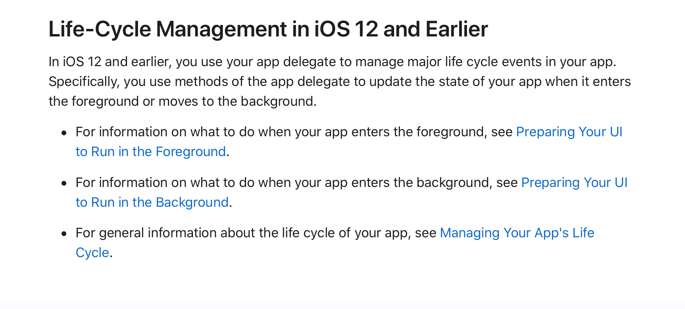

 A todo esto, ¿A que nos referimos?. Bueno, al crear un proyecto en Xcode encontramos un archivo llamado `AppDelegate.swift`. Dentro de esta clase vemos que hay algunas funciones predefinidas.

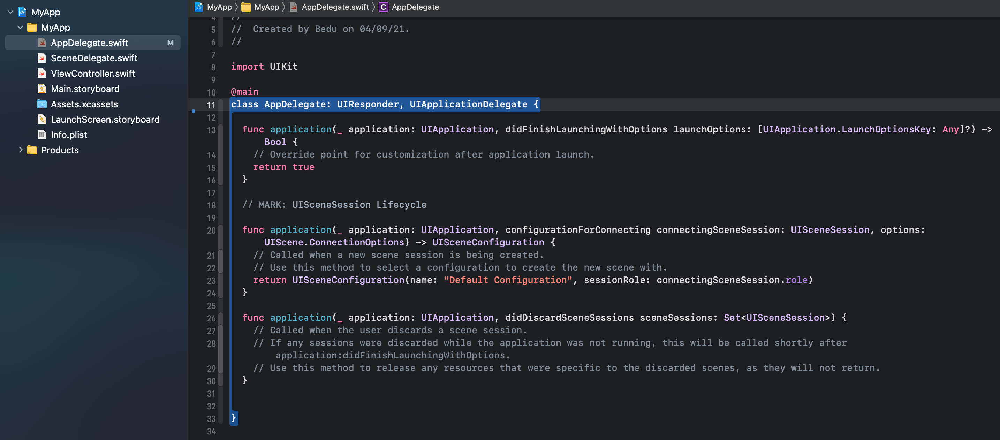
 
Una de las funciones mas usadas en el desarrollo de iOS es `didFinishLaunchingWithOptions`, esta función ejecuta tareas que esten contenidas en ella una vez que la App se ejecuta.

Por ejemplo, si quisieramos usar otro Storyboard en lugar del predefinido como Main, escribimos el código en esta función. Veamos el siguiente ejemplo donde cargamos un Storyboard distinto al predefinido.

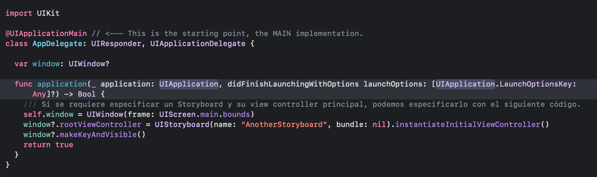

### SceneDelegate

A la llegada de iOS 13 se introdujo el concepto de Scene, que basicamente viene a ser un nuevo concepto para "Ventanta". La idea de que una app tenga Scenes consiste en poder tener varios tipos de ventanas, es decir una app multi-window. Pensemos en una App que tenga una ventana para iOS y una para iPad.

Con la llegada de `SceneDelegate`, las responsabilidades se dividen.

- AppDelegate será responsable del cliclo de vida de la app y de su configuración.

- SceneDelegate se encargará de manejar el contenido en la pantalla mediante Scenes.

Para el SceneDelegate tenemos una función que es considerada la mas importante, esta es `scene(_:willConnectTo:options:)`. Esta función es llamada cuando una Scene es agregada a la app.

Como mencionamos, un `SceneDelegate` toma responsabilidades de un `AppDelegate`, en particular aquellos relacionados con UIWindow, que ahora será `UIScene`.

Una app puede tener mas de una Scene.

Las funciones que pueden ser ejecutadas por `SceneDelegate` son:

1. `scene(_:willConnectTo:options:)`
2. `sceneDidDisconnect(_:)`
3. `sceneDidBecomeActive(_:)`
4. `sceneWillResignActive(_:)`
5. `sceneWillEnterForeground(_:)`
6. `sceneDidEnterBackground(_:)`

Describiremos cada una de ellas brevemente:

- `scene(_:willConnectTo:options:)`:

Este es el primer metodo llamado en el ciclo de vida de `UISceneSession`.
Esta función creará una nueva ventana de tipo UIWindow, establece el root view controller y hace de esta la ventana principal para ser mostrada.

- `sceneWillEnterForeground(_:)`:

Cuando el Scene esta por iniciar, esto es cuando la app se "Activa" por primera vez o cuando transiciona del brackground al foreground.

- `sceneDidBecomeActive(_:)`:

Esta función es llamada despues de `WillEnterForeground` y aquí la Scene es configurada y visiple, lista para usarse

- `sceneWillResignActive(_:) and sceneDidEnterBackground(_:)`:

Esta función es llamada cuando la app entra al background.

- `sceneDidDisconnect(_:)`:

Cuando el Scene es enviado al background, iOS decidirá si descartarla para liberar recursos. Esto no significa que la app no este en ejecución, sino que solamente la Scene esta desconectada de la sesión y esta como "no activa". En otras palabras, puede haber procesos en ejecución sin una vista de UI. 

De igual forma, iOS puede decidir si reconectar de nuevo esta Scene a su sesión cuando el usuario vuelva a interactuar con esta.
 
 
### SwiftUI

Por último mencionaremos brevemente este paradigma de iOS. Recientemente se introdujo el uso de SwiftUI como nueva propuesta para la creación de UI en apps de iOS (y en general todo el ecosistema Apple). Esta nueva propuesta incluye una nueva sintaxis conocida como programación declarativa.

Para comenzar, al crear un proyecto en iOS encontraremos que SwiftUI ofrece utilizar `AppDelegate` con `SceneDelegate` y solo usar el ciclo de vida de `SwiftUI App`.

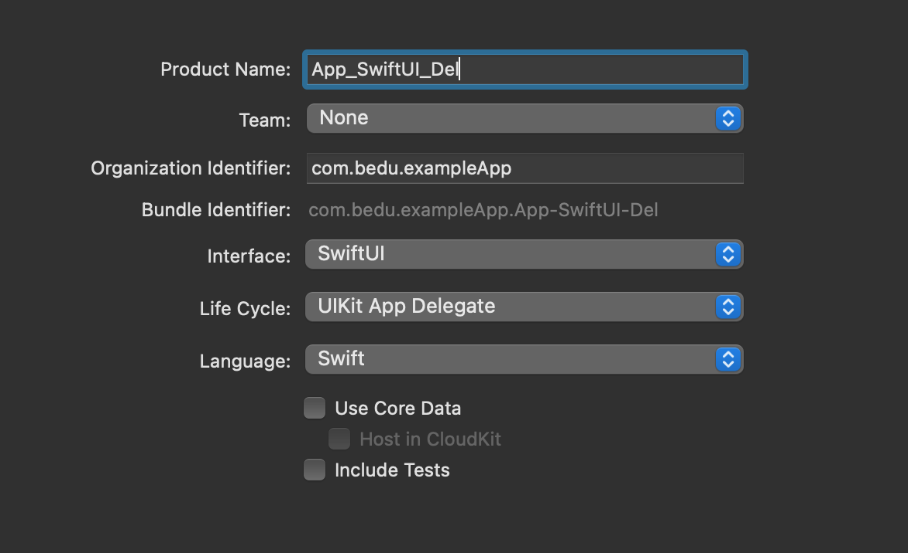

Si elegimos utilizar el ciclo de vida de UIKit App Delegate los archivos de inicio son similares a los que encontramos al crear una App utilizando Storyboards, a excepción de que tenemos un archivo adicional llamado *ContentView*.

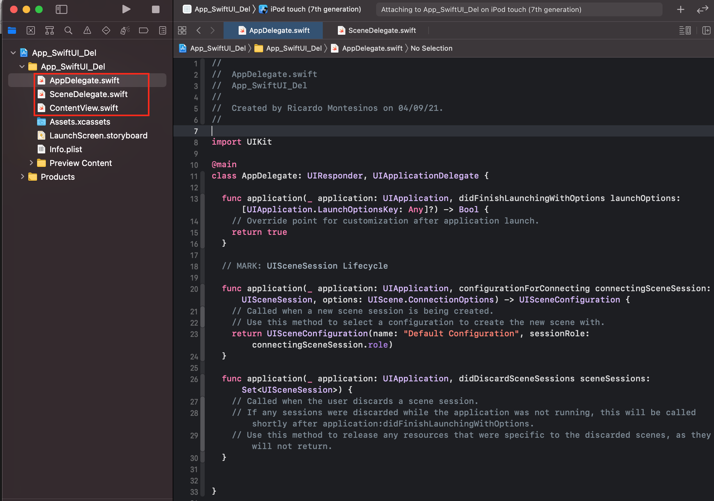

Dentro de SceneDelegate tenemos la implementación de ContentView.

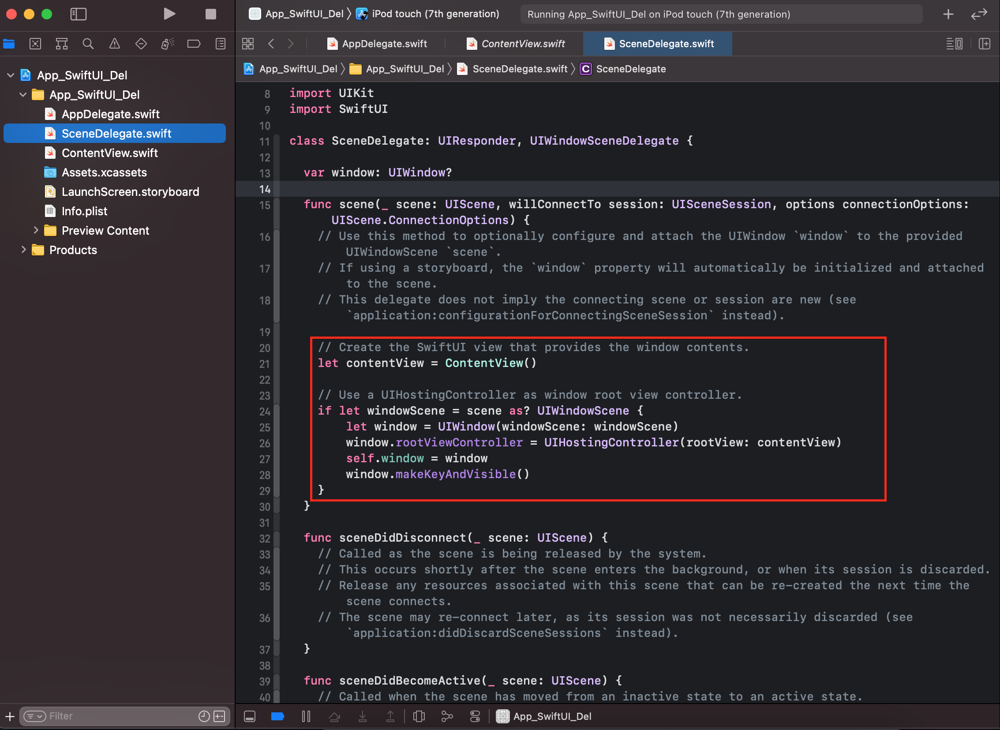

ContentView es la capa de código de SwiftUI, esta posee un previsualizador.

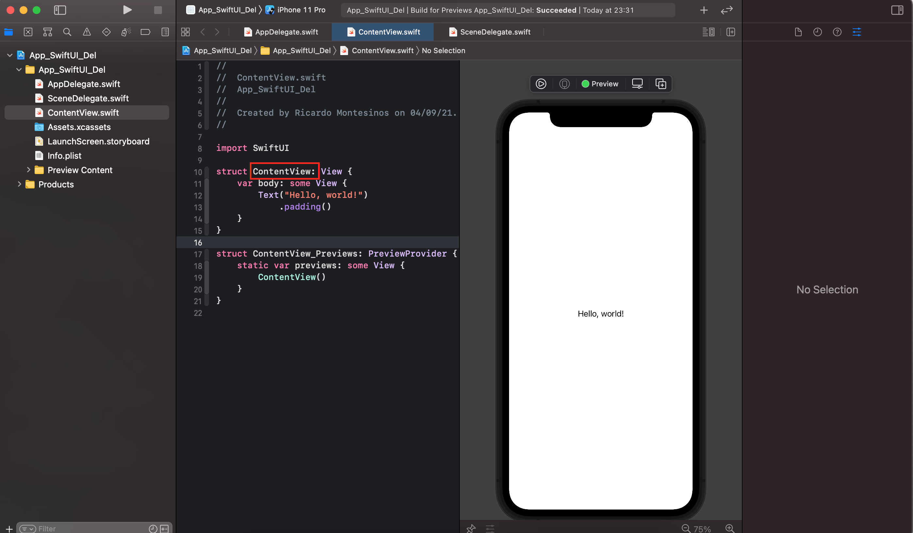

### Ejemplos y Retos

- Ejemplo-01: Uso del Simulador

	[Ejemplo 01](Ejemplo-01)

- Ejemplo-02: Jugando en los Playgrounds

	[Ejemplo 02](Ejemplo-02)

- Ejemplo-03: Creando un proyecto con UIKit - AppDelegate, Switf y Storyboards.

	[Ejemplo 03](Ejemplo-03)
 
- Reto-01. Crear un proyecto con UIKit - AppDelegate, con un Storyboard adicional.

	[Reto 01](Reto-01)

- Reto-02. Crear un proyecto sin utilizar Storyboard. 

	[Reto 02](Reto-02)

- Reto-03. Crear un proyecto sin utilizar Storyboard y con AppDelegate

	[Reto 03](Reto-03)
   

### Postwork

- [Creación de Proyectos y Playgrounds](Postwork)

