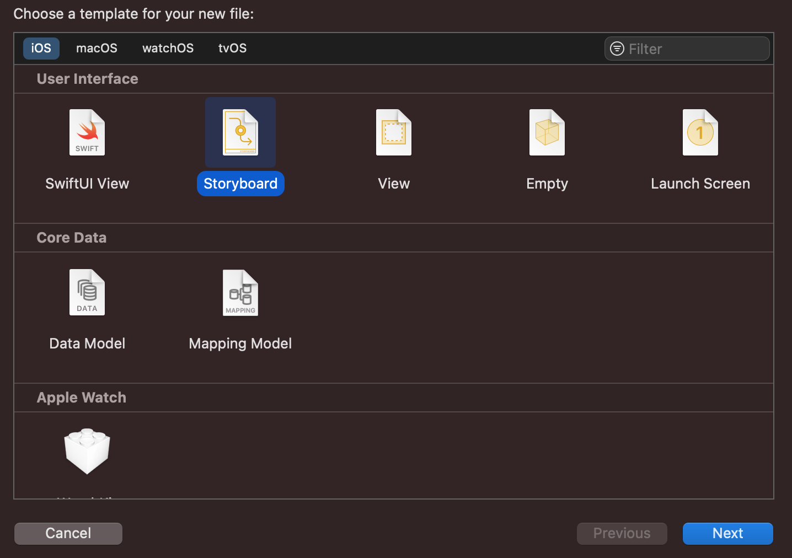
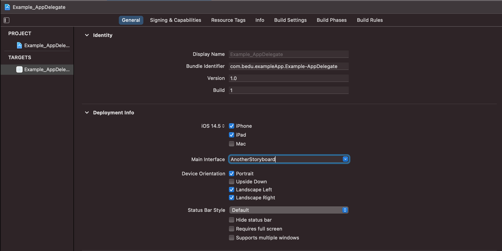
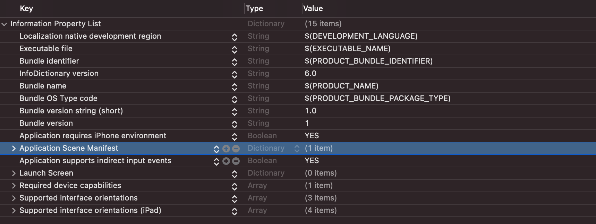
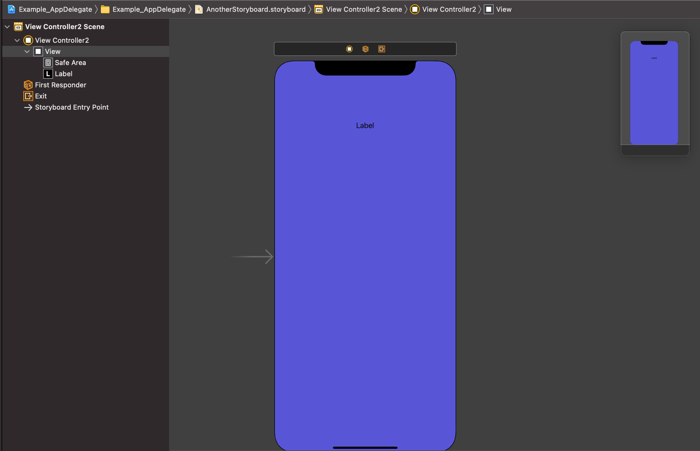

 

`Desarrollo Mobile` > `Swift Fundamentals`
 
	
## Reto-01. Crear un proyecto con UIKit - AppDelegate, con un Storyboard adicional.

### OBJETIVO 

- Crear un proyecto que reemplacé el Storyboard por defecto Main.

#### REQUISITOS 

1. Xcode 12.5.1

#### DESARROLLO

**Requisitos**

Crear un proyecto nuevo, indicando en Interface: Storyboard, Life Cycle: UIKit App Delegate y lenguaje Swift.

El proyecto no debe hacer uso de SceneDelegate.

**¿Como comenzamos?**

Agregar un nuevo Storyboard dando click derecho sobre el navigation de archivos, seleccionamos New File. y agregamos un Storyboard.

En la configuración general de nuestro target, asignamos este nuevo Storyboard como Main Interface.

Vamos a nuestro `Info.plist` y eliminamos el manifest de SceneDelegate, este valor es `Application Scene Manifest`. 

En nuestro nuevo Storyboard agregaremos un nuevo View Controller, lo personalizamos a nuestro gusto. Este nuevo ViewController sera nuestro nuevo Initial View Controller.

¿A partir de aquí iras solo, que falta para hacer funcionar este proyecto?

	
Solución

	
 El siguiente paso para hacer funcionar el proyecto es por supuesto indicar que nuestro nuevo view controller es el inicial. Desde nuestro nuevo Storyboard, seleccionamos el ViewController y desde el Inspector en Attributes seleccionamos `Is Initial View Controller`.

	
 Creamos un nuevo ViewController con extensión `.swift` y lo asignamos a este ViewController del nuevo Storyboard. 

	
 Agregamos el main en nuestro archivo AppDelegate, este es `@UIApplicationMain`, justo arriba de class. 

	
 A nuestra ventana o variable window asignamos el view controller nuevo, este debe hacer referencia al nuevo Storyboard. Por último indicamos que esta ventana es visible. Veamos el código dentro de `didFinishLaunchingWithOptions`: 

	
 
	self.window = UIWindow(frame: UIScreen.main.bounds)
    window?.rootViewController = UIStoryboard(name: "AnotherStoryboard", bundle: nil).instantiateInitialViewController()
    window?.makeKeyAndVisible()
   

 

