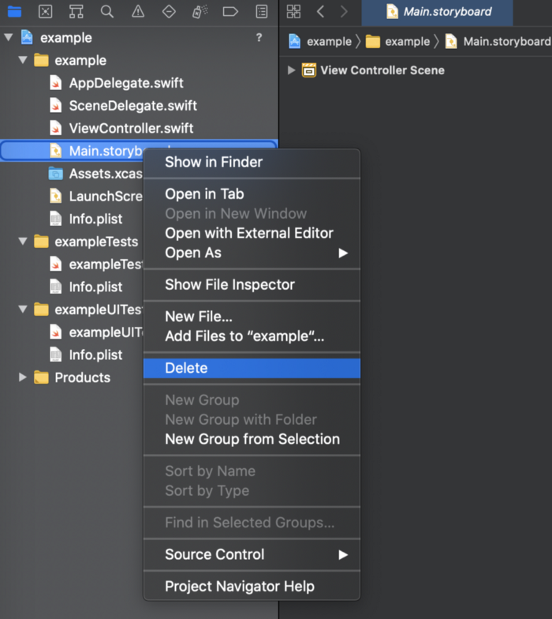
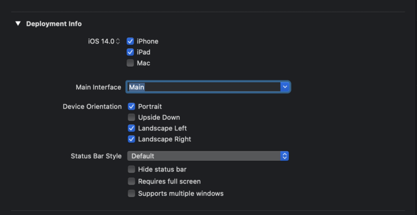
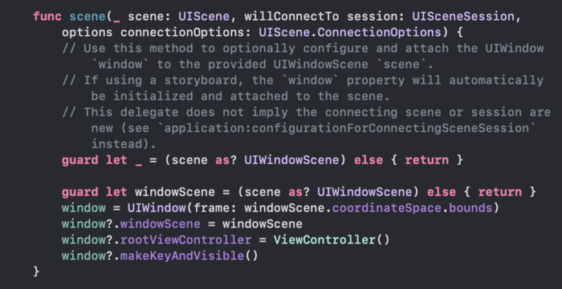

 

`Desarrollo Mobile` > `Swift Fundamentals`
 
	
## Reto-02. Crear un proyecto sin utilizar Storyboard. 

### OBJETIVO 

- Crear un proyecto que no utilice Storyboard para su UI.

#### REQUISITOS 

1. Xcode 12.5.1

#### DESARROLLO
 
 Crearemos un nuevo proyecto de Xcode para iOS con Interface Storyboard, Life Cycle UIKit y Language Swift.
 
 Una vez que cargue nuestro proyecto, en el panel de Navigation o Archivos borramos `Main.storyboard`.
 
 

Seleccionamos el proyecto, vamos a General y en Deployment Info borramos la referencia a Main.

**Hay que eliminar una referencia mas, ¿Adivinas donde?**

Explora el proyecto y descubre donde tienes que eliminar este valor, recuerda es una referencia a Main.
 
En nuestro SceneDelegate.swift agregamos el sig. código. Con esto crearemos la vista.

 
 

	
Solución

	
 La referencia a eliminar se encuentra en el Info.plist 

	
 Buscamos Application Scene Manifest, Scene Configuration, Application Session Role, Item 0, Seleccionamos el string Storyboard Name y lo borramos con el boton de menos (-) 

	
 En el mismo Info.plist, buscamos Main Storyboard file base name y lo eliminamos.

 

 

