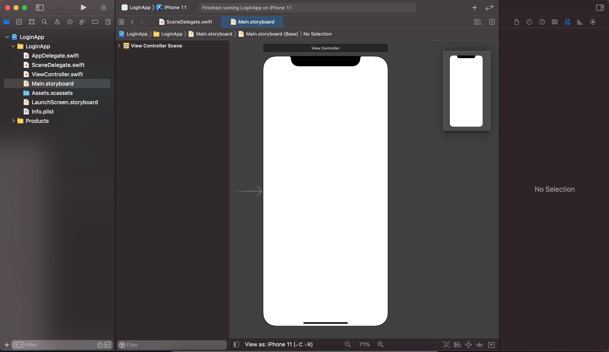
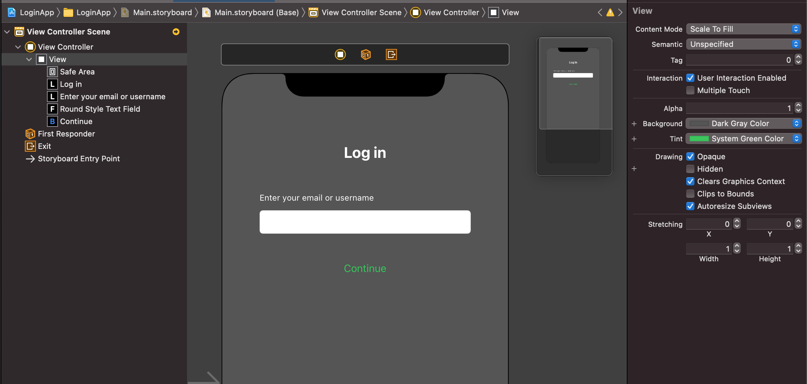
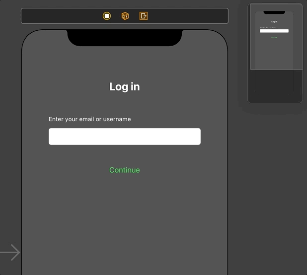
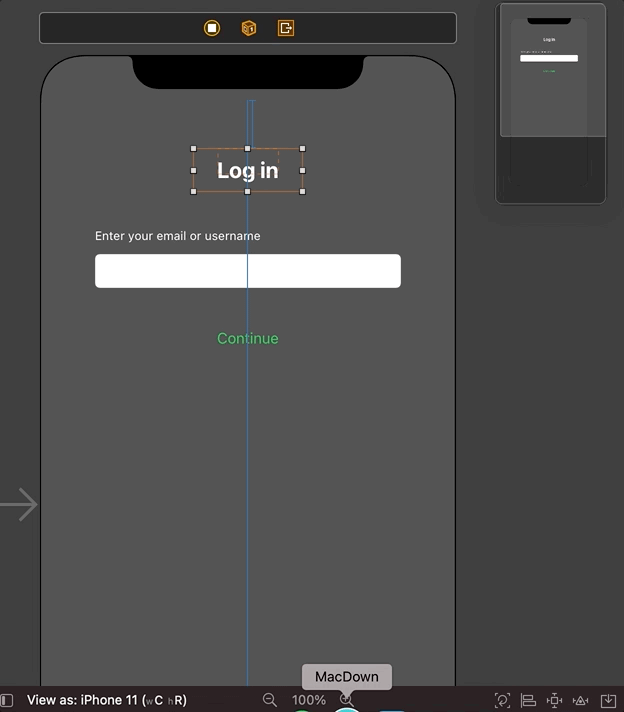
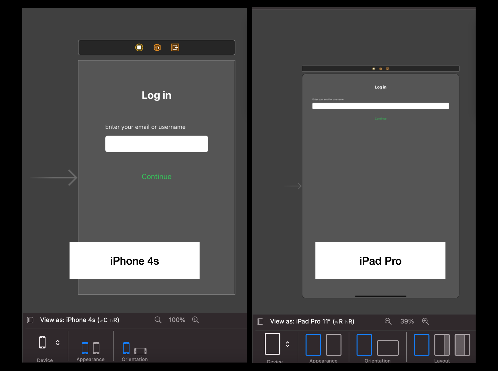

`Desarrollo Mobile` > `Swift Fundamentals`

## Ejemplo-01: Crear una vista agregando elementos de UI haciendo uso de constraints

### OBJETIVO

- Agregar mas elementos de UI a tu vista de storyboard.

#### DESARROLLO

1.- Crear un nuevo proyecto con el nombre `LoginApp`. Este proyecto usará Storyboards, UIKit y Swift.

2.- Nos dirigimos al Storyboard.

3.- Agregamos los elementos tipicos de una vista de Login. No olvides personalizarlos.

4.- Una vez acomodados los elementos, asignamos los constraints. Podemos usar los menus inferiores dedicados a esto o mediante control + click.

Comenzamos con el Label de Login, damos un espacio Top y una alineación respecto al Centro de la pantalla. 

Posteriormente e asignamos un ancho y alto (width y height).

Continuamos con el Label con la leyenda "Enter your email or username". Lo alineamos con el TextField y damos un espacio entre ellos.
Este Label también tendra una distancia respecto a la izquierda y con el elemento superior. Asignamos los elementos faltantes de ancho y alto.

Hacemos lo mismo con el botón de Continue, lo centramos con la pantalla y damos un espacio con el elemento superior mas próximo.

5.- Probamos cambiando de vistas para tener una previsualización, vemos que los elementos conservan cierta simetria al cambiar de pantalla.

