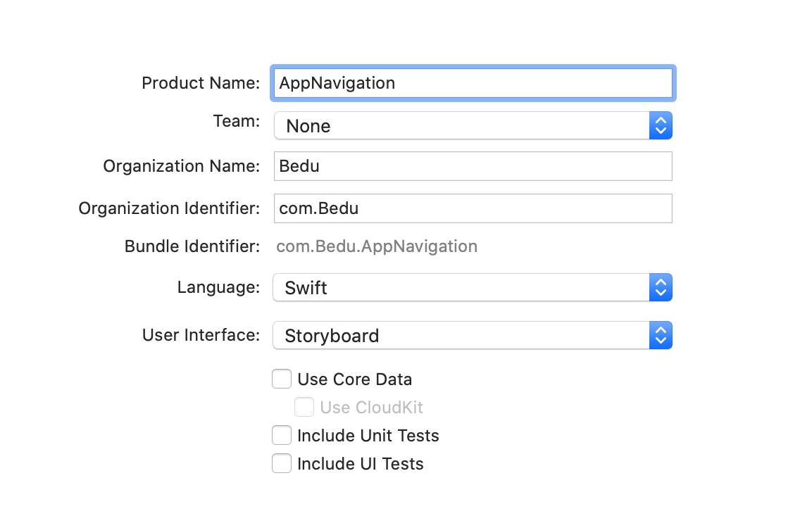
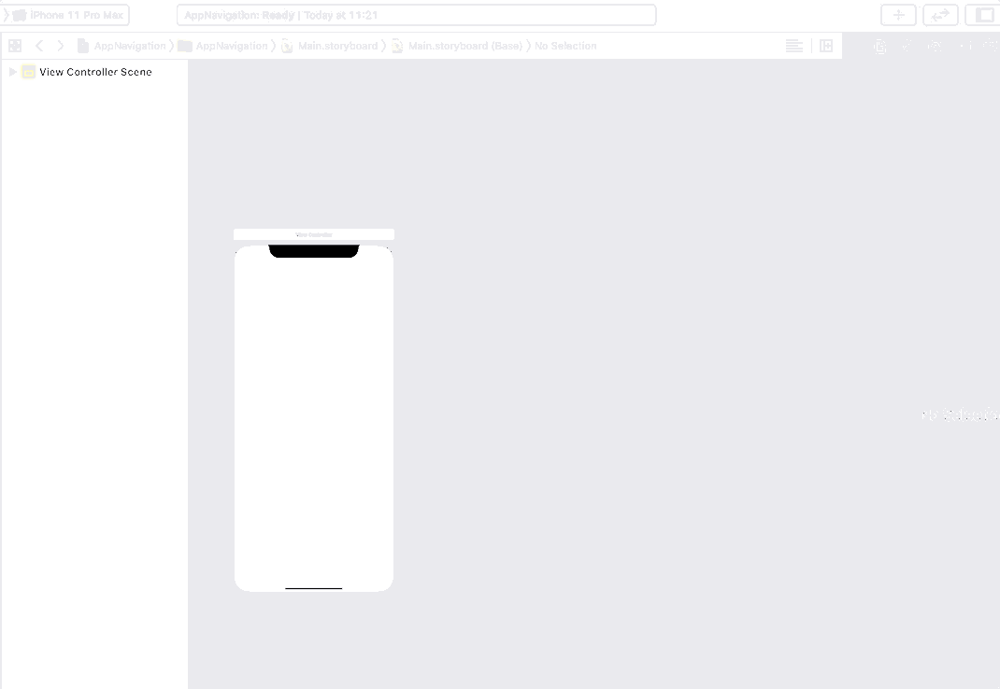

`Desarrollo Mobile` > `Swift Fundamentals`

## Navigation, flujo entre dos vistas

### OBJETIVO

- Aprender como conectar dos vistas en el Storyboard y como ir de la vista raiz (root) a la segunda vista.

#### REQUISITOS

1.- Crea un proyecto en Xcode como **Single View App**, con las opciones como se muestran a continuación:

2.- Abrir el Storyboard, y agregar un ViewController adicional.

3.- Al Primer ViewController agregar un UIButton.

4.- Conectar el UIButton como Push.

5.- Configurar el flujo como Navigation. Ir a menú `Editor > Embed In > Navigation Controller`

6.- Ejecutar la App.
