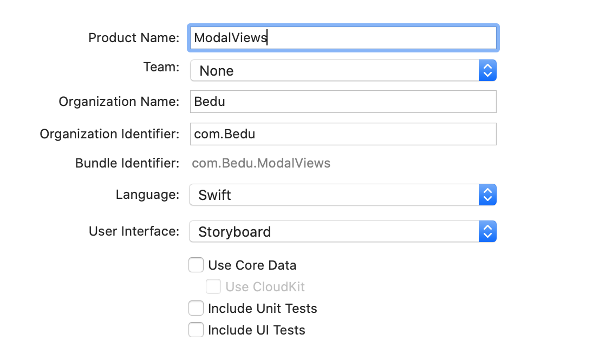
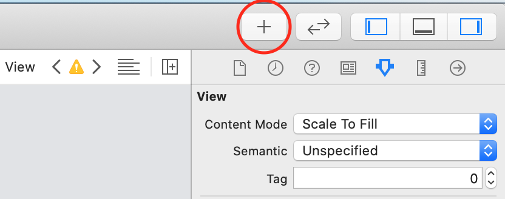
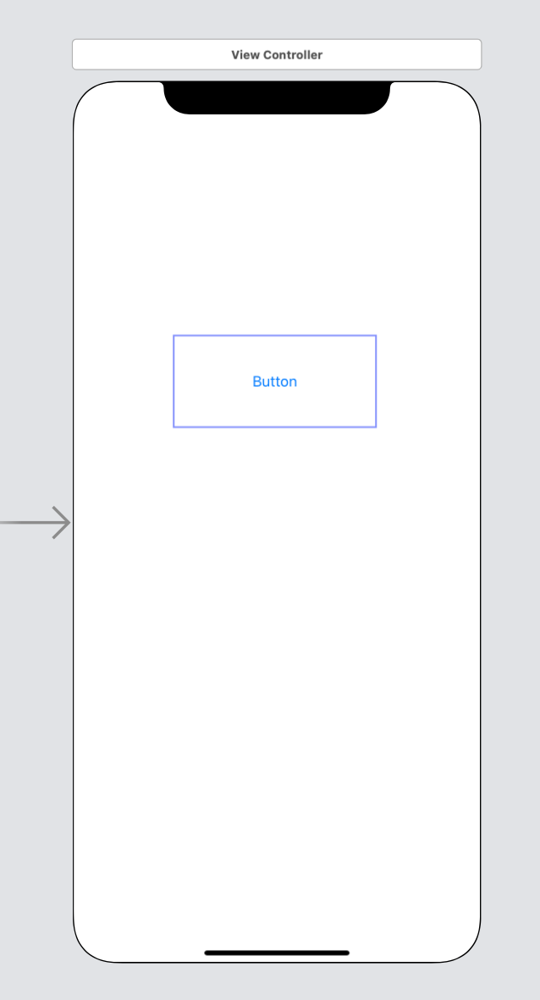
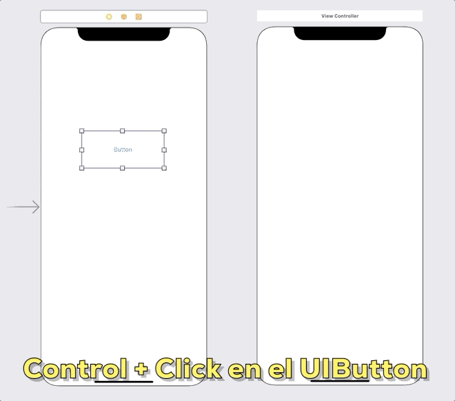

`Desarrollo Mobile` > `Swift Fundamentals`

## Agregando una segunda vista

### OBJETIVO

- Ya se conoce como ir a una segunda vista mediante *Show* (push). Al finalizar este ejemplo se aprenderá una alternativa para mostrar vistas.

#### REQUISITOS

1.- Crea un proyecto en Xcode como **Single View App**, con las opciones como se muestran a continuación:

#### DESARROLLO

1.- Una vez creado el proyecto, ir a Storyboard.

2.- Dentro del Storyboard, agregar un nuevo ViewController con el botón **+** ubicado en la esquina superior derecha del editor.

3.- Agregar un UIButton a la primera vista.

 
4.- Conectar el UIButton con la segunda vista con **Present Modally**.

5.- Ejecutar la App.
