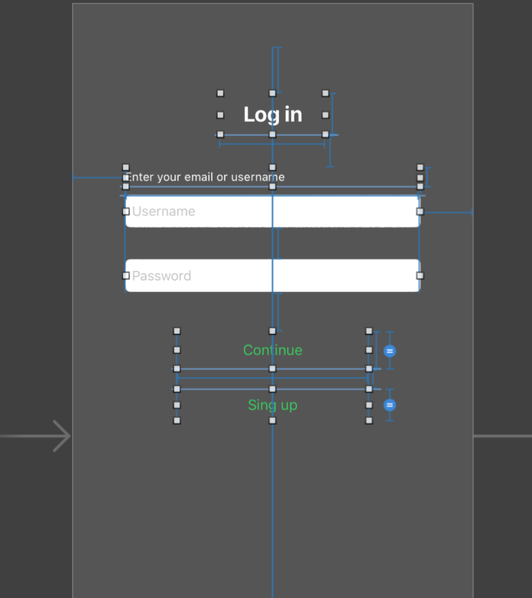
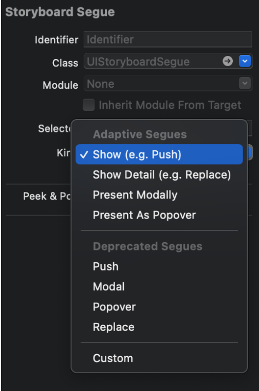

`Desarrollo Mobile` > `Swift Fundamentals`

## Postwork: Tu Primera App

### OBJETIVO

- Crear un flujo de navegación mediante Storyboards en el proyecto modular.

- Agregar constraints y aplicar personalización al flujo de navegación.

#### DESARROLLO

En este Postwork se crearán dos vistas para tu proyecto final, una de Login y la otra de Sign Up.  Ambas vistas serán con elementos del Library de Storyboard y con la función de navegación de una vista a otra mediante push.

Recuerda que todo lo trabajado en tu prework, así como durante la sesión, puede ser aplicado a tu proyecto personal. 

**Indicaciones generales:**

El propósito de este Postwork es realizar las modificaciones descritas a continuación para lograr el resultado de vistas y navegación de la imagen. 

Comenzamos con la pantalla inicial de Login.

1. En la pantalla de Login se debe agregar un Label en la parte superior a manera de título. Podemos usar este componente como base para alinear las distancias con el siguiente Label que lleva como texto “Enter your email or username”. Los valores de las dimensiones son abiertas al desarrollador, al igual que los colores.

2. Define los constraints de cada elemento de UI como se muestra en la imagen.

Nota: En Storyboard es muy común caer en redundancias, es decir, agregar constraints innecesarios o duplicar valores. En caso de llegar a duplicar un constraint simplemente se borra haciendo click sobre él y presionando la tecla delete (backspace).
colores.

3. Por último implementa la navegación de una vista a otra. Se sugiere usar el modo modal de Show o Push.

