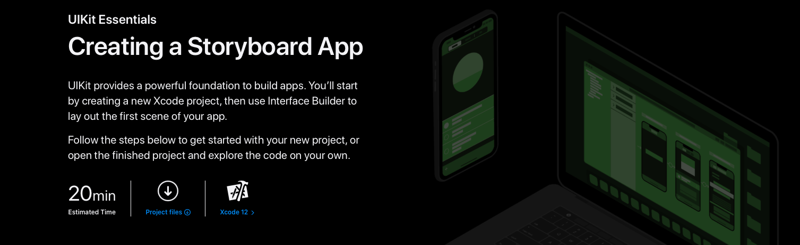

`Desarrollo Mobile` > `Swift Fundamentals`

## :wave: Sesión 3: Tu Primera App    

### 🎯 Objetivo de la sesión:

- Aprender a utilizar el Storyboard

### ⚙ Configuración

Software instalado:

- Xcode 12.5.1
- Command line tools 

### 🎯 Qué aprenderán

- Uso de Storyboard
- Personalización de vistas mediante el inspector
- Hola mundo desde el storyboard
- Agregando mas de una vista mediante el Storyboad
- Constraints

### 🎩 Desarrollo

En esta sesión aprenderemos a utilizar el Storybaord para crear una app sencilla utilizando vistas de navegación, tabs, constraints y personalización basica de los elementos de UI.

#### Antes de comenzar...

Con la creación de Apps en iOS debes saber que existen diferentes formas de crear un proyecto desde cero.

##### ¿Que hay que considerar?

Recapitulando... primero comenzamos con el tipo de dispositivo a soportar, ya sea iPhone, iPad, Watch, Apple TV o Mac.

Una vez definido el dispositivo, hay que elegir la versión del sistema operativo.

Esto es importante ya que es nuestro punto de partida, esto definirá si utilizaremos entre `AppDelegate`, `SceneDelegate` o `SwiftUI`.

##### ¿Con que opciones contamos?

- `AppDelegate` es utilizado principalmente en sistemas menores a iOS 13, pero compatible con cualquier versión.

- `SceneDelegate` se introdujó a partir de iOS 13. La idea es poder tener multiples ventanas en una app.

- [SwiftUI](https://developer.apple.com/documentation/swiftui/) esta disponible a partir de iOS 13 bajo la versión de Swift 5.1+. Es la nueva propuesta para UI en iOS. El problema radica en que no esta soportado en versiones inferiores a iOS 13.

### Creando tu primera App

Bien manos a la obra, vamos a iniciar por la creación de un proyecto utilizando Storyboard. En Xcode nos dirigimos a `File > New Project...`, elegimos `App` y en la sig. pantalla agregamos la configuración mostrada.

En la app tenemos el campo de *Organization Identifier*, aqui agregamos el que deseemos siguiendo un formato similar a `com.<organization>.<appName>`. Para mas información puedes consultar el sitio de Apple: [Configuration Info](https://developer.apple.com/documentation/xcode/creating-an-xcode-project-for-an-app).

Finalizamos la creación del proyecto y vemos una pantalla similar a esta:

Ejecutamos la App, dando click en el triangulo que parece un botón de Play en la esquina izquierda.

El simulador se muestra en pantalla, identico a un dispositivo físico.

¡Excelente!, vamos a revisar mas a detalle que estamos creando. 

Elegimos el archivo de proyecto, donde vemos el número `1`, posteriormente la pantalla cambia mostrandonos en `2` el nombre de nuestro proyecto y en `3` el nombre de la App (este nombre solo lo usamos en nuestro proyecto y no necesariamente es el mismo que usarás en el AppStore).

A esta sección le llamaremos `info` y es muy importante ya que aqui estableceremos la versión de iOS minima compatible de nuestra app, esto en la flecha `A`.

A continuación se muestra *Configurations* (flecha `B`), de igual forma es muy importante ya que mientras estamos desarrollando una App es usual tener múltiples ambientes de desarrollo como el de pruebas o de producción. Claro que puedes configurar tantos necesites.

Por último en esta sección de Info tenemos *Localizations* (flecha `C`), no es mas que los idiomas elegidos para tu app.

Ahora bien, identifiquemos la zona de TARGETS y elegimos la que tiene el nombre de nuestro proyecto. 
Dentro de General, identificamos *Identity* con la flecha de nombre `A`, se most rará la configuración del proyecto, tales como la versión de la app, el número de build, el bundle identifier y el Display Name que es el nombre que mostrará la app en el dispositivo.

Seguimos con `B`, Deployment Info. Aqui elegimos si nuestro proyecto será compatible con iPhone, iPad y/o Mac. También se muestran opciones relacionadas con la pantalla y la interfaz principal de Storyboard.

Al final de esta vista tenemos opciones como la del icono que elegiremos para la App, tambien sobre que paquetes o dependencias el proyecto usará, es decir, librerias/frameworks de terceros.

### El Storyboard

Comencemos a agregar contenido a nuestra App, para ello nos dirigimos al storyboard. Dentro de nuestro panel de navegación de archivos buscamos `Main.storyboard`, damos click y la pantalla mostrará lo que se asemeja a un iPhone. 

Seleccionamos el ViewController (flecha `2`) o bien la vista/pantalla de la App. 

Con el inspector elegimos la opción de Identity (flecha `3`), en esta opción podemos ver a que archivo de Swift esta asociada la vista, en este caso vemos que el valor de `Class` es `ViewController`, esto significa que para que nuestra vista muestre contenido, el código debe ir en esta clase.

En la sesión anterior comentamos que el uso de Storyboards facilita a la visualización del flujo de navegación de pantallas creando un mapa.

Continuemos explorando el Storyboard, ampliemos las opciones de visualización dando click en `1` y luego en `2` como se muestra en la imagen.

Dentro de las opciones mostradas podemos elegir las pantallas disponibles en iOS tanto de iPhone como iPad, asi como modo oscuro y orientación de pantalla.

**TIP**: Elegir el tamaño de pantalla mas pequeño para comenzar a diseñar una UI.

### Diseñando tu Storyboard

Es momento de agregar contenido a tu Storyboard, ubicamos en Xcode un botón con el símbolo `+` damos click en él y una menú flotante aparecerá. En este menú se enlistarán los elementos de UI disponibles en Xcode, cabe mencionar que son elementos predefinidos, el programador puede crear sus propios elementos si asi lo desea.

Bien, damos click en `Label` y lo arrastramos a la pantalla.

Mantenemos seleccionado el UILabel agregado a la pantalla y vemos que hay cierta información mostrada. Primero, de lado izq. aparecerá `ViewController > View > Label`. Esta gerarquía muestra como estan contenidos los elementos uno dentro del otro. Ahora bien, aparece algo llamado *Safe Area*, esto es una referencia, ya que el contenido dentro del *Safe Area* esta garantizado que se mostrará en pantalla, es decir, cualquier elemento dentro de esta area esta dentro de los limites de la pantalla, incluyendo el espacio del *Notch* del iphone.

Por último, nos dirigimos al inspector, seleccionando la opción de Attributes. En esta opción vemos las diferentes opciones de configuración para nuestro UILabel, como color, tamaño, etc.

Al dar doble click sobre el Label podemos editar el texto que contiene.

Ejecutamos la App y veamos el resultado.

!Bien!, ahora hagamos el siguiente experimento. Desde el simulador y con el teclado presionemos las teclas `Command` + `Left/Right Arrow`. El simulador cambiará su orientación de Portrait a Landscape y visceversa. Es importante mencionar que el *Label* agregado a la pantalla no tiene ninguna referencia, es por eso que no se ve "alineado".

### Constraints y Autolayout

¿Como le decimos al Storyboard que mi elemento se comporte de la siguiente manera?, es decir, conservando su posición en la esquina a cierta distancia.

Para lograr este efecto es necesario utilizar **Constraints**. Los constraints son reglas de relación entre objetos de UI, es decir, establecemos posición, alineamiento, tamaños, distancia entre objetos, etc. Las opciones de constraints estan ubicadas en la parte inferior derecha del editor de Storyboard.

Comencemos con algo simple, arrastremos nuestro UILabel a la posición deseada, en nuestro caso sugiero acercarlo a una esquina. Seleccionamos el Label y presionando la tecla `control` + click-arrastar hacia la izquierda/derecha/arriba, un menú flotante se mostrará.

Las opciones mostradas son `Leading/Trailing/Top Space to Safe Area` (¿Recuerdas lo que comentamos sobre el safe area?). Damos click en la opción que necesitemos, Leading se referira a la distancia hacia el lado izquierdo, Trailing a la distancia de lado derecho y top a la distancia superior.

¿Y es la única manera para agregar constraints?, No. Existe mas de una manera para agregar un constraint en iOS y Xcode.

Comencemos de nuevo, borremos el Label anterior y agreguemos uno nuevo al a pantalla. En la sig. imágen mostramos los pasos para agregar Constraints haciendo uso del menú de opciones del Storyboard.

Seleccionamos el elemento `1`, damos click en el menú *Add new constraints* `2`, emergerá un menú flotante, aqui vemos algunos números y líneas rojas `3`. Estas son las distancias o padding del elemento elegido, es decir 43 unidades de distancia hacia el lado izquierdo o 35 unidades hacia el margen superior. Para agregar un constraint se debe dar click en la linea roja a manera de que se muestre de color rojo intenso (y no rojo apagado). Una vez elegido que constraints vamos a agregar, damos click en `Add 3 Constraints`, flecha `4`.

#### ¿Que sigue?

En los siguientes ejemplos cubriremos los siguietes temas:

- Como crear un flujo de vistas en Storyboard
- Como crear una app con tabs desde el Storyboard
- Uso de Constraints con mas elementos de UI

### Ejemplos y Retos

- Ejemplo-01: Crear una vista agregando elementos de UI haciendo uso de constraints.

	[Ejemplo 01](Ejemplo-01)

- Reto-01. Crear multiples vistas con elementos de UI

	[Reto 01](Reto-01)

- Ejemplo-02: Creando un flujo de navegación simple. Flujo entre dos vistas.

	[Ejemplo 02](Ejemplo-02)
	
- Reto-02. Ampliar el flujo de navegación agregando mas botones y vistas.

	[Reto 02](Reto-02)

- Ejemplo-03: Presentar vistas Modales.

	[Ejemplo 03](Ejemplo-03)
  
- Reto-03. Agregando mas vistas modales y botón de dismiss.

	[Reto 03](Reto-03)

  
### One more thing

Si quieres reforzar este conocimiento te invitamos a consultar la documentación oficial de Apple.

[Creating a Storyboard App](https://developer.apple.com/tutorials/app-dev-training/creating-a-storyboard-app)

[Setting Constraints with Auto Layout](https://developer.apple.com/tutorials/app-dev-training/setting-constraints-with-auto-layout)

### Postwork

- [Creación de Proyectos y Playgrounds](Postwork)

