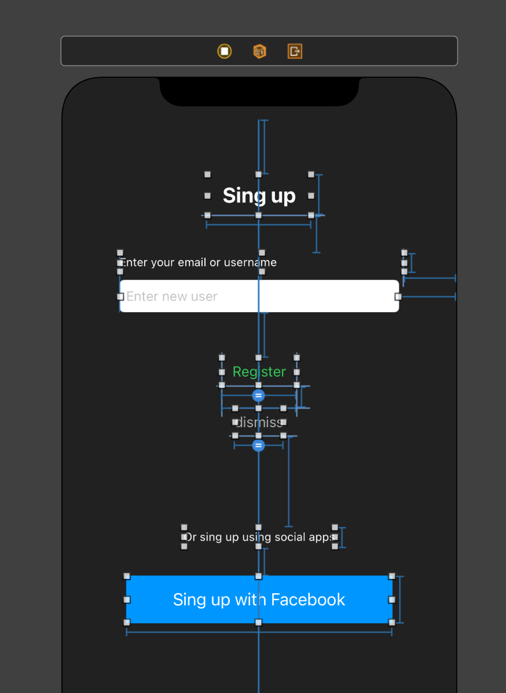

`Desarrollo Mobile` > `Swift Fundamentals`

## Reto-01: Crear multiples vistas con elementos de UI

### OBJETIVO

- Agregar mas elementos de UI a tu vista de Login.
- Crear una vista adicional para Sing Up.

#### DESARROLLO

Con base en el proyecto del Ejemplo-01, crearemos una vista adicional, esta vista deberá incluir la tradicional pantalla de Sing Up.

Veamos cual deberia ser el resultado:

