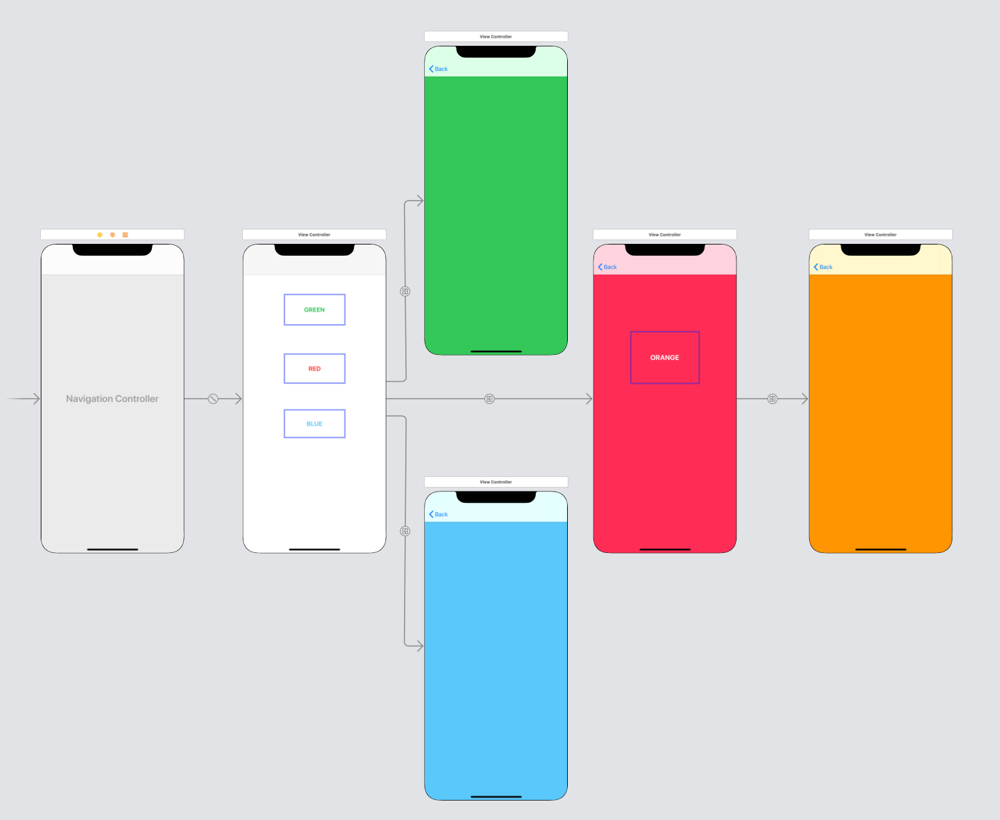
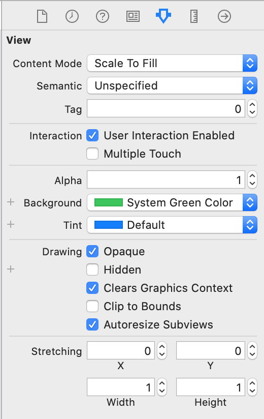

 

`Desarrollo Mobile` > `Swift Fundamentals`
	
## Navigation, haz un flujo mas largo en tu app.

### OBJETIVO 

- Conocer como agregar diferentes flujos a partir de diferentes vistas. La idea es crear un árbol de flujo de vistas.

#### REQUISITOS 

1. Utilizar el proyecto de Navigation del Ejemplo-03.

#### DESARROLLO

1.- Abre el proyecto de *Navigation* del *Ejemplo-03*.

2.- En el Storyboard agregar mas ViewControllers, los que gustes.

3.- Agregar botones a estos ViewControllers.

4.- Cambiar el color de fondo de cada ViewController.

5.- Conectar las vistas como se desee el flujo.

*TIP: Recrear un flujo parecido al siguiente*:

        
Solución

        
 Abrir el proyecto y dentro de Storyboard, realizar lo siguiente: 

        
 Cada ViewController se agregará mediante e*l botón de <strong>+</strong> ubicado en la esquina superior derecha, dicho botón es llamado <i>Library</i>. 

        
Al presionar el botón <strong>+</strong>, aparecerá un menú de componentes, buscar ViewController

        
Al tener ViewController, arrastarlo al Storyboard.

        
Selecciona cada View y en el Inspector cambiar el color de fondo Busca la opción Background.

        </img>
        
 Conectar cada vista mediante ctrl+click en el UIButton y el View deseado.

