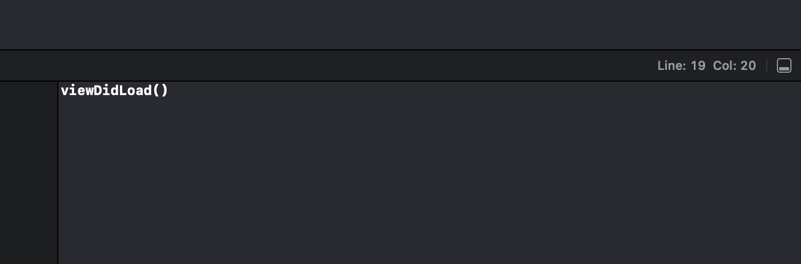
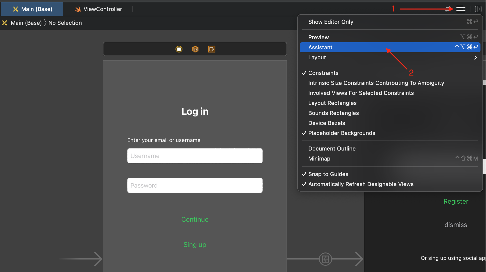
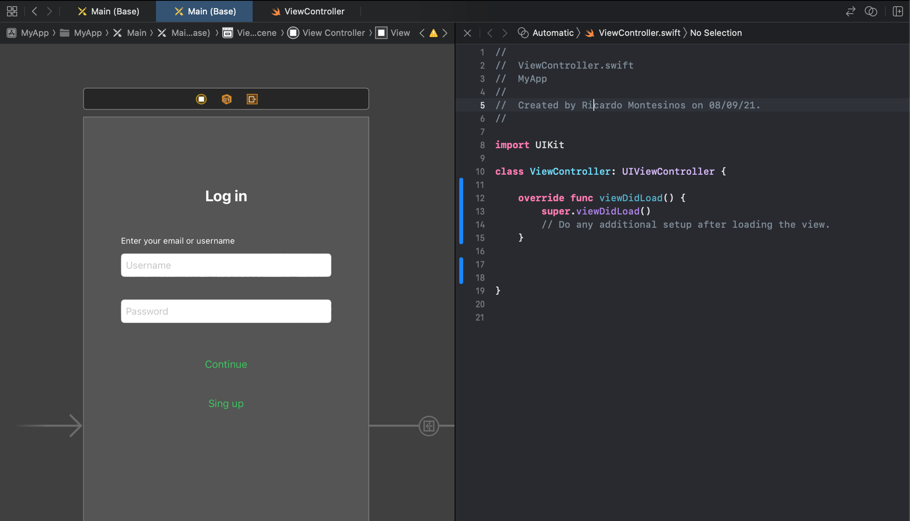
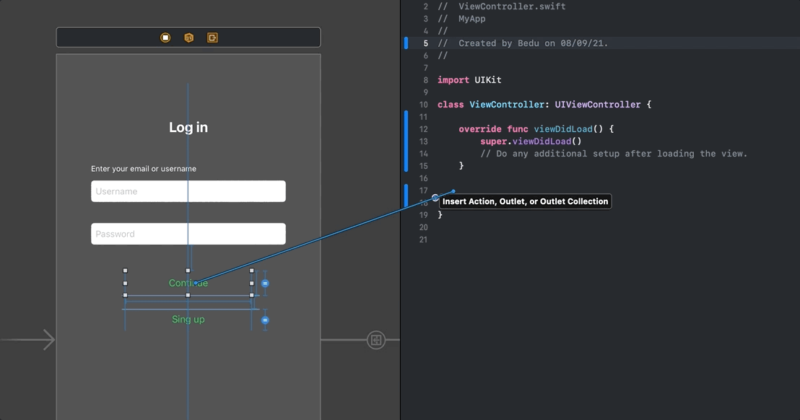
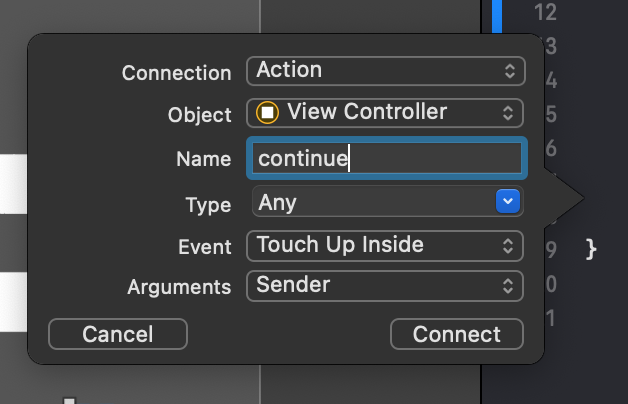
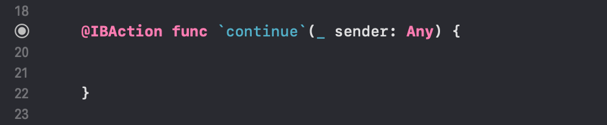
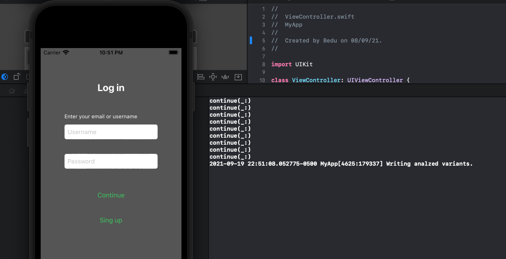

`Desarrollo Mobile` > `Swift Fundamentals`

## :wave: Sesión 4: Estructura básica del lenguaje Swift  

### OBJETIVO

- Implementar una sintaxis básica de Swift con funciones.

- Conectar elementos de Storyboard con Swift.

#### REQUISITOS

1. Proyecto de la sesión 03 funcionando.

#### DESARROLLO
 
Recuerda que todo lo trabajado en tu prework, así como durante la sesión, puede ser aplicado a tu proyecto personal. 

De acuerdo al ejemplo de funciones visto en el Work considera la siguiente sintaxis:

> func function_name(parameters) { }

Hay variantes de esta sintaxis, por ejemplo agregar parámetros con valores por defecto como:

> func myNameis(name: String = "Bedu") { }

En esta función se asignó un parámetro de tipo String que por defecto tendrá el valor de "Bedu".

Al implementar esta función es posible usarla de la siguiente forma.

> myNameis(name: "Ricardo")

En varios proyectos de programación es común el uso de la función `print()`. En este Postwork implementaremos una función de tipo print que permite saber qué función del proyecto se está ejecutando, es decir, cuando se ejecute la función *viewDidLoad* debemos mostrar en la consola un mensaje como el de la imagen debajo, y este comportamiento debe repetirse en cada función que declaremos.

Pista. En Swift existe la siguiente palabra reservada: `#function`. Al usarla, esta retornará el valor de la función en donde se encuentre, y el valor será de tipo String.

Por ejemplo:

> let name: String = #function

**Indicaciones generales:**

El propósito de este Postwork es realizar las modificaciones descritas a continuación al proyecto modular. Asegúrate de contar con los constraints para que las vistas se puedan ver apropiadamente.

1. Implementa una función que permita imprimir en consola el nombre de la función que está ejecutando.

2. Procede a crear IBActions con los pasos a continuación. Estas son funciones que se conectan directamente con los elementos de UIKit en el Storyboard, y en este caso será con los UIButtons.

	a) Hay que dirigirse al Storyboard y ubicar el ícono de líneas horizontales, hacer click sobre este y elegir Assistant entre las opciones de visualización desplegadas.

La vista se mostrará de la siguiente manera:

Esta opción de Assistant divide la pantalla entre Storyboard y editor de código, y gracias a esta función podemos conectar elementos de UIKit con Swift.

b) Se hace clic principal + ctrl sobre el botón continue del Storyboard, y manteniendo estos presionados se arrastra el cursor hasta la pantalla de editor de código. Al hacerlo debería mostrarse una línea azul, como en el ejemplo siguiente.

c) Un pop-up emergerá y es necesario ingresar el nombre de la función, y finalmente se hace click en `connect`.

Una función debe aparecer con el nombre que se asignó y con la palabra `IBAction` al inicio.

3. Repite los pasos necesarios para agregar la función IBAction correspondiente al botón sign up.

