`Desarrollo Mobile` > `Swift Fundamentals`
 
## :wave: Sesión 4: Estructura básica del lenguaje Swift  

### 🎯 Objetivo de la sesión:

- Aprender la sintaxis de swift

### ⚙ Configuración

Software instalado:

- Xcode 12.5.1
- Playgrounds 

### 🎯 Qué aprenderán

- Jerarquía de operaciones
- Tipos de datos
- Constantes y variables
- Operaciones con tipos de datos
- Colecciones
- Funciones

### 🎩 Desarrollo

#### Jerarquía de operaciones:

En swift como en diferentes lenguajes de programación, las instrucciones se ejecutarán de acuerdo a cierta jerarquía. 

En matemáticas tenemos la prioridad de resolución de ciertas operaciones, por ejemplo aquellas que esten entre paréntesis tendran mas prioridad que las sumas o restas.

Recordemos como es esta prioridad, de la mas alta a la mas baja:

1.- Efectuar las operaciones entre paréntesis, corchetes y llaves.

2.- Calcular las potencias y raíces.

3.- Efectuar los productos y cocientes.

4.- Realizar las sumas y restas.

Revisemos el sig. ejemplo:

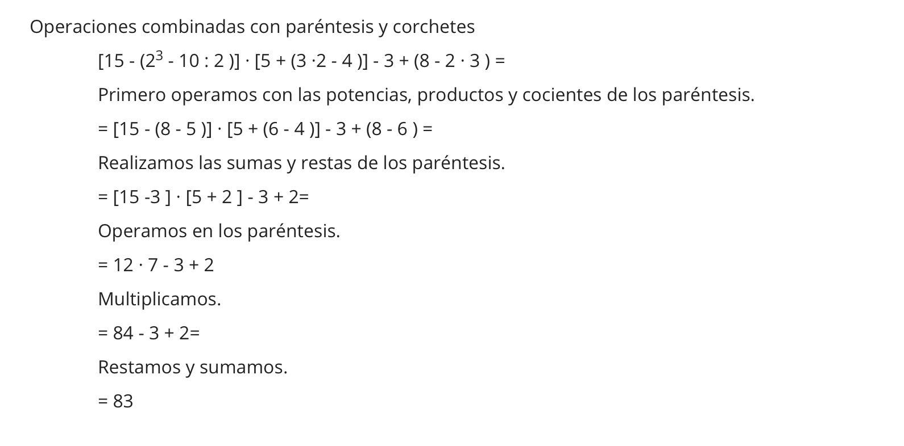


Comencemos con el operador mas común `+`. El operador de adición nos permitirá sumar números entre sí y además concatenar cadenas de texto de tipo String. 

Es decir:

` 5 + 6 ` dará como resultado `11`
` "5" + "6" ` ambas letras entre comillas indicando que son cadenas de texto se concatenarán dando como resultado `56`.

 


Los operadores aritméticos son: ` + - * / %`

```
Add: +
Subtract: -
Multiply: *
Divide: /
Remainder: %
```
 
En un playground de Xcode agreguemos las operaciones matematicas de la siguiente manera:
 
 ```
 5 + 6
 5+6
 5+ 6
 5 +6
 ```
 
 Al ejecutar el Playground obtenemos dos errores, pero ¿por que?
 
 

 El error `+' is not a postfix unary operator` es debido a que el operador de `+` no tiene un espacio a la izquierda, la operación `5+ 6` se entiende como si `5+` fueran una operación propia.
 
Esto es debido a que en Swift hay tres tipos de operadores: `postfix, prefix o infix`. A grandes rasgos, un operador *postfix* aparece despues de los operandos, es decir algo como `a!` o `a?`. El operador *prefix* aparecerá antes que el operando, ejemplo `&a`. Y por último *infix* esperará tener dos operandos, uno al inicio y otro al final, ejemplo ` 5 + 6`.

 Dicho esto, si escribimos `5+` swift pensará que `+` esta actuando como un operador *postfix* y eso arroja un error, ya que ese operador no esta preparado para funcionar de esa manera. 
 
 
 Continuemos con la jerarquía de operaciones, de acuerdo a las reglas algebraicas comenzaremos con las operaciones entre paréntesis, luego multiplicaciones y divisiones. Si ingresamos el siguiente código a un Playground obtendremos
 
```
(10 * 2) / (4 + 2)   // resultado 3
10 * 2 / 4 + 2		 // resultado 7
```
 
 Las jerarquias no solo aplican para operadores matemáticos, por ejemplo el siguiente código es un ejemplo de uso de jerarquía de operadores de agrupación, donde el código que se encuentre mas "interno" es el que tendrá la prioridad en la ejecución, en este caso es *getUser*, seguido de *verifyIfValid* y por último *performLogin*.
 
 ```
 performLogin(verifyIfValid(getUser()))
 ```

#### Tipos de datos

En muchos lenguajes de programación, existen distintos tipos de datos que permiten almacenar tipos especificos de información. Comenzamos con los tipos de datos mas simples, tambien llamados como tipos primitivos. Este tipo de datos incluyen desde números, cadenas de texto y valores booleanos.

Usualmente se especifica que tipo de dato se quiere utilizar en una variable. Las variables son aquellas que almacenarán este tipo de información.

Por ejemplo, Int es un tipo de dato que especifica que una variable solo puede almacenar tipos de datos enteros (números enteros).

> var num: Int

En la siguiente tabla mostraremos los tipos de datos primitivos en Swift.
 
  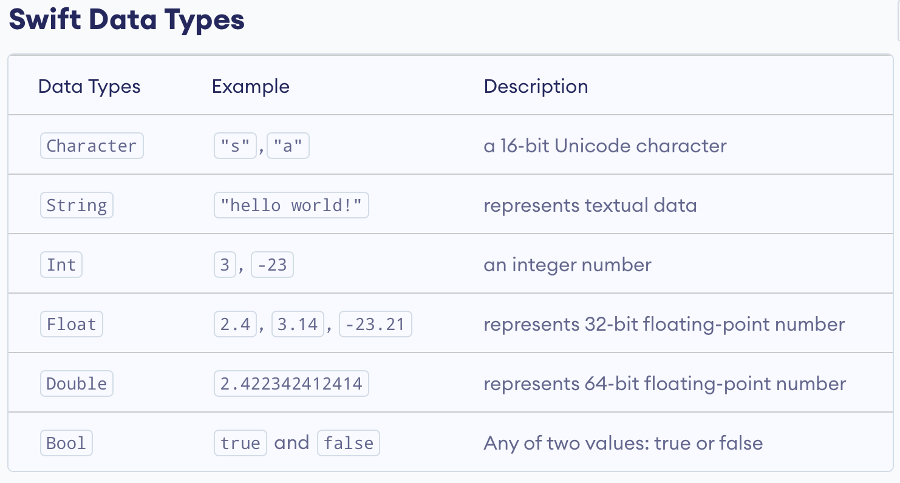


Como vimos en el ejemplo, la variable `num` puede almacenar cualquier número entero, con un límite dependiendo de la plataforma en donde se ejecute, es decir, en una plataforma de 32 bits tendremos un menor rango de números enteros que en una de 64bits.

```
-2^31 to 2^31-1 (32 bit platform)
-2^63 to 2^63-1 (64-bit platform)
```

Y no solo el tamaño del rango de Int es variable, sino Int mismo. Swift nos proporciona diferentes versiones de Int. En la siguiente tabla se puede observar el tipo de Int en la columna Variant, su tamaño en bits y el rango de valores que puede manejar. Dentro de esta lista el único que no puede manejar valores negativos es Unsigned Int o UInt.

  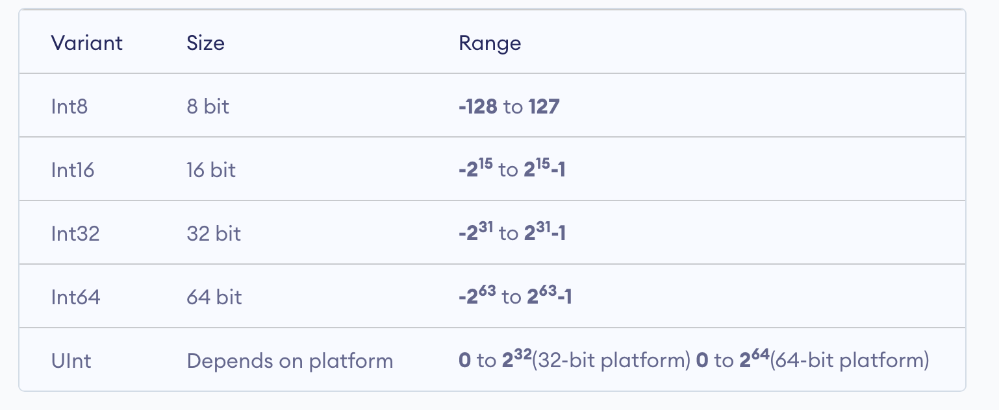

Es momento de conocer el resto de tipos primitivos, en un playground agregamos lo siguiente. Comenzaremos con un caractér, continuamos con una cadena de texto o String, un número entero negativo, un número entero, un valor flotante o decimal, un decimal largo, y dos valores booleanos. Los valores booleanos solo pueden tener el valor de true o false.

   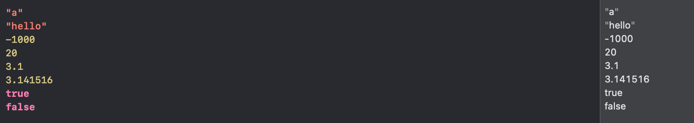


#### Constantes y variables

**Variables**

Ya aprendimos sobre las jerarquias de operaciones y de algunos operadores. Ahora vamos a ver de que manera podemos almacenar dichos valores primitivos para manipularlos a lo largo de nuestro código.

Para ello tenemos a las *variables*, una variable se conforma de la siguiente sintaxis:

> var nombre_de_la_variable: Tipo_de_Dato

Por ejemplo:

> var name: String

Una variable siempre comenzará con la palabra reservada `var`, esta palabra le indica al compilador que estamos declarando una variable. Toda variable necesita de un nombre, de un tipo de dato y de un valor.

Sin embargo, Swift provee de un mecanismo en el cuál podemos omitir escribir el tipo de dato esperado por la variable. Esto permite escribir variables como por ejemplo:

> var name = "my name"

La variable name ya no necesita saber explicitamente que es de tipo String ya que el valor que almacena es de ese tipo. Swift infiere que es de tipo String por el contenido de la variable.

TIP: El proceso de inferir el tipo de dato en una variable tiene un costo. Swift debe buscar que tipo de dato es el mas apropiado para la variable y esto puede impactar en el tiempo de ejecución. Es una buena práctica especificar el tipo de dato para evitar costo innecesario. 

**Constantes**

Una constante es un tipo de variable que no cambia su valor una vez es asignado. La sintaxis difiere, en lugar de usar la palabra reservada `var` utilizamos `let`, vemos un ejemplo:

> let name: String

Por lo tanto la diferencia radica en que una variable permite alterar su contenido al asignarle nuevos valores y la constante no permite esta operación.

**Malas prácticas**

Al declarar variables o constantes es importante asignar nombres apropiados. Buenos nombres harán que tu código sea facil de leer y que otros programadores puedan entender que hace tu código.

Un buen nombre para una variable describe en que consiste su funcionamiento, por ejemplo, la variable `name` indica que solo almacenará nombres. Una variable `age` indicará que espera números enteros referentes a la edad.

Un mal nombre es aquél que no da información clara, por ejemplo: `a`, `variable`, `x`, `i`.
Estos nombres no dan información del tipo de valor que contienen. 

Y algo mas... es cierto que Swift permite poner emojis como variables, sin embargo esto es una mala práctica. Pero es divertido asi que probemos en un Playground:

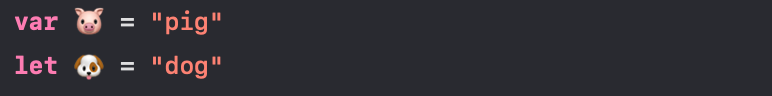


#### Operaciones con tipos de datos

**Conversión de tipo**

Como aprendimos, podemos declarar una variable de tipo Int como sigue:

> var value: Int = 10

Que ocurre si asignamos un valor no declarado, como por ejemplo:

> value = 30.55

Swift arrojará un error, `Cannot assign value of type 'Double' to type 'Int'`:

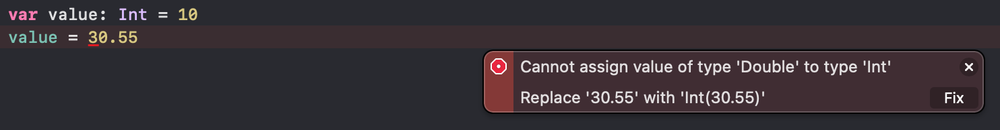

Como era de esperarse, ambos valores son diferentes y por lo tanto incompatibles. Sin embargo, hay una manera de "hacerlos compatibles". El costo de esta conversión es que podria perderse información. Para poder convertir el valor de `30.55` a `Int` debemos deshacernos de los decimales, dejando solo la parte entera `30`.

Si damos click sobre `Fix`, vemos que se agrega un Int y entre paréntesis el valor. Ahora la variable `value` tiene un `30` asignado.

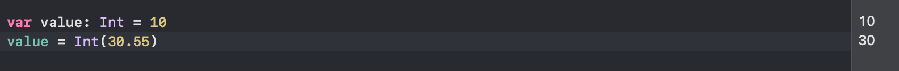

Tambien es posible convertir variables de tipo String a un tipo numerico como Double:


Aunque no siempre es asi de simple, en ocasiones Swift requiere de ciertas adaptaciones. Si solamente intentamos convertir un valor de tipo String a Double, Xcode arrojará un error ya que necesita asegurarse de que este tipo String no sea un valor vacio o bien algo diferente a un número. Por lo tanto ofrece algunas alternativas para solucionar este error.

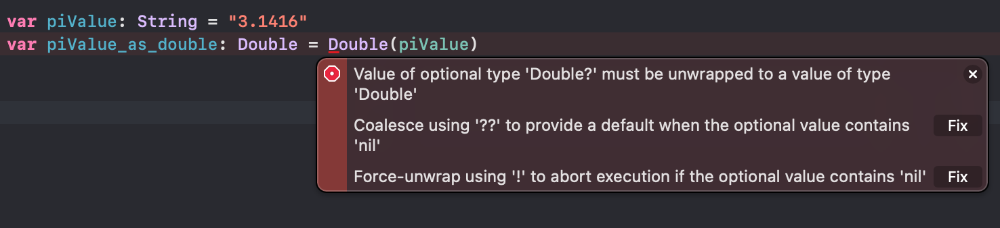

Agregaremos un operador `??` que permite establecer un valor por defecto en caso de que la operacion `Double()` falle. En nuestro caso simplemente pusismos `0.0` pero puede ser el valor que deseemos.

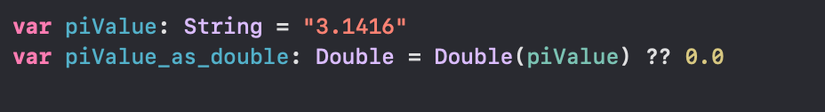

El operador `??` es conocido como *nil coalescing operator* o también llamado *default operator*.

#### Strings

Para representar texto en Swift tenemos al tipo de dato String o bien Character para una sola letra o emoji.

Un ejemplo de caracter de emoji:

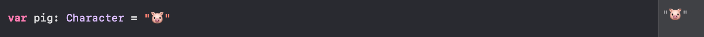

Un ejemplo de string:

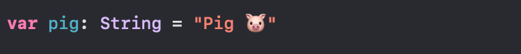

Los Strings suelen emplear el uso del operador `+` para concatenar otros Strings. 

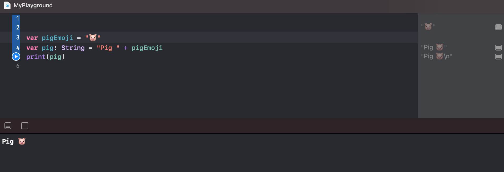

Las cadenas de texto pueden ser multilinea:

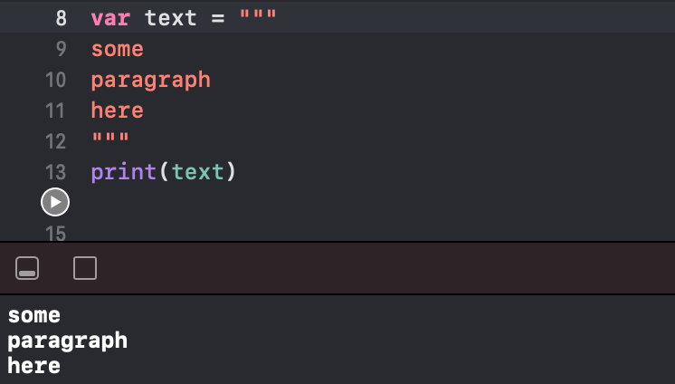

En un String es posible almacenar una cadena de texto compleja con caracteres especiales, etc. Le llamaremos `raw string` y son cadenas de texto que comienzan y terminan con el símbolo `#`.

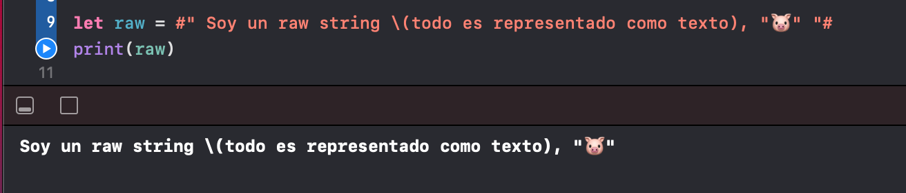


#### Colecciones

Las colecciones son contenedores flexibles que permiten almacenar valores juntos, como un grupo. Hy dos tipos de colecciones, de tipo mutable e inmutable.
Así como vimos con las variables y constantes, las colecciones pueden tener el mismo comportamiento de mutabilidad, si son declaradas como variables pueden modificar sus valores, si son declaradas como constantes una vez asignado su valor ya no es posible modificarlo.

**Arrays**

Son los tipos de colección mas utilizados en el mundo de la programación. Se define a un Array como un contenedor ordenado de elementos, del mismo tipo de dato.

Comenzamos definiendo si es una colección mutable o inmutable haciendo uso de `var` o `let`, seguimos asignandole un nombre y por último su valor.

Entonces tenemos que la sintaxis básica de un array es la siguiente: `let/var nombre: [tipo_de_dato]`.

> let arr: [Int]

por ejemplo:

> let arr: [Int] = [0, 1, 2, 3 ,4 , 5]

o bien, 

> let arr = [0, 1, 2, 3 ,4 , 5]

La numeración de un array comenzará desde la posición 0 para el primer elemento, 1 para el segundo elemento, 2 para el tercer elemento y asi sucesivamente. 

Para acceder a un valor del array indicamos el índice del valor que queremos obtener, por ejemplo, para leer el primer valor:

> arr[0] // valor 0

Declaremos un array donde almacenemos cadenas de texto:

> var letters = ["a", "b", "c", "d", "e", "f", "g"]

Si deseamos acceder al elemento 3 (la letra *c*), escribimos:

> letters[2] // "c"

Los arrays poseen algunas funciones predefinidas, como las de agregar y eliminar elementos. Supongamos que deseamos agregar una letra mas a nuestra colección.

> letters.append("h")

Otras funciones que podemos encontrar frecuentemente en un Array son:

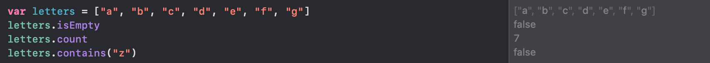


**Dictionaries**
Los diccionarios son contenedores en donde para acceder a un elemento requeriremos de una llave `key`. La ventaja de esto es que esta operación es rápida.

Muy similar a los Arrays, la sintaxis que seguiremos es la siguiente, `let/var nombre: [Key: Type]`.

Ejemplo:

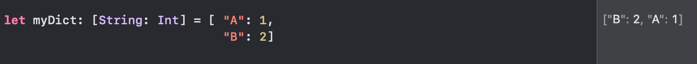

En este ejemplo se observa que las llaves son los valores `A` y `B`, y sus valores `1` y `2`.

Cabe mencionar que en un diccionario no existe el orden como en un Array.

Para acceder a un valor del diccionario solo hace falta usar su llave, si la llave no existe entonces el valor es `nil`.

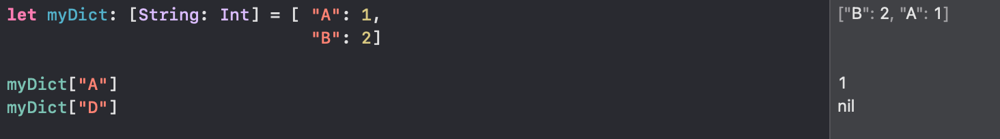

Algunas operaciones comunes en los diccionarios involucran el uso de keys, values y el número de elementos que contienen.

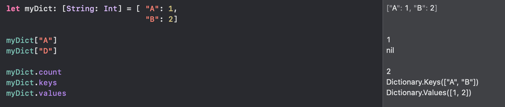


**Sets**

Un `Set` es una colección de elementos desordenados, en donde no se podrán repetir elementos iguales. Algunos definen al Set como un diccionario donde solo se almacenan llaves, ya que en un diccionario no es posible repetir las llaves.

Tanto un `Set` como un `Dictionary` son implementados con base a tablas hash y tienen un performance similar.

Su sintaxis es similar a la de un array.

`let values: Set = [1, 2, 3, 4, 5]`


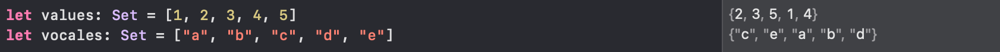


#### Funciones

A lo largo de esta sesión implementamos algunas funciones predefinidas en las colecciones y tambien ejecutamos la función `print()`. 

Las funciones son un bloque de código que ejecuta una tarea. Generalmente ubicamos una función debido a su sintaxis, poseen un paréntesis, `funcion()`.


Recordando la función `print()`, esta posee nombre y paréntesis, su tarea es mostrar en pantalla valores.

> print("Hello")

Para definir nuestras propias funciones comenzamos por escribir la palabra reservada `func` seguida de un nombre, paréntesis y llaves.


```
func myFunction() {

}
```

Dentro de este bloque agregaremos el código que queramos ejecutar una vez invoquemos a la función. Así como con `print()`, para ejecutar nuestra función escribimos `myFunction()`.

Ejemplo:

```
func myFunction() {
	var pigEmoji = "🐷"
	var pig: String = "Pig " + pigEmoji
	print(pig)
}
```

Las funciones pueden retornar un valor una vez terminan su ejecución, por ejemplo, si el resultado de la ejecución es una cadena de tipo String utilizaremos la palabra reservada `return` la cuál indicará que el resultado es dicho valor, quien invoque a la función obtendra dicho resultado y este puede ser almacenado en una variable.

La función anterior la convertiremos en una que retorne un tipo de dato, en este caso String.

Con el operador flecha `->` indicamos el tipo de dato que se espera al finalizar la ejecución de la función.

```
func myFunction() -> String {
	var pigEmoji = "🐷"
	var pig: String = "Pig " + pigEmoji
	return pig
}
```

Ahora, al invocar `myFunction()` esperamos recibir un valor de tipo String, este puede ser almacenado en una variable.

```
var myPig = myFunction()
```

Una función puede recibir valores, estos valores los llamaremos parámetros. Los parámetros son variables que ayudan a ingresar valores a la función.

Haremos un cambio a la función anterior. Renombraremos la función y agregaremos un parámetro de tipo string.

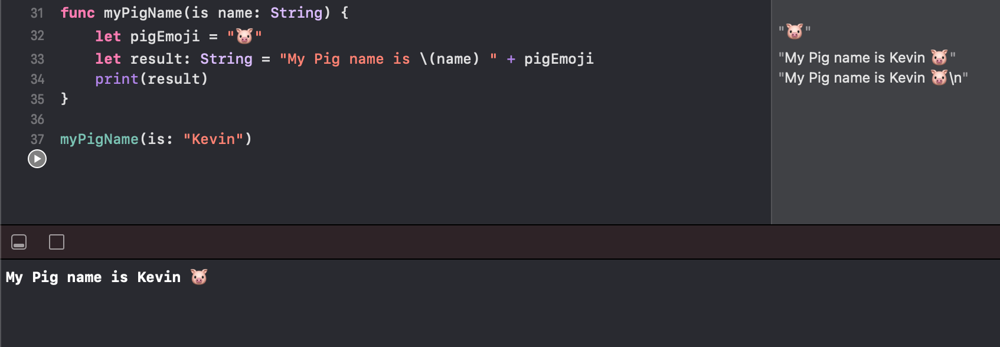

Al invocar la función Xcode nos pedirá ingresar el valor de `name`.

Como una vez mencionamos, Swift permite omitir el uso de `return`. Implementemos lo siguiente en un Playground:

```
func getAge() -> Int {
    5
}

func getName() -> String {
  "Kevin"
}
```

Ambas funciones te regresan un valor, la primera un número de tipo Int y la segunda función una cadena de texto de tipo String.

Al ingresar ambas funciones en un `print()` podemos obtener su valor.

> print("My pig name is \(getName()), it is \(getAge())")

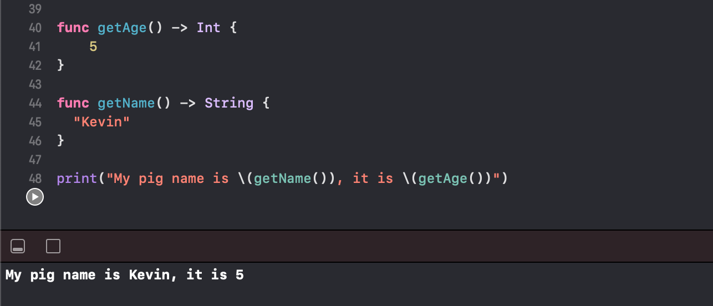


##### Práctica:

- [Ejemplo-01, Jerarquía de Operaciones](Ejemplo-01)

- [Ejemplo-02, Tipos de datos y operaciónes](Ejemplo-02)

- [Ejemplo-03, Colecciones](Ejemplo-03) 

- [Ejemplo-04, Funciones](Ejemplo-04)


##### Retos

- [Reto-01, Arrays2D](Reto-01)

- [Reto-02, SubArrays y Arrays3D](Reto-02)


#### Postwork

Proyecto con IBOutlets y IBActions:

- [Postwork](Postwork)
