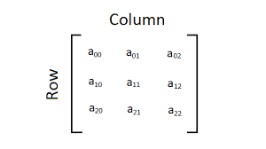

`Desarrollo Mobile` > `Swift Fundamentals`

## Reto-01: Array multidimensional

### OBJETIVO

- Aprender la sintaxis y uso de los diferentes tipos de Array en Swift.

#### DESARROLLO

Durante la sesión aprendimos que es un Array y como escribir uno en Swift.

Un array puede tener cualquier tipo de dato que especifiquemos, ya sea Int, String o uno propio, pero, este ¿puede tener como tipo de dato un Array?.

> var array_name: [MY_DATA_TYPE]

En otras palabras, `MY_DATA_TYPE` puede ser de tipo Array?, ¿como seria esto?

El siguiente reto consiste en definir un array que a su vez su tipo de dato sea otro Array, esto es conocido como array multidimensional. Un array multidimensional puede pensarse como un tablero de ajedrez, es una cuadricula donde tenemos filas y columnas.

Las tareas a realizar en este reto son:

1.- Definir un array dimensional de tipo String, este array deberá tener tamaño 3x3.

2.- Este array debe contener en todas sus posiciones una letra, elige la que mas te guste.

Una pista: `Array(repeating: "a", count: 3)`

3.- En la primera posición del array (00) cambiar la cadena de texto.

4.- Para la segunda posición del array (01), asignar la cadena de texto que tenemos en la posición 00.

