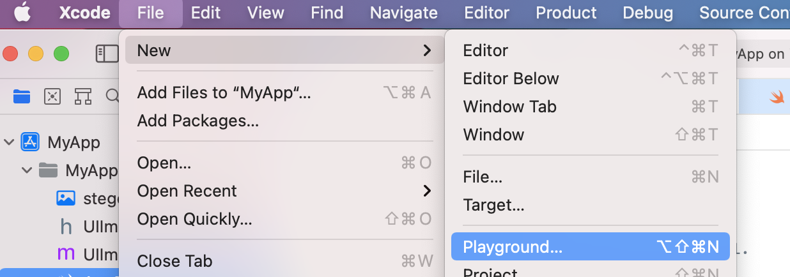
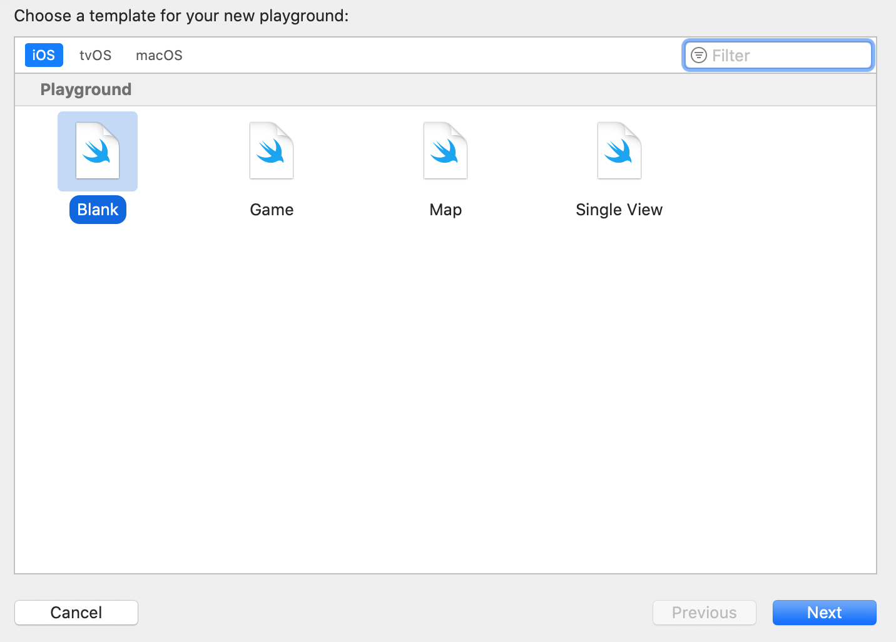
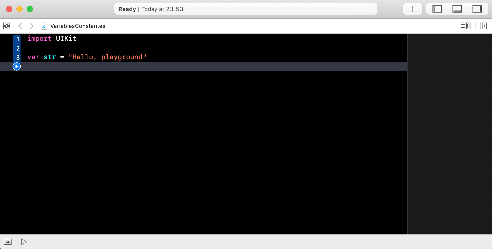
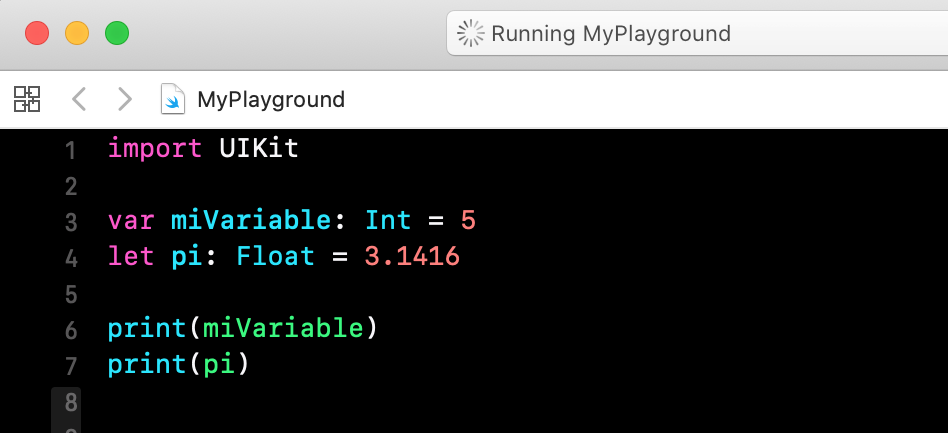

Desarrollo Mobile` > `Swift Fundamentals`


## Variables y Constantes

### INTRODUCCIÓN

Las variables y constantes son fundamentales en cualquier lenguaje de programación y Swift no es la excepción. Si tienes algun conocimiento previo en otro lenguaje encontrarás muchas similitudes que te serán útiles para entender la forma en que se manejan las variables.

### OBJETIVO

- Aprender la diferencia entre estos dos conceptos básicos de Swift.

#### REQUISITOS

1. Lectura del prework de la Sesion 4.

#### DESARROLLO

1.- Abrir Xcode, y crear un nuevo Playground.

Seleccionar `File` > Elegir `New` >`Playground`  Y `especificar un Nombre` > `Finalizar`.







#### Variables 

Una variable es aquello que puede almacenar un valor y además podemos cambiar su valor.

La manera de escribirla (sintaxis) es comenzando con la palabra *var*, seguida de un nombre, un operador de asignación de valor **=** y un valor *5*.

> var miVariable = 5

Podemos especificar el tipo de dato, supongamos un tipo Entero **Int**, para ello usamos dos puntos seguido del tipo de dato deseado.

> var miVariable: Int = 5


#### Constantes

Una constante es aquella que puede almacenar un valor y **NO** podemos cambiar su valor.

La manera de escribirla (sintaxis) es comenzando con la palabra *let*, seguida de un nombre, un operador de asignación de valor **=** y un valor *5*.

> let pi = 3.1416

O especificando el tipo de dato:

> let pi: Float = 3.1416


2.- Ahora en el Playground ingresaremos ambos ejemplos y veremos el resultado. En adición a esto, utilizaremos una función llamada `print()` la cuál nos permitirá mostrar el valor de una variable o constante en la zona de la consola o debug area.

El código a utilizar en el playground es:

```
import UIKit

var miVariable: Int = 5
let pi: Float = 3.1416

print(miVariable)
print(pi)

```



3.- Es momento de realizar algunas operaciones básicas, haremos una suma, resta, multiplicación y división.

```
let radio: Float = 40.0
let lado = 10
let base = 20
let altura = 30
var perimetroCuadrado = lado + lado + lado + lado
var areaCirculo = pi * radio * radio
var areaTriangulo = (base * altura)/2
```


#### Ultimo pero no menos importante

Al no especificar el tipo de dato Swift necesita "sugerir" o formalmente dicho *inferir* que tipo de dato se esta usando, por ello si se desea crear un proyecto con buen código es mejor especificar el tipo de dato.


