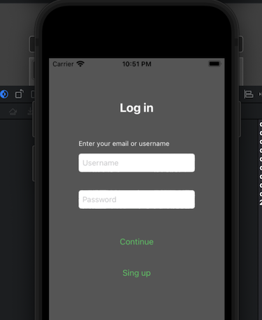

 

`Desarrollo Mobile` > `Swift Fundamentals`
​	

## Sesión 05: Variables y tipos de datos en Swift

### OBJETIVOS 

- Reconocer el procedimiento para conectar elementos de UI al controller y describir el código autogenerado con los nuevos conocimientos de variables y tipos de datos.
- Agregar funcionalidad a la vista login mediante estructuras de control de código Swift.

#### DESARROLLO

El propósito de este Postwork es utilizar los conocimientos adquiridos sobre variables y opcionales, así como las estructuras condicionales, para implementar las validaciones necesarias en la app de la información introducida por el usuario.

Recuerda que todo lo trabajado en tu prework, así como durante la sesión, puede ser aplicado a tu proyecto personal.

En el Prework se explicó la manera de hacer optional unwrapping y, aunque el tema de estructuras de control se explicará ampliamente en la próxima sesión, para este Postwork recuerda que la forma de hacer Optional binding involucra el uso de la estructura de control if de las siguientes formas:

- Comprobar el opcional:

**if variableOpcional != nil {**

**// hacer algo**

**}**

- Desempaquetado condicional

**if let valor = variableOpcional {**

**// Hacer algo con la constante valor**

**} else {**

**// variableOpcional es nil.**

**}**

#### INDICACIONES GENERALES

El propósito de este Postwork es realizar las modificaciones descritas a continuación al proyecto modular. 

1. En el Postwork anterior se conectaron los elementos de UIKit con el código del ViewController, específicamente los botones. Analiza el código generado al crear el IBAction. Guíate respondiendo a las siguientes preguntas.

- Dentro de este ¿qué tipo de variable (objeto) recibe el método como parámetro? 
- ¿A qué  tipo de dato se refiere?

2. Dentro de la función IBAction que corresponde al botón “continue” haz lo siguiente.

- Declara una variable tipo String y asígnale el valor del contenido del cuadro de texto “username” (si no hay un IBOutlet para el cuadro de texto, crea uno). Observa que la propiedad que se refiere al contenido del cuadro de texto es un objeto de tipo opcional… ¿Qué deberías hacer para asignarlo a una variable? Indágalo y hazlo.

3. De igual manera, declara otra variable tipo String para el otro cuadro de texto (“password”) con las mismas consideraciones que en el caso anterior

4. Dentro de la misma función compara lo siguiente:

- Si el valor de ambas variables es diferente de cadena vacía.
- Si el valor de ambas cadenas tiene una longitud mayor a 10 caracteres. 

5. Estas validaciones del punto anterior deben estar anidadas. Es decir, solo si la primera es verdadera se evaluará la segunda.El resultado de cada validación debe aparecer en la consola, y si todas las validaciones son correctas manda a la consola el mensaje “autenticar usuario”.