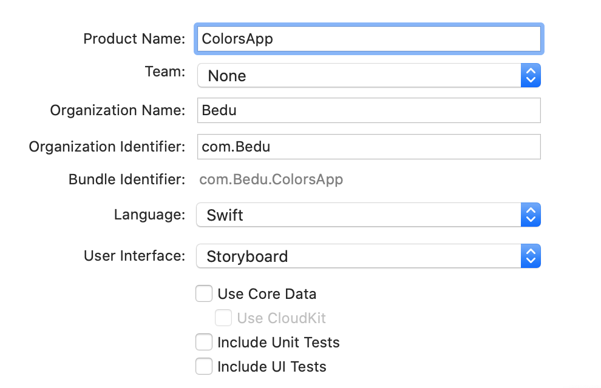
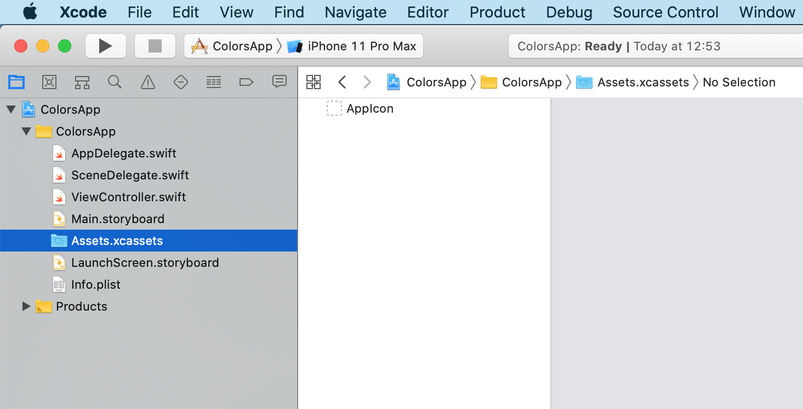
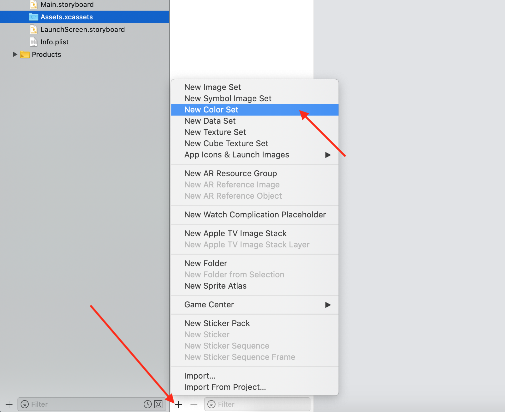
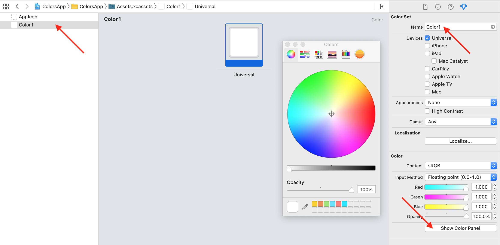
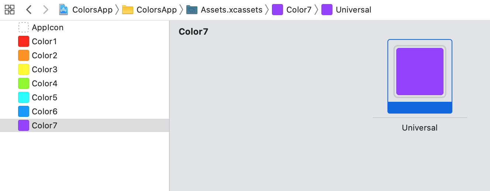
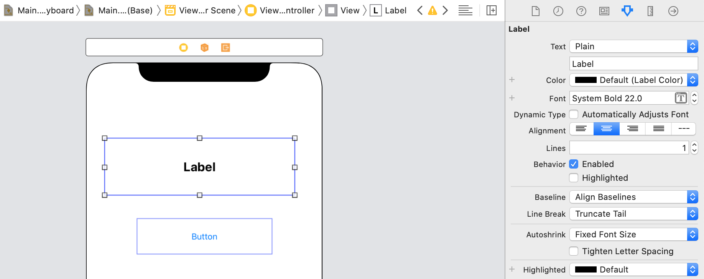
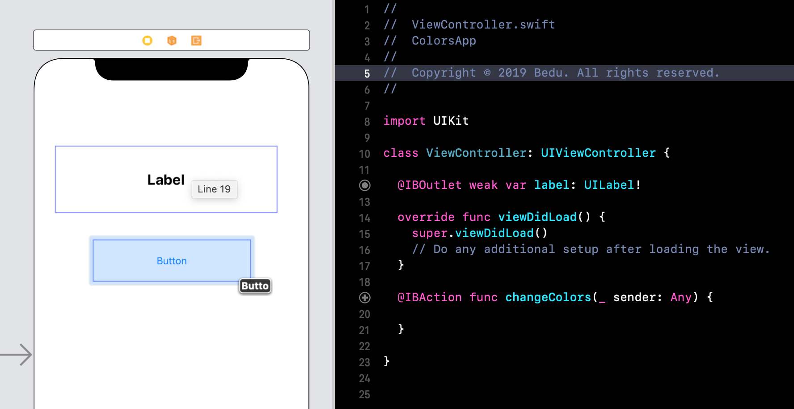
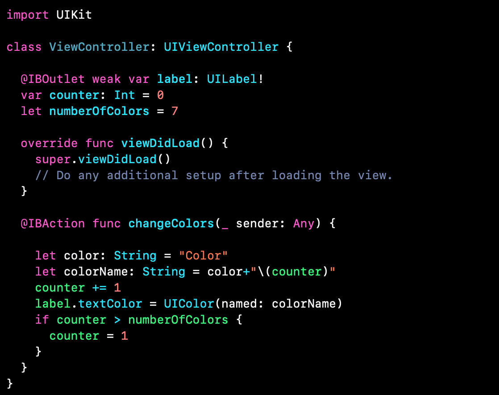
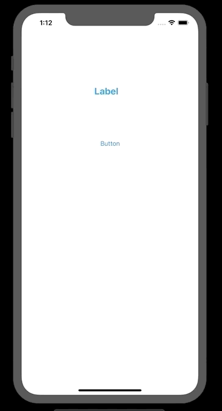

`Desarrollo Mobile` > `Swift Fundamentals`

## Assets y Colores en una App.

### OBJETIVO

- Aprender a utilizar los Assets de un proyecto en Xcode y el manejo de colores.

#### DESARROLLO

1.- Crear un nuevo proyecto de Xcode.

2.- Nos dirigimos a `Assets.xcassets` para agregar los colores del proyecto.

3.- Y en dicha ventana, agregar un `New Color Set`.

4.- Agregamos un nuevo color, lo renombramos como `Color1` y le cambiamos el color con la paleta de colores.

5.- Agregamos muchos colores, pero siempre en orden númerico.

6.- Creamos una vista con un UILabel y un UIButton.

7.- Conectamos ambos elementos de UI con el ViewController.swift.

8.- Como variable global guardaremos el conteo del color y especificaremos cuantos colores agregamos en el `Assets`. 

9.- Implementar dentro del IBAction el algoritmo de cambio de color. Al dar click sobre el botón deberiamos cambiar el color del texto del Label.

10.- Al ejecutar la app deberiamos tener el sig. resultado.

