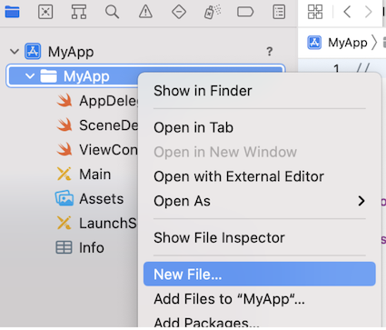
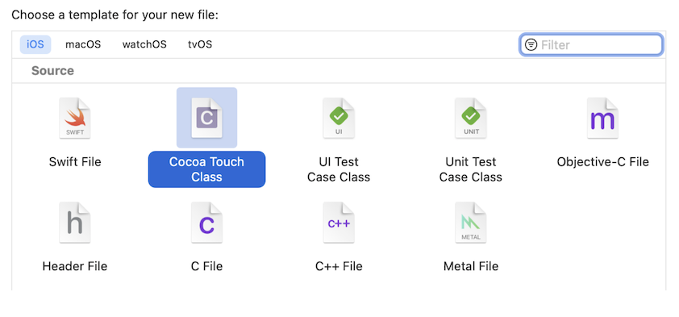
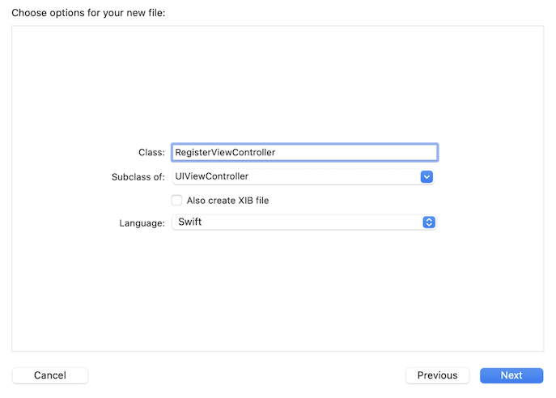
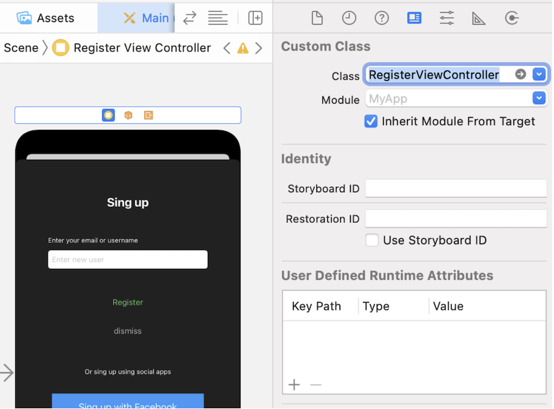

 

`Desarrollo Mobile` > `Swift Fundamentals`
​	

## Sesión 06: Operadores

### OBJETIVO 

- Agregar funcionalidad a la vista mediante estructuras de control de código Swift.
- Agregar los assets de colores al app.

#### DESARROLLO

En este Postwork se proseguirán los avances sobre las vistas de Login y Sign-up.

Recuerda que todo lo trabajado en tu prework, así como durante la sesión, puede ser aplicado a tu proyecto personal.

#### INDICACIONES GENERALES

El propósito de este Postwork es utilizar los conocimientos adquiridos sobre Swift y Xcode para mejorar la app modular. 

En el Postwork previo se agregaron  algunas validaciones  en el código del ViewController correspondiente a la vista de Login. Ahora se trabajará en el ViewController conectado a la vista de Sign-up. Para ello sigue las indicaciones a continuación.

1.- Agrega una nueva clase al proyecto, que sea subclase de UIViewController:

- Clic secundario en el grupo principal de archivos del proyecto, y del menú contextual selecciona “New File”

  

- En la ventana que aparece, elige el tipo “Cocoa touch”

  

- En la siguiente ventana, elige el nombre de la clase, y confirma que la clase padre es **UIViewController**

  

- Acepta la ubicación para crear el archivo, y clic en “Create”

- Para relacionar esta clase con el objeto ViewController, en el Storyboard  selecciona este último y en el panel de inspección, en la pestaña “Identity Inspector” buscar la clase que acabas de crear en el campo **Class**

2.- Ahora asegúrate de crear los Outlets y Actions que conecten a todos los elementos de la vista con el código Swift correspondiente, tal como lo hiciste con la vista de Login.

3.- Dentro de la función IBAction que corresponde al botón “register”, replica las validaciones que se agregaron en la vista de Login para el cuadro de texto “username”; es decir, que el campo no esté vacío y que lo que introduzca el usuario sean más de 10 caracteres.

4.- Crea los assets de colores, para que se puedan asignar a los elementos de las vistas, y con ello “vestir” ambas vistas. Por lo menos dos colores distintos, el color principal y el color secundario o “acento”. Asigna estos colores en el método viewDidLoad de cada ViewController. El color principal a los textos y el color secundario al fondo de la vista. 

**NOTA:** Recuerda lo visto en la sesión, ¿que necesitas para poder asignar el color a las etiquetas?