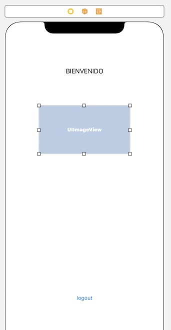

`Desarrollo Mobile` > `Swift Fundamentals`

## Esqueleto de una App

### OBJETIVO

- Conforme lo aprendido en todo el curso, crear un esqueleto de App.

#### REQUISITOS

1. Xcode 11.

#### DESARROLLO

1.- Crear un proyecto nuevo en Xcode.

2.- Este nuevo proyecto tendrá dos vistas, una de Login y una de Registro de Usuario.
Abrir el Storyboard y agregar dos ViewControllers.

3.- Configurar la vista de Login.

4.- Configura la vista de Registro de cuenta y conectala con el botón de `Registro` mediante un `Push`.

Ejecutar y debe funcionar asi:

5.- Ahora es momento de crear dos `ViewControllers` pero con extensión `.swift`. Aquí escribiremos nuestro código.

Agregar un `AccountRegisterViewController.swift`, y lo asociamos al ViewController del Storyboard de registro de cuenta.

6.- Conectamos cada elemento de UI con su respectivo ViewController.

