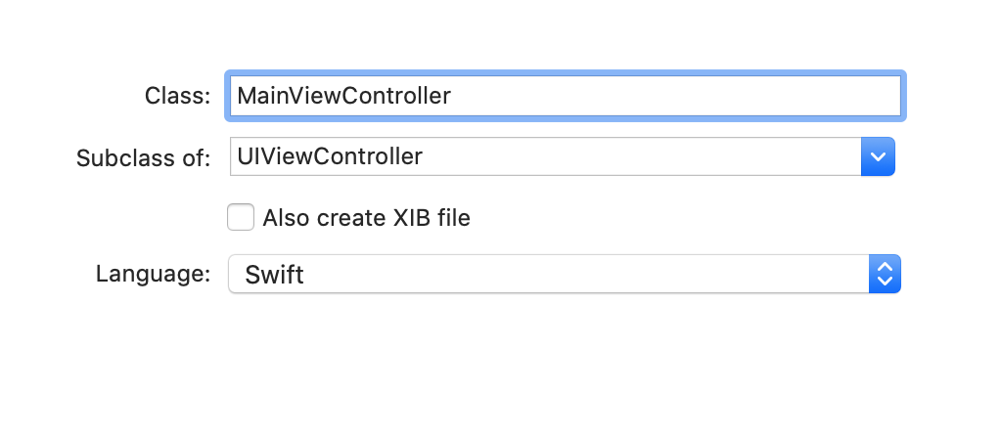

`Desarrollo Mobile` > `Swift Fundamentals`

## 

### OBJETIVO

- Aumentar la funcionalidad de nuestro proyecto final, esta vez agregando mas elementos de UI y ViewControllers.

#### REQUISITOS

1. Basarse en el proyecto del módulo

#### DESARROLLO

1.- Nuestro proyecto de momento tiene dos vistas, una de Login y una de Registro de Usuario. En el Storyboard agrega un tercer objeto ViewController.

2.- Agregar un Label con el texto "Bienvenido" y un Boton de "logout".  Además, busca en la librería el objeto Image View y también agrégalo. Coloca los objetos como se ven en la siguiente imagen:

Recuerda agregar constraints a los elementos de UI, previsualizarlos y ejecutarlos en distintos simuladores.

3.- Agregar un nuevo archivo Swift, subclase de *Viewcontroller*, esta vez para la tercera vista.

 y asignale esta clase **MainViewController.swift** a la vista creada en el Storyboard. De momento esta vista será el "home" de nuestra App, es decir, la vista a la cual se accederá al hacer un login exitoso.

4.- El objeto Image View, como la mayoría de los objetos del framework UIKit, se puede crear y configurar desde el Storyboard y/o programáticamente. En este caso en el Storyboard podemos configurar como se verá inicialmente, con el panel de Inspección, como hemos hecho con otros componentes. Busca la pestaña "attributes inspector" y en la propiedad Image, encontrarás todas las imágenes disponibles actualmente en el proyecto, busca la que se llama "brain.head.profile" y tu ImageView deberá verse como en la siguiente imagen:

5.- Para que podamos cambiar la imagen en tiempo de ejecución, necesitas crear un Outlet para este objeto como lo has hecho anteriormente con los demás objetos que colocaste en las otras vistas. Una vez teniendo el outlet correctamente conectado, cambiar la imagen es tan simple como esto:

​	**imagen.image = UIImage(named: "unaImagen")**

En este caso estamos suponiendo que se ha creado una imagen en la carpeta de assets, nombrada `unaImagen`

Si queremos usar una de las imagenes que están incluidas en iOS (como la que tenemos ahora `brain.head.profile`) entonces la instrucción sería:

**imagen.image = UIImage(systemName: "una.imagen.predefinida")**

Las imagenes que vienen incluidas con iOS varían de una versión a otra, pero la referencia completa de como identificarlas, la puedes consultar [AQUI](https://developer.apple.com/design/human-interface-guidelines/sf-symbols/overview/)

6.- Finalmente, crea también un Outlet para la etiqueta "bienvenido" y un Action para el botón `logout`.