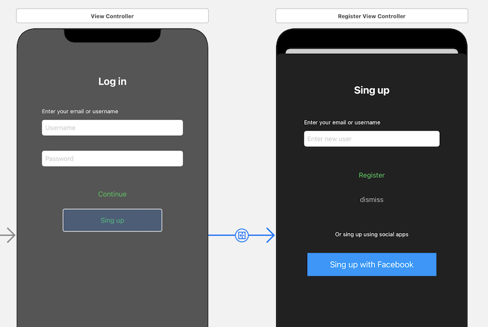
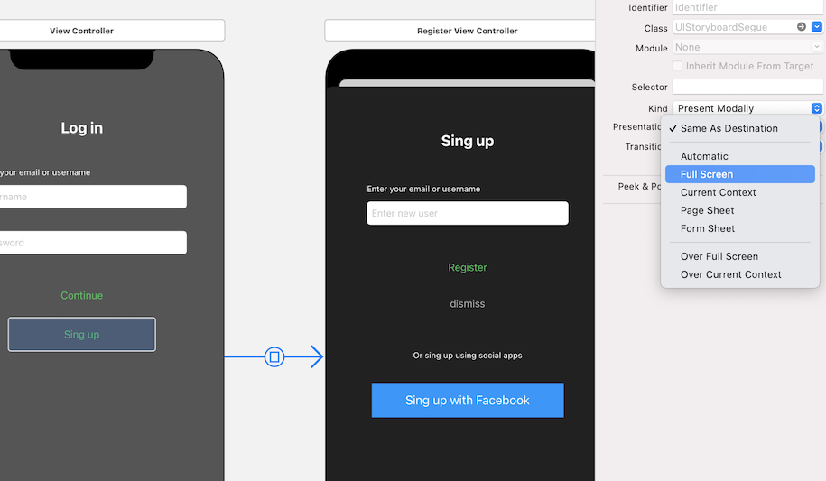
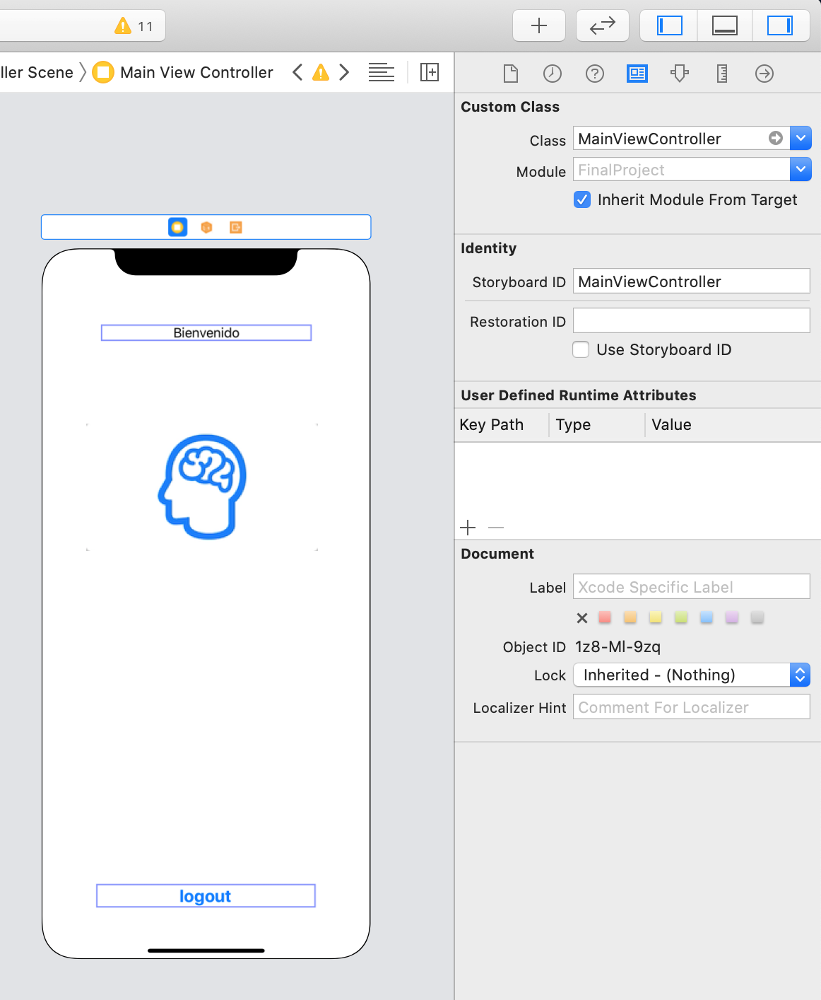

`Desarrollo Mobile` > `Swift Fundamentals`


## Titulo del Ejemplo

### OBJETIVO

- Aumentar la App , esta vez agregando mas elementos de UI y ViewControllers.

#### REQUISITOS

1. Basarse en el *Ejemplo-01*.

#### DESARROLLO

1.- Abrir el proyecto del *Ejemplo-01*.

2.- En la vista Principal agregar un view de imagen y agregar un icono.



3.- Agregar un *Viewcontroller*, esta vez para la tercera vista.



4.- A la tercera vista, asignarle el **ViewController.swift** creado y agregar un Boton de Logout y conectarlo con su IBAction.



5.- Agregaremos funcionalidad para ocultar el teclado al tocar en alguna parte de la pantalla.

Para ello crearemos un `Extension` del `UIViewController`.

En nuestro `ViewController.swift` escribimos:

```
extension UIViewController {
  // Oculta teclado al tocar en la pantalla
  override open func touchesBegan(_ touches: Set<UITouch>, with event: UIEvent?) {
    self.view.endEditing(true)
  }
}
```
