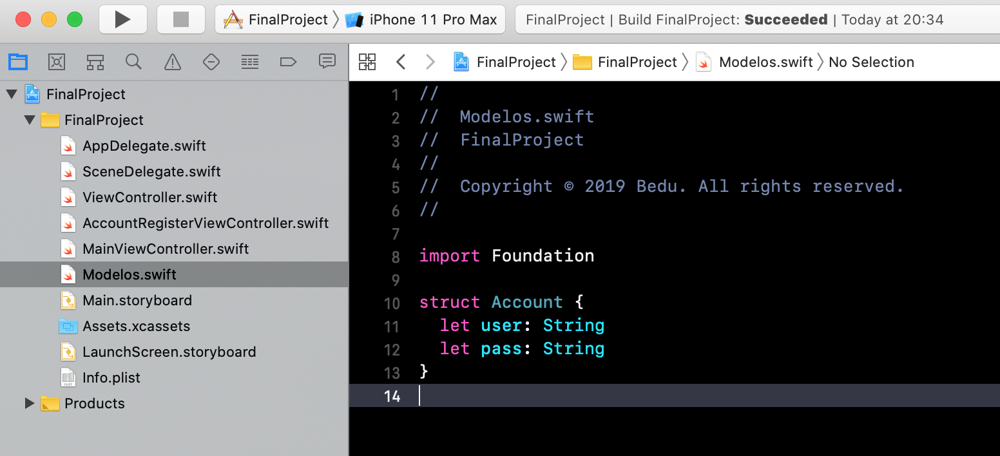

`Desarrollo Mobile` > `Swift Fundamentals`

## Navegación de vistas

### OBJETIVO

- Como navegar entre vistas tanto en código como mediante el Storyboard.

#### REQUISITOS

1. Utilizar de base ejemplo-02.

#### DESARROLLO

1.- Cambiar el modo de navegación.
A la vista de Login agregarle un `Embed In Navigation`.



2.- Seleccionar el `segue` (la flecha que conecta las vistas) de `push` que va a la vista de Registro y en el inspector seleccionar `Present Modally`.


3.- Seleccionar la vista post login y agregar un Identifier.


4.- Regresamos al ViewController.swift, se creará una función que permitirá mostrar la vista de post-login. Esta función deberá ser invocada en la condición donde tanto el password y usuario son correctos.

```
  func goToMainViewController() {
    let vc = UIStoryboard.init(name: "Main", bundle: Bundle.main).instantiateViewController(withIdentifier: "MainViewController") as? MainViewController
    self.navigationController?.pushViewController(vc!, animated: true)
  }
```

La lógica de verificación de usuario sería:

```
@IBAction func login(_ sender: Any) {
    if myUser == user.text && myPassword == password.text {
      imageView.image = UIImage(named: "profile")
      goToMainViewController()
    } else {
      imageView.image = UIImage(named: "user1")
    }
  }
```
