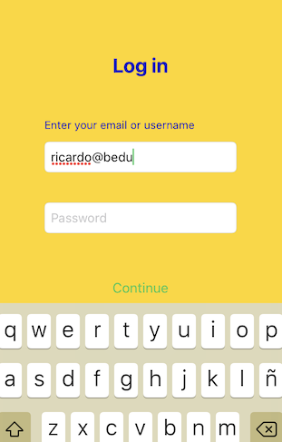
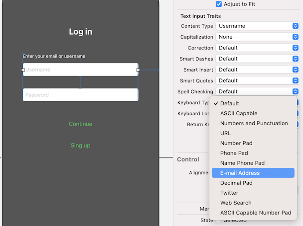

`Desarrollo Mobile` > `Swift Fundamentals`

## Arquitectura MVC

### OBJETIVO

- Implementar la arquitectura Modelo Vista Controlador en nuestra app de Login.
- 
#### REQUISITOS

1. Utilizar de base el proyecto *Reto-03*.

#### DESARROLLO

1.- Crear un nuevo archivo de Swift, llamado `Modelos`.

2.- En este archivo agregaremos un modelo o struct que definirá a nuestra cuenta de usuario.

```
struct Account {
	let user: String
	let pass: String
}
```



3.- Agregar en el mismo archivo de Modelos, la definición de nuestra cuenta.

```
struct Registered {
  let user1: Account = Account(user: "Ricardo", pass: "Password")
}
```

4.- En la clase Viewcontroller agregaremos una instancia de este modelo.

