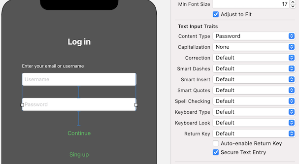

 

`Desarrollo Mobile` > `Swift Fundamentals`
​	
## Manejar el teclado

### OBJETIVO 

- Mejorar la experiencia del usuario cuando tiene que usar el teclado

#### REQUISITOS 

1. Utilizar el proyecto del modulo, terminado hasta el Reto-02

#### DESARROLLO

1.- En la vista Login y también en la de Registro tenemos cuadros de texto. De forma predeterminada siempre que un objeto en la vista requiere la introducción de texto, el teclado aparece cuando el usuario selecciona ese objeto, esto nos puede causar problemas si el teclado cubre algun(os) objeto(s) en la pantalla:


**NOTA:** si el teclado no aparece en el simulador, puedes presionar las teclas `command + K` para mostrarlo y tener la perspectiva más real de como verá el usuario nuestra app.

El teclado aparece automáticamente, sin embargo no desaparece a menos que ningun objeto se esté editando. El objeto view tiene un método que nos permite especificar si queremos terminar cualquier edición que se esté haciendo en los objetos colocados en ella.

    view.endEditing(true)
2.- El comportamiento normal esperado por todos los usuarios de smartphones es que cuando estas capturando algun texto, puedes tocar fuera del cuadro de texto para que el teclado desaparezca. Para implementar esto, necesitamos sobreescribir el siguiente método de la clase ViewController:

```
override func touchesBegan(_ touches: Set<UITouch>, with event: UIEvent?) {
    self.view.endEditing(true)
}
```

3.- Otro aspecto importante, es que el teclado que aparezca debe ser el adecuado según el tipo de dato que estamos esperando que el usuario introduzca. Esto lo podemos configurar en el Storyboard, usando el panel de inspección y la pestaña "attributes inspector". Ahí tenemos una sección llamada `Text Input Traits` donde podemos configurar las caracteristicas que necesitamos que estén habilitadas en el teclado. Por ejemplo, para el caso del cuadro de texto **username** necesitamos que el teclado sea "tipo E-mail address":


y para el cuadro de texto **password** por supuesto que no queremos que los caracteres capturados por el usuario sean visibles, así que habilitaremos la opción "Secure Text Entry":


