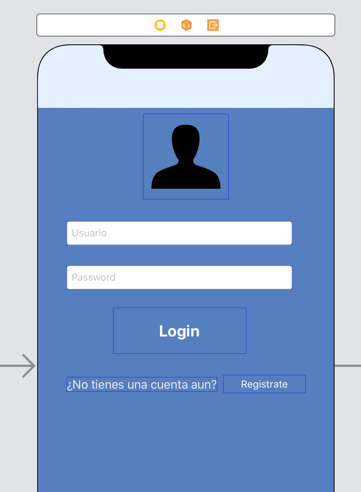
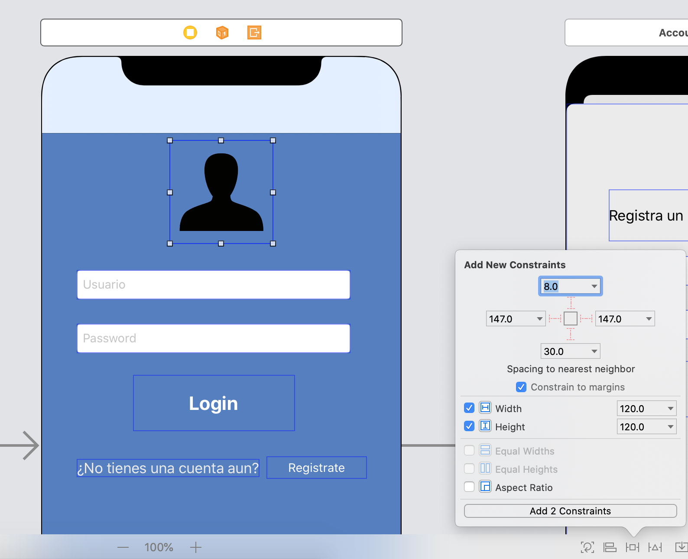
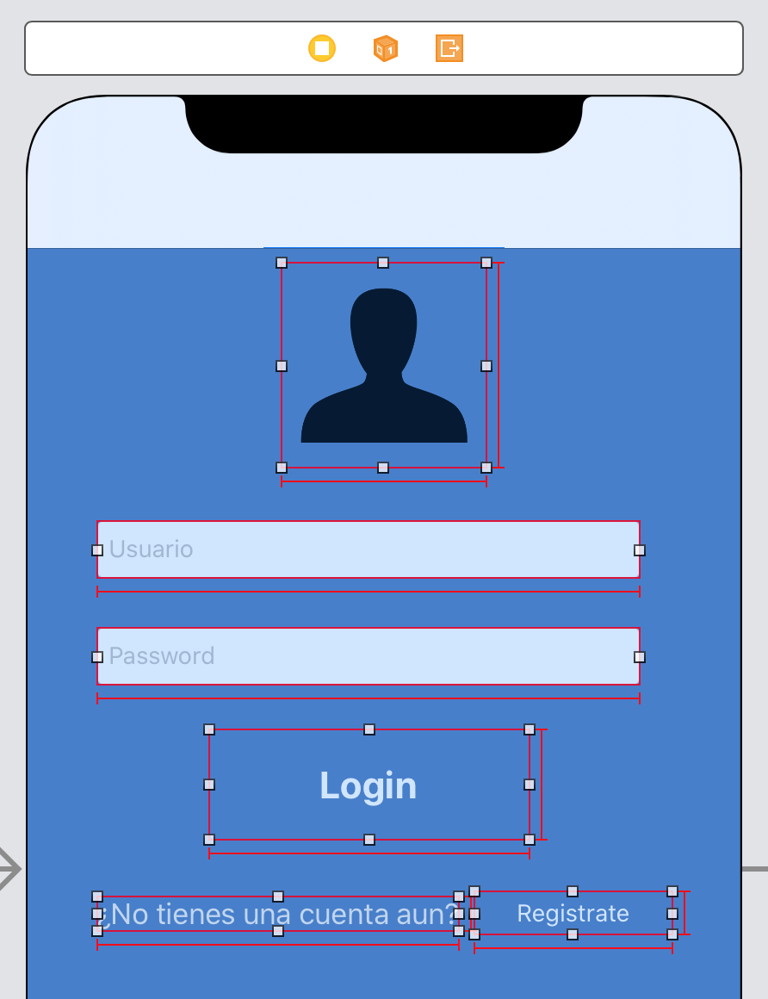
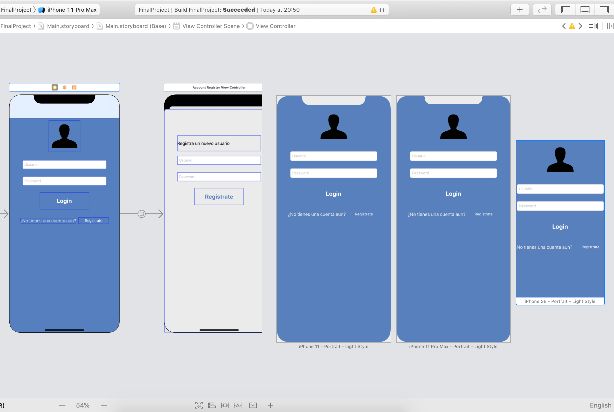
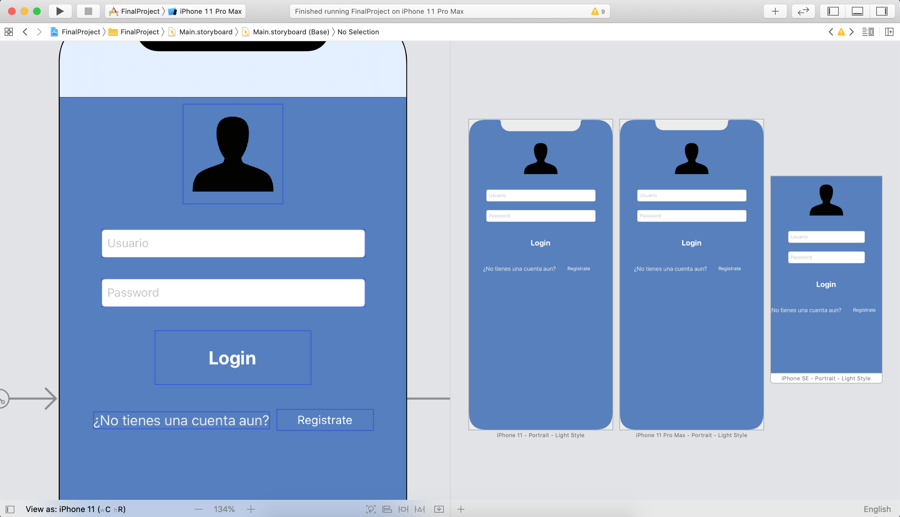
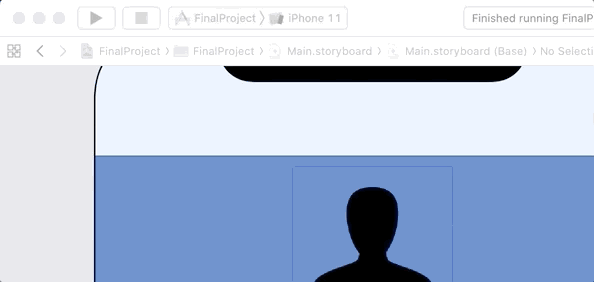

`Desarrollo Mobile` > `Swift Fundamentals`

## Constraints y múltiples simuladores

### OBJETIVO

- Agregar constraints a los elementos de UI, previsualizarlos y ejecutarlos en distintos simuladores.

#### REQUISITOS

1. Utilizar de base el proyecto *Ejemplo-04*.

#### DESARROLLO

1.- Del proyecto, abrir el Storyboard y nos dirigimos a la vista 1.

2.- Ajustaremos los constraints. Iniciando por el ancho y alto de cada elemento en esta vista.

Obteniendo un resultado parecido a este.

Realizamos lo mismo para la vista de registro de cuenta.

3.- Ahora, alinearemos los elementos y agregaremos los espacios entre ellos.

Ver como agregar [constraints](constraints).

4.- Utilizaremos el **Preview** para visualizar la distribución de los constraints. Agregamos dispositivos grandes y pequeños.

5.- Si es necesario, ajustar constraints para que se previsualicen correctamente.

6.- Ejecutamos en distintos simuladores. Para ello elegimos en la lista alado de nuestro Target.

7.- El resultado debe ser similar al de Preview.

