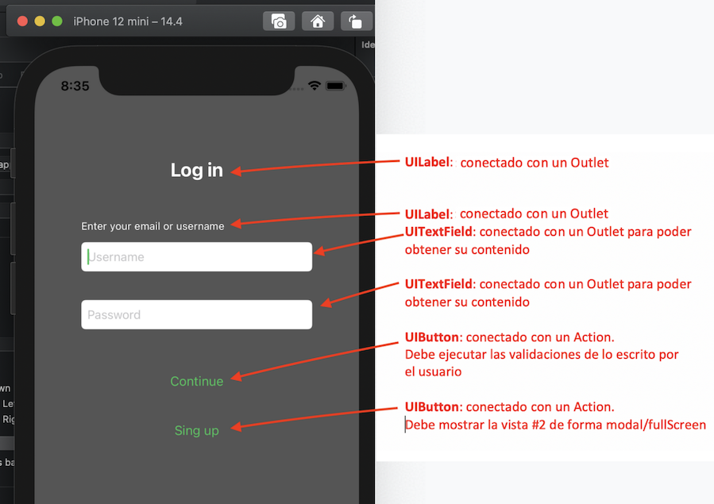
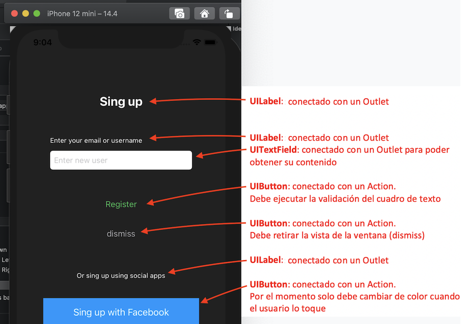
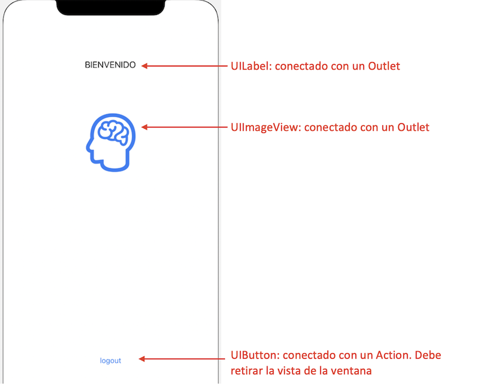
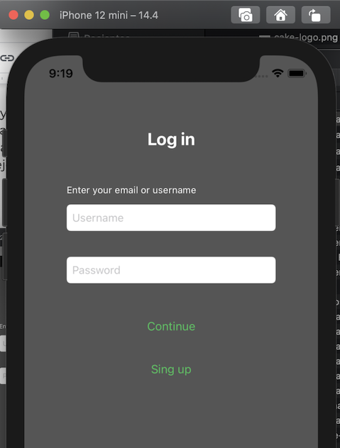
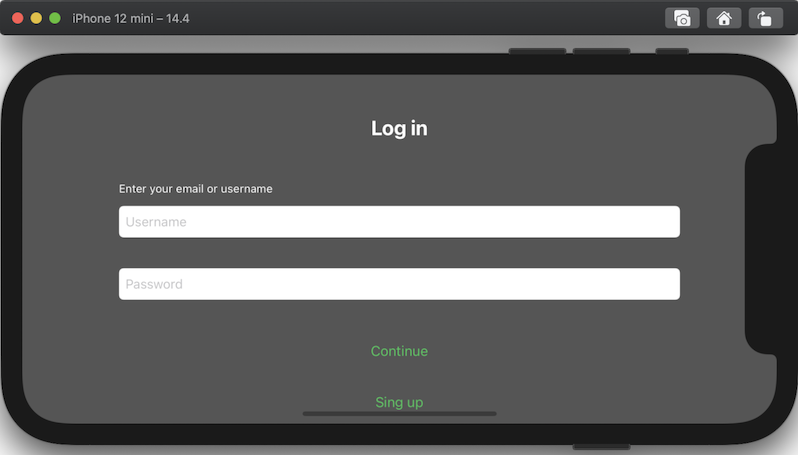

 

`Desarrollo Mobile` > `Swift Fundamentals`
​	

## Sesión 08: Elementos de interfaz de usuario UIKit

### OBJETIVO 

- Verificar que cada elemento de la interfaz del proyecto está conectado correctamente de acuerdo a su funcionalidad.
- Comprobar que el App es responsiva con las distintas pantallas de los simuladores de iOS. 
- Implementar expresiones regulares para la mejora de la funcionalidad básica de la validación.


#### DESARROLLO

En este Postwork sumaremos valor al App propuesta asegurándonos de que las vistas de Login y Sign-up están completas y funcionales.

Recuerda que todo lo trabajado en tu prework, así como durante la sesión, puede ser aplicado a tu proyecto personal.


#### INDICACIONES GENERALES

El propósito de este Postwork es consolidar los conocimientos adquiridos a lo largo del módulo para mejorar el código del app. 

En el Postwork previo se mejoraron  mediante ciclos las validaciones  en el código de los ViewControllers correspondientes a las vista de Login y Sign-up. Ahora implementaremos dichas validaciones de una manera más efectiva a través de expresiones regulares.

**NOTA IMPORTANTE:** Durante la sesión se trabajó el proyecto modular y este Postwork considera como estado actual del app todos los avances hasta ese momento.

Para cumplir el avance requerido y culminar el módulo sigue las indicaciones a continuación.

1.- Verifica que no haya elementos “desconectados” en las vistas.

Es sumamente importante que todos los elementos que el usuario puede encontrar en una vista de tu app cumplan con la función esperada. Esto significa que cada objeto tiene una función básica para la que fue desarrollado por Apple, y esa funcionalidad debe estar correctamente implementada en la app, y no deben usarse objetos para realizar funciones que no son las normales (Ej. hacer que una etiqueta responda a eventos touch). 

Hasta el momento existen dos vistas en la app, y en ellas se tienen objetos UIKit. Estos deben estar conectados al controller correspondiente con la apropiada funcionalidad implementada de acuerdo a las señalizaciones de las siguientes imágenes:


**Vista 1:**




**Vista 2:**




**Vista 3:**



**NOTA:** Recuerda que los labels se conectaron con Outlets para asignarles el color definido.


2.- Confirma que los constraints estén correctamente definidos para que las vistas sean adaptables a cualquier tamaño de pantalla.

Cualquier proyecto iOS en Xcode puede configurarse para que sea solo para iPhone, solo para iPad, o bien, Universal. Esto de ninguna manera es un lineamiento de Apple, y es perfectamente válido que un app solo funcione en iPhone sin que eso pudiera ser una causa de rechazo al momento de la revisión. De igual manera es también válido que la interfaz de una app no gire si se configura que solo se pueda utilizar en orientación portrait.

Para este proyecto se implementará que el app se pueda mostrar en cualquier orientación pero sólo para iPhone, por lo que hay que revisar/agregar los constraints para que el resultado al momento de ejecutar el app sea como se muestra.

**En portrait:**




**En landscape:**




Es clave ejecutar siempre las apps en el simulador o dispositivo con el tamaño de pantalla más pequeño, y también hacerlo en el tamaño de pantalla más grande, para verificar que todos los elementos de las vistas están bien colocados y se distribuyen apropiadamente y así no tener “espacios muertos”


3.- En este paso se mejorará una validación empleando expresiones regulares.

Es probable que ya conozcas o hayas utilizado expresiones regulares con otros lenguajes de programación. En términos generales, una expresión regular, también conocidas como regex o regexp (por la contracción de las palabras “regular expression”), es una secuencia de caracteres que conforma un patrón de búsqueda. Se utilizan principalmente para la búsqueda de patrones de cadenas de caracteres u operaciones de sustituciones.

Las expresiones regulares proporcionan una manera muy flexible de buscar o reconocer cadenas de texto. Por ejemplo, el grupo formado por las cadenas Handel, Händel y Haendel se describe con el patrón "H(a|ä|ae)ndel". Observa el siguiente ejemplo en Swift y posteriormente ejecútalo en un playground:

````
	let cadena = "Haendel"
	let patron = "H(a|ä|ae)ndel"
	let regExp = try! NSRegularExpression(pattern: patron, options: [])
	let coincidencias = regExp.matches(in: cadena, options: [], range: NSRange(location: 0, length: cadena.count))
	if coincidencias.count == 1 {
    		print ("La cadena si cumple con el patrón")
	}
	else {
    		print ("no es una cadena correcta")
	}
````

La clase NSRegularExpression del framework Foundation permite crear objetos de tipo “expresión regular” que luego es posible comparar con el método matches(in: options: range) contra algún objeto de tipo String para evaluar si ese string, o una parte de él (por eso el argumento range) cumple con el patrón definido por la expresión regular. 

Observa otro ejemplo. Supón que necesitas validar si una cadena de texto como la siguiente

````
let pareceUnTelefono = "5534567890"
````

El tema de expresiones regulares es muy extenso y no es un tema específico de programación, mucho menos de programación iOS, por lo que no nos detendremos a explicarlo aquí, pero te compartimos los links donde puedes encontrar toda la información al respecto.

[Haz clic aquí si deseas consultar información sobre escritura de expresiones regulares.](https://www.geeksforgeeks.org/write-regular-expressions/)

Además te compartimos sitios donde puedes generar expresiones regulares requeridas si no tienes tiempo de profundizar en la teoría.

[Regex101](https://regex101.com/)

[RegExr](https://regexr.com/)

Una vez que se cuenta con la expresión regular se debe crear un objeto de la clase NSRegularExpression:

````
let regex = try! NSRegularExpression(pattern: pat, options: [])
````


Y se hace la prueba para determinar si la variable “pareceUnTelefono” contiene una cadena de caracteres que cumpla con el patrón descrito por la expresión regular:

````
let matches = regex.matches(in:pareceUnTelefono, options:[], range: 
NSRange(location: 0, length: testStr.count))
if matches.count == 1 {
    	print ("si son 10 digitos")
}
else {
    	print ("no es un teléfono válido")
}
````


Llegó el momento. Ahora es tu turno. Mejora la validación del campo **username** aplicando una expresión regular para validar que lo escrito por el usuario sea, efectivamente, un correo electrónico.