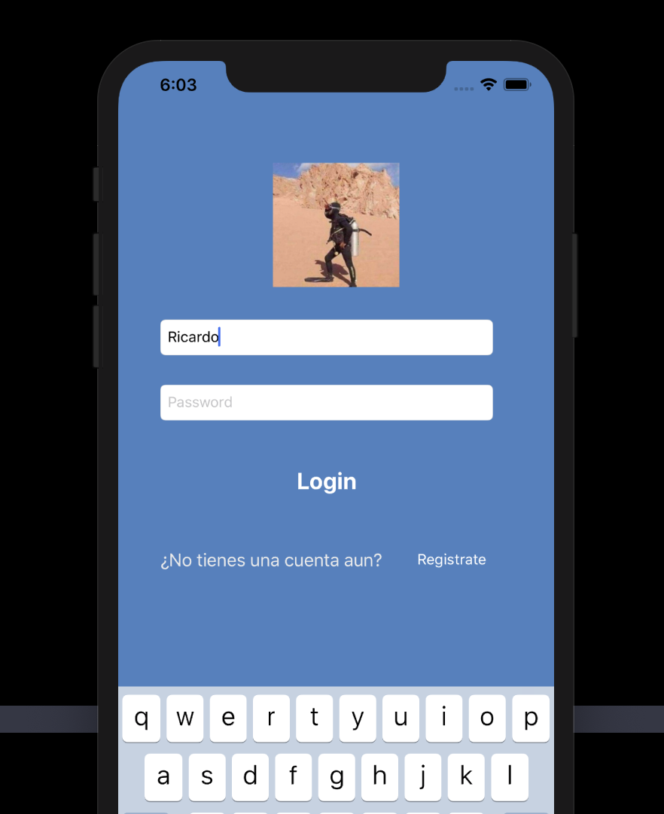

 

`Desarrollo Mobile` > `Swift Fundamentals`
	
## Cambiar imágen de Profile 

### OBJETIVO 

- Con lo aprendido en las sesiones, el alumno debería poder cambiar la imágen de profile del Login.

#### REQUISITOS 

1. Utilizar ejemplo-02.

#### DESARROLLO



1.- Agregar tu foto de perfil

2.- Agregar tu usuario en el código.

3.- Si el usuario tecleado coincide con el registrado cambiar foto de perfil.

<details>
        <summary>Solución</summary>
<p> Abrirl ViewController.swift </p>
<p> Agregar la variable de tu nombre de usuario </p>
<p> Crear algoritmo de cambio de imagen. </p>

```
class ViewController: UIViewController {
  
  @IBOutlet weak var user: UITextField!
  @IBOutlet weak var password: UITextField!
  @IBOutlet weak var imageView: UIImageView!
  
  let myUser = "Ricardo"
  
  override func viewDidLoad() {
    super.viewDidLoad()
  }
  
  @IBAction func login(_ sender: Any) {
    //login success action
    if myUser == user.text {
      imageView.image = UIImage(named: "profile")
    } else {
       imageView.image = UIImage(named: "user1")
    }
  }
}
```


</details>
