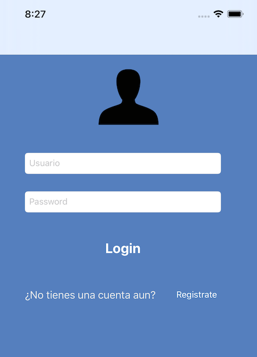
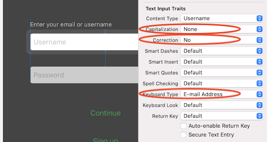

`Desarrollo Mobile` > `Swift Fundamentals`

## Editando la Navegación de vistas

### OBJETIVO

- Personalizar la barra de navegación en la app.

#### REQUISITOS

1. Utilizar de base Ejemplo-03.

#### DESARROLLO

1.- Con base en el proyecto del Ejemplo-03, editar el color de la barra de navegación.



2.- Recrear la siguiente configuración:



<details>
        <summary>Solución</summary>
<p>  Dentro de <strong>ViewController.swift</strong>, buscar la función <strong>viewDidLoad()</strong>, dentro de esta agregár el sig. código: </p>

```
self.navigationController!.navigationBar.setBackgroundImage(UIImage(), for: UIBarMetrics.default)
self.navigationController?.navigationBar.shadowImage = UIImage()
self.navigationController?.navigationBar.isTranslucent = true
self.navigationController!.view.backgroundColor = UIColor.clear
self.navigationController?.navigationBar.backgroundColor = UIColor.clear
```
</details>
